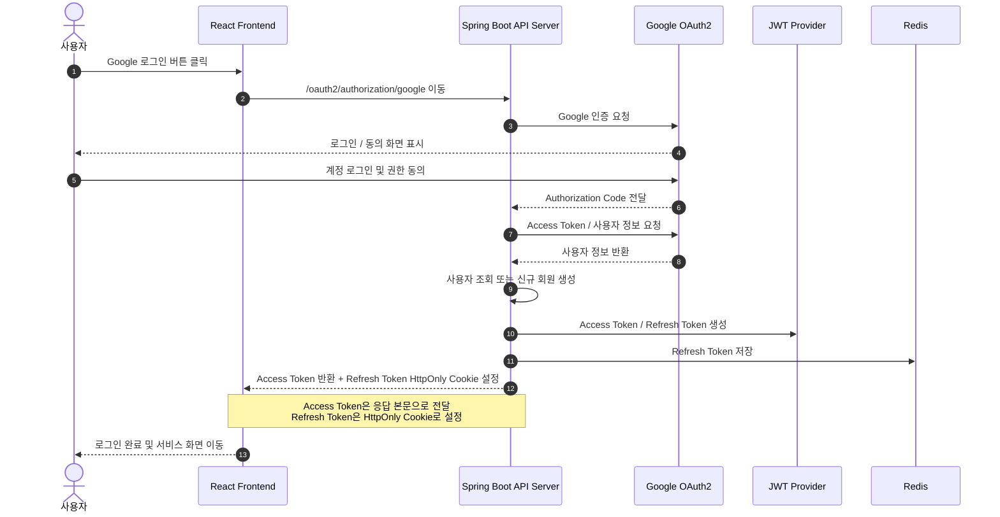
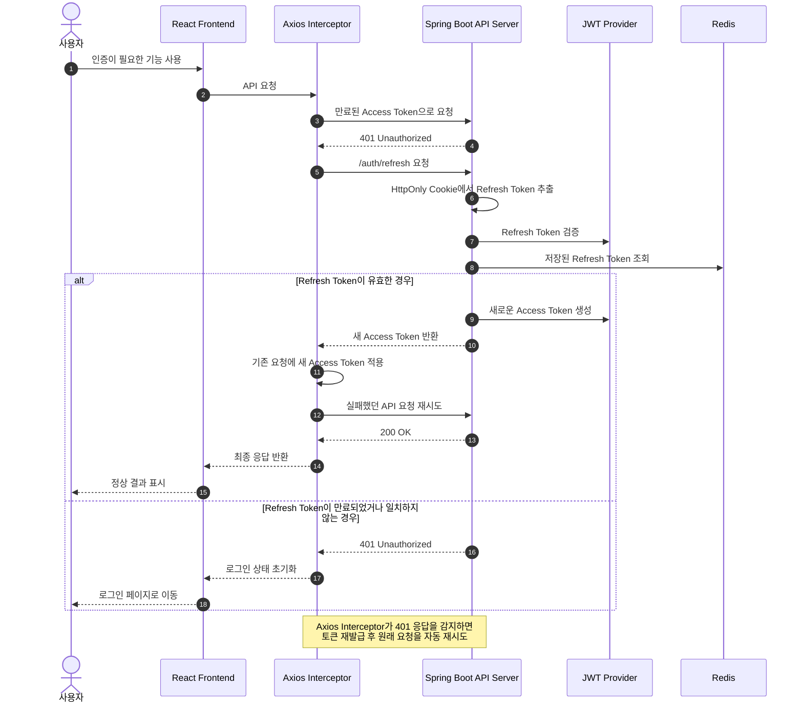

# 인증 / 세션 관리

EVIDO AI는 Google OAuth2 로그인과 JWT 기반 인증을 사용합니다.  
브라우저에는 토큰 값을 직접 노출하지 않고, HttpOnly Cookie로 Access Token과 Refresh Token을 관리합니다.

- 사용자가 별도 회원가입 없이 Google 계정으로 로그인할 수 있도록 구성
- Access Token은 짧게 유지하고, Refresh Token으로 재발급 처리
- 프론트엔드에서 401 응답이 발생하면 자동으로 토큰을 재발급하고 기존 요청을 재시도
- Refresh Token은 Redis에 저장하여 로그아웃, 재사용 감지, 만료 처리를 쉽게 관리
- 로그인하지 않은 사용자도 게스트 세션으로 기본 기능을 체험할 수 있도록 지원

---

## 1. 전체 인증 흐름

```text
서비스 접속
→ /api/auth/session 세션 조회
→ 인증 정보가 없으면 /api/auth/guest/token 호출
→ 게스트 Access Token / Refresh Token 발급
→ Google 로그인 시 OAuth2 인증 진행
→ OAuth2 성공 후 사용자 정보 저장 또는 조회
→ JWT Access Token / Refresh Token 발급
→ HttpOnly Cookie 저장
→ 이후 요청마다 Access Token Cookie 기반 인증 처리
```

## 인증 시퀀스 다이어그램

### 1. Google OAuth2 로그인 흐름



### 2. Access Token 자동 재발급 흐름



---

## 2. 주요 기능

| 기능 | 설명 |
| --- | --- |
| Google OAuth2 로그인 | Google 계정으로 로그인하고 사용자 정보를 저장합니다. |
| 게스트 토큰 발급 | 비로그인 사용자도 임시 권한으로 서비스를 사용할 수 있도록 토큰을 발급합니다. |
| 세션 조회 | 현재 요청의 인증 여부와 사용자 ID, 권한을 반환합니다. |
| JWT 인증 | Access Token을 검증하여 Spring Security 인증 객체를 생성합니다. |
| 토큰 재발급 | Refresh Token을 검증한 뒤 새로운 Access Token과 Refresh Token을 발급합니다. |
| 로그아웃 | Redis에 저장된 Refresh Token을 삭제하고 브라우저 쿠키를 만료시킵니다. |
| 자동 재시도 | 프론트엔드에서 401 발생 시 /api/auth/refresh 호출 후 기존 요청을 다시 실행합니다. |

---

## 3. 주요 API

| Method | URL | 설명 | 인증 |
| --- | --- | --- | --- |
| GET | /api/auth/session | 현재 세션 조회 | 선택 |
| POST | /api/auth/guest/token | 게스트 토큰 발급 | 불필요 |
| POST | /api/auth/refresh | Access Token / Refresh Token 재발급 | Refresh Token Cookie 필요 |
| POST | /api/auth/logout | 로그아웃 및 쿠키 삭제 | 선택 |
| GET | /oauth2/authorization/google | Google OAuth2 로그인 시작 | 불필요 |

### 세션 조회 응답 예시

```json
{
  "authenticated": true,
  "userId": "8f1b7c2e-...",
  "role": "ROLE_USER"
}
```

인증 정보가 없을 경우 다음과 같이 반환됩니다.

```json
{
  "authenticated": false,
  "userId": null,
  "role": null
}
```

---

## 4. 백엔드 구조

```text
com.evido.api.auth
├─ api
│  ├─ controller
│  │  ├─ AuthController
│  │  └─ OAuth2SuccessHandler
│  └─ dto
│     └─ SessionResponse
├─ application
│  ├─ port
│  │  ├─ in
│  │  │  ├─ IssueTokenUseCase
│  │  │  ├─ RefreshTokenUseCase
│  │  │  └─ LogoutUseCase
│  │  └─ out
│  │     ├─ TokenProviderPort
│  │     ├─ UserRepositoryPort
│  │     └─ RefreshTokenRepositoryPort
│  └─ service
│     ├─ IssueTokenService
│     ├─ RefreshTokenService
│     └─ LogoutService
├─ domain
│  ├─ User
│  ├─ Role
│  └─ TokenPayload
└─ infrastructure
   ├─ cookie
   │  └─ AuthCookieManager
   ├─ persistence
   │  ├─ UserEntity
   │  ├─ UserJpaRepository
   │  └─ UserRepositoryAdapter
   ├─ redis
   │  └─ RefreshTokenRedisAdapter
   └─ security
      ├─ AuthSecurityConfig
      ├─ JwtAuthenticationFilter
      ├─ JwtTokenProvider
      └─ CurrentUserProvider
```

---

## 5. Google OAuth2 로그인

사용자가 로그인 버튼을 누르면 프론트엔드는 백엔드의 OAuth2 엔드포인트로 이동합니다.

```ts
window.location.href = ${OAUTH_BASE}/oauth2/authorization/google;
```

OAuth2 인증이 성공하면 OAuth2SuccessHandler가 실행됩니다.

처리 흐름은 다음과 같습니다.

```text
Google OAuth2 인증 성공
→ OAuth2User에서 email, name 추출
→ 기존 사용자 조회
→ 사용자가 없으면 신규 User 생성
→ Access Token / Refresh Token 생성
→ Refresh Token Redis 저장
→ ACCESS_TOKEN / REFRESH_TOKEN 쿠키 설정
→ 프론트엔드 메인 페이지로 리다이렉트
```

```java
String email = oAuth2User.getAttribute("email");
String name = oAuth2User.getAttribute("name");

TokenPair tokenPair = issueTokenUseCase.issueOAuthUser(
        email,
        name,
        "GOOGLE"
);
```

OAuth2 성공 후에는 다음 주소로 리다이렉트합니다.

```text
https://evido.site/
```

OAuth2 실패 시에는 로그인 페이지에 에러 파라미터를 붙여 이동합니다.

```text
https://evido.site/login?oauthError=true
```

---

## 6. 게스트 인증

EVIDO AI는 로그인하지 않은 사용자도 기본 기능을 체험할 수 있도록 게스트 토큰을 발급합니다.

프론트엔드의 AuthProvider는 최초 로딩 시 /api/auth/session을 호출합니다.  
인증된 세션이 없으면 /api/auth/guest/token을 호출하여 게스트 토큰을 발급받고, 다시 세션을 조회합니다.

```ts
async function fetchAuthUser(): Promise<AuthUser> {
    const res = await api.get<AuthUser>("/api/auth/session");

    if (res.data.authenticated) {
        return res.data;
    }

    await api.post("/api/auth/guest/token");

    const guestRes = await api.get<AuthUser>("/api/auth/session");
    return guestRes.data;
}
```

백엔드에서는 게스트 사용자를 생성하고 ROLE_GUEST 권한을 가진 토큰을 발급합니다.

```java
public static User createGuest() {
    return new User(
            null,
            null,
            "GUEST",
            null,
            Role.ROLE_GUEST,
            LocalDateTime.now(),
            null
    );
}
```

---

## 7. JWT 토큰 구조

JWT에는 사용자 식별자, 토큰 타입, 권한 정보를 포함합니다.

| Claim | 설명 |
| --- | --- |
| sub | 사용자 ID |
| type | 토큰 타입: ACCESS, REFRESH |
| role | 사용자 권한: ROLE_GUEST, ROLE_USER, ROLE_ADMIN |
| iat | 발급 시간 |
| exp | 만료 시간 |

### 토큰 만료 시간

| 토큰 | 만료 시간 | 저장 위치 |
| --- | --- | --- |
| Access Token | 15분 | HttpOnly Cookie |
| Refresh Token | 7일 | HttpOnly Cookie + Redis |

### 토큰 생성 예시

```java
return Jwts.builder()
        .setSubject(subject)
        .claim("type", type)
        .claim("role", role.name())
        .setIssuedAt(now)
        .setExpiration(expiry)
        .signWith(key, SignatureAlgorithm.HS256)
        .compact();
```

---

## 8. Cookie 관리

토큰은 JavaScript에서 직접 접근할 수 없도록 HttpOnly Cookie에 저장합니다.

| Cookie | 설명 | Max-Age |
| --- | --- | --- |
| ACCESS_TOKEN | API 요청 인증에 사용하는 토큰 | 900초 |
| REFRESH_TOKEN | Access Token 재발급에 사용하는 토큰 | 604800초 |

쿠키 설정

```java
ResponseCookie.from("ACCESS_TOKEN", token)
        .httpOnly(true)
        .secure(true)
        .sameSite("None")
        .path("/")
        .maxAge(900)
        .build();
```

운영 환경에서 프론트엔드와 백엔드 도메인이 다르기 때문에 SameSite=None, Secure=true 설정을 사용합니다.  
프론트엔드는 withCredentials: true로 쿠키를 포함하여 요청합니다.

```ts
const api = axios.create({
    baseURL: API_BASE || undefined,
    withCredentials: true,
    timeout: 15000,
});
```

---

## 9. Refresh Token 저장과 재사용 감지

Refresh Token은 Redis에 저장합니다.

```text
key   = refresh:{userId}
value = refreshToken
ttl   = 604800 seconds
```

토큰 재발급 요청이 들어오면 다음 순서로 검증합니다.

```text
Refresh Token 서명 검증
→ Token type이 REFRESH인지 확인
→ JWT subject에서 userId 추출
→ Redis에 저장된 Refresh Token 조회
→ 요청 토큰과 Redis 토큰 비교
→ 일치하면 새 Access Token / Refresh Token 발급
→ 새 Refresh Token을 Redis에 다시 저장
```

요청된 Refresh Token이 Redis에 저장된 값과 다르면 재사용이 감지된 것으로 판단하고 Redis 값을 삭제합니다.

```java
if (saved == null || !saved.equals(refreshToken)) {
    refreshRepo.delete(userId);
    throw new BusinessException(
            ErrorCode.UNAUTHORIZED,
            "refresh token 재사용이 감지되었습니다."
    );
}
```

이 방식으로 이전 Refresh Token이 탈취되어 재사용되는 상황을 방어할 수 있습니다.

---

## 10. JWT 인증 필터

API 요청이 들어오면 JwtAuthenticationFilter가 ACCESS_TOKEN 쿠키를 확인합니다.

```text
요청 수신
→ ACCESS_TOKEN Cookie 조회
→ JWT 검증
→ Token type이 ACCESS인지 확인
→ userId와 role을 기반으로 Authentication 생성
→ SecurityContext에 저장
```

```java
UsernamePasswordAuthenticationToken authentication =
        new UsernamePasswordAuthenticationToken(
                payload.subject(),
                null,
                List.of(new SimpleGrantedAuthority(payload.role().name()))
        );

SecurityContextHolder.getContext().setAuthentication(authentication);
```

이후 Controller나 Service에서는 Authentication 객체를 통해 현재 사용자 ID와 권한을 확인할 수 있습니다.

```java
String userId = currentUserProvider.getUserId(authentication);
String role = currentUserProvider.getRole(authentication);
```

---

## 11. 프론트엔드 인증 상태 관리

프론트엔드에서는 AuthProvider가 앱 전체의 인증 상태를 관리합니다.

```text
App.tsx
└─ AuthProvider
   └─ RouterProvider
```

AuthContext에서 제공하는 값은 다음과 같습니다.

| 값 | 설명 |
| --- | --- |
| user | 현재 사용자 인증 상태 |
| loading | 인증 확인 중 여부 |
| refreshAuth | 세션 정보를 다시 조회하는 함수 |

```ts
export interface AuthUser {
    authenticated: boolean;
    principal?: string;
    role?: string;
}
```

> 현재 백엔드의 세션 응답 필드는 userId이고, 프론트엔드 타입에는 principal이 남아 있습니다.  
> 실제 사용 시에는 principal 대신 userId로 타입명을 맞추는 것이 좋습니다.

---

## 12. 401 자동 재발급 처리

프론트엔드 API 클라이언트는 Axios Interceptor를 사용합니다.  
API 요청 중 401 응답이 발생하면 /api/auth/refresh를 호출하여 토큰을 재발급하고, 기존 요청을 한 번 재시도합니다.

```text
API 요청
→ 401 응답 발생
→ 기존 요청이 재시도된 요청인지 확인
→ /api/auth/refresh 호출
→ 재발급 성공 시 기존 요청 재시도
→ 재발급 실패 시 /login 이동
```

```ts
if (
    status === 401 &&
    originalRequest &&
    !originalRequest._retry &&
    !isRefreshRequest
) {
    originalRequest._retry = true;

    try {
        await refreshAccessToken();
        return api(originalRequest);
    } catch {
        window.location.href = "/login";
        return Promise.reject(
            new ApiError(
                401,
                "UNAUTHORIZED",
                "로그인이 만료되었습니다. 다시 로그인해주세요."
            )
        );
    }
}
```

동시에 여러 요청이 401을 받을 수 있기 때문에 refreshPromise를 공유하여 Refresh 요청이 중복 실행되지 않도록 처리했습니다.

```ts
let refreshPromise: Promise<void> | null = null;
```

---

## 13. 로그아웃

로그아웃 요청이 들어오면 서버는 현재 사용자의 Refresh Token을 Redis에서 삭제합니다.  
이후 Access Token과 Refresh Token 쿠키를 만료시킵니다.

```text
POST /api/auth/logout
→ 현재 Authentication에서 userId 추출
→ Redis refresh:{userId} 삭제
→ ACCESS_TOKEN Max-Age=0
→ REFRESH_TOKEN Max-Age=0
```

```java
ResponseCookie deleteAccess = cookieManager.deleteAccessToken();
ResponseCookie deleteRefresh = cookieManager.deleteRefreshToken();
```

---

## 14. 권한 구조

현재 권한은 세 가지로 구분합니다.

| 권한 | 설명 |
| --- | --- |
| ROLE_GUEST | 게스트 사용자 |
| ROLE_USER | Google OAuth2 로그인 사용자 |
| ROLE_ADMIN | 관리자 확장용 권한 |

일부 API는 인증된 사용자 또는 게스트 권한을 요구할 수 있습니다.

```java
.requestMatchers("/api/upload/**")
.hasAnyRole("USER", "GUEST")
```

현재는 대부분의 API 접근 제어가 서비스 내부의 사용자 ID, 워크스페이스 권한 검증과 함께 동작하도록 구성되어 있습니다.

---

## 15. CORS 설정

프론트엔드와 백엔드가 다른 도메인에서 동작하기 때문에 CORS에서 Credential 요청을 허용합니다.

```java
config.setAllowedOrigins(List.of(
        "http://localhost:5173",
        "http://localhost:3000",
        "https://evido.site",
        "https://www.evido.site"
));
config.setAllowedMethods(List.of("GET", "POST", "PUT", "PATCH", "DELETE", "OPTIONS"));
config.setAllowedHeaders(List.of("*"));
config.setAllowCredentials(true);
```

쿠키 기반 인증을 사용하므로 다음 설정이 함께 필요합니다.

| 위치 | 설정 |
| --- | --- |
| Backend Cookie | HttpOnly, Secure, SameSite=None |
| Backend CORS | allowCredentials=true |
| Frontend Axios | withCredentials=true |

---

## 16. 보안상 고려한 점

| 항목 | 적용 내용 |
| --- | --- |
| 토큰 저장 | 브라우저 LocalStorage 대신 HttpOnly Cookie 사용 |
| Access Token 만료 | 15분으로 짧게 설정 |
| Refresh Token 저장 | Redis에 저장하여 서버 측에서 무효화 가능 |
| Refresh Token Rotation | 재발급 시 Refresh Token도 함께 교체 |
| Refresh Token 재사용 감지 | Redis 값과 요청 토큰이 다르면 재사용으로 판단 후 삭제 |
| 로그아웃 | Redis Refresh Token 삭제 및 쿠키 만료 |
| CORS | 허용된 프론트엔드 도메인만 Credential 요청 허용 |
| 운영 설정 | OAuth Client Secret, JWT Secret은 환경변수로 관리 |

---

## 17. 관련 파일

### Backend

| 파일 | 역할 |
| --- | --- |
| AuthController.java | 세션 조회, 게스트 토큰 발급, 토큰 재발급, 로그아웃 API |
| OAuth2SuccessHandler.java | Google OAuth2 로그인 성공 후 토큰 발급 및 리다이렉트 |
| IssueTokenService.java | 게스트 / OAuth 사용자 토큰 발급 |
| RefreshTokenService.java | Refresh Token 검증 및 토큰 재발급 |
| LogoutService.java | Redis Refresh Token 삭제 |
| JwtTokenProvider.java | JWT 생성, 검증, 파싱 |
| JwtAuthenticationFilter.java | Access Token Cookie 기반 인증 처리 |
| AuthCookieManager.java | 인증 쿠키 생성 및 삭제 |
| RefreshTokenRedisAdapter.java | Refresh Token Redis 저장소 Adapter |
| AuthSecurityConfig.java | Spring Security, OAuth2, JWT Filter 설정 |
| WebConfig.java | CORS 설정 |

### Frontend

| 파일 | 역할 |
| --- | --- |
| contexts/AuthContext.tsx | 앱 전역 인증 상태 관리 |
| hooks/useAuth.ts | 인증 Context 접근 Hook |
| api/client.ts | Axios 인스턴스, 401 자동 재발급 처리 |
| pages/auth/LoginPage.tsx | Google 로그인 버튼 및 OAuth2 시작 |
| App.tsx | AuthProvider로 라우터 감싸기 |

---

## 18. 개선 예정

| 개선 항목 | 설명 |
| --- | --- |
| 프론트엔드 타입 정리 | principal과 userId 필드명을 통일 |
| 보호 라우트 추가 | 로그인 필요 페이지와 게스트 허용 페이지를 명확히 분리 |
| 권한 검증 강화 | Controller 또는 Method Security 기반으로 API 접근 권한 명시 |
| OAuth Redirect URL 설정 분리 | 운영/개발 환경별 리다이렉트 URL을 설정값으로 분리 |
| CSRF 대응 검토 | Cookie 기반 인증 구조에서 CSRF 방어 전략 추가 검토 |
| 게스트 데이터 전환 | 게스트 사용자가 Google 로그인할 때 기존 작업 데이터를 사용자 계정으로 이전하는 구조 검토 |
| Refresh Token 관리 고도화 | 기기별 Refresh Token 관리, 세션 목록 조회, 강제 로그아웃 기능 확장 |
