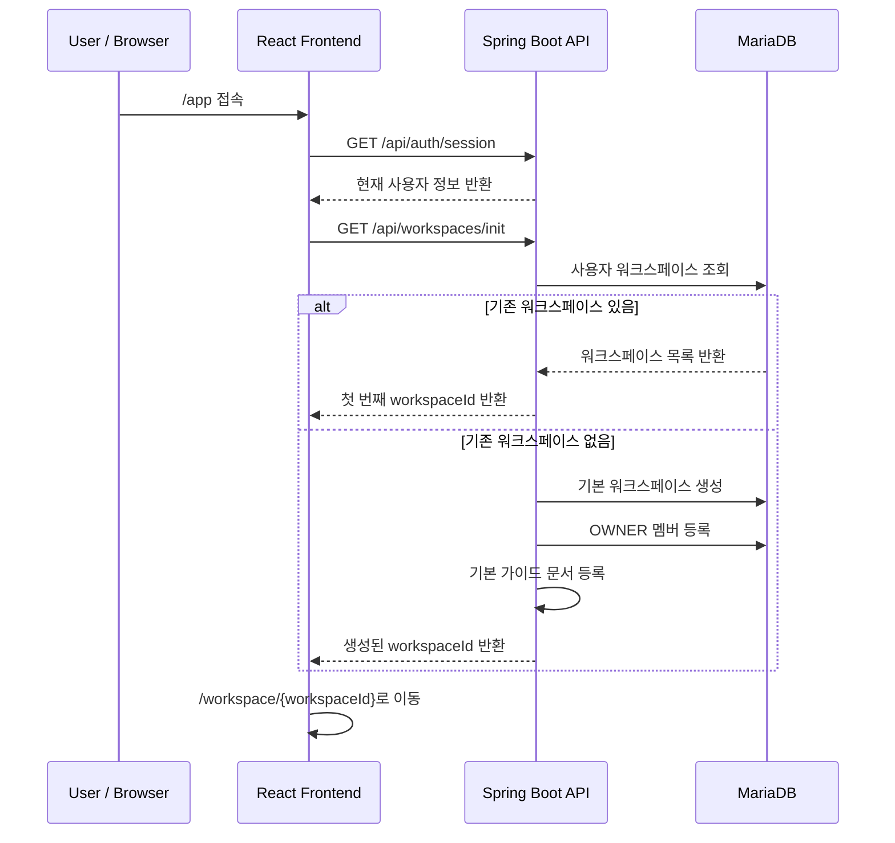

# 워크스페이스 관리

EVIDO AI에서 워크스페이스는 문서, 대화, 설정, 권한을 묶는 기본 작업 공간입니다.  
사용자는 워크스페이스를 기준으로 문서를 업로드하고, 해당 워크스페이스에 포함된 문서를 기반으로 AI 질문을 수행합니다.

- 사용자별로 독립적인 작업 공간을 생성하고 관리
- 문서와 대화를 워크스페이스 단위로 분리
- URL의 workspaceId를 기준으로 현재 작업 범위 결정
- 워크스페이스 멤버 여부를 확인하여 문서, 대화 접근 범위 제한
- 향후 팀/조직 단위 협업 기능으로 확장할 수 있도록 OWNER, MEMBER 권한 구조 준비

---

## 1. 전체 흐름

```text
서비스 접속
→ 세션 확인
→ /api/workspaces/init 호출
→ 기존 워크스페이스가 있으면 첫 번째 워크스페이스 반환
→ 기존 워크스페이스가 없으면 기본 워크스페이스 생성
→ 기본 가이드 문서 자동 등록
→ /workspace/{workspaceId}로 이동
→ 해당 워크스페이스 안에서 문서, 대화, 설정 사용
```



---

## 2. 주요 기능

| 기능 | 설명 |
| --- | --- |
| 워크스페이스 초기화 | 최초 접속 시 기존 워크스페이스를 찾고, 없으면 기본 워크스페이스를 생성합니다. |
| 워크스페이스 목록 조회 | 현재 사용자가 멤버로 속한 워크스페이스 목록을 조회합니다. |
| 워크스페이스 생성 | 새 작업 공간을 생성하고 생성자를 OWNER로 등록합니다. |
| 워크스페이스 이름 변경 | OWNER 권한을 가진 사용자만 워크스페이스 이름을 변경할 수 있습니다. |
| 워크스페이스 삭제 | OWNER 권한을 가진 사용자만 워크스페이스를 삭제할 수 있습니다. |
| 접근 권한 확인 | 문서, 대화 기능에서 workspaceId + userId를 기준으로 접근 가능 여부를 검증합니다. |
| 프론트 라우팅 | /workspace/:workspaceId를 기준으로 대화, 문서, 설정 페이지를 분리합니다. |

---

## 3. 주요 API

| Method | URL | 설명 | 인증 |
| --- | --- | --- | --- |
| GET | /api/workspaces/init | 워크스페이스 초기화 | 필요 |
| GET | /api/workspaces | 내 워크스페이스 목록 조회 | 필요 |
| POST | /api/workspaces | 워크스페이스 생성 | 필요 |
| PATCH | /api/workspaces/{workspaceId} | 워크스페이스 이름 수정 | 필요 |
| DELETE | /api/workspaces/{workspaceId} | 워크스페이스 삭제 | 필요 |

### 워크스페이스 초기화 응답

```json
{
  "success": true,
  "code": "SUCCESS",
  "message": "요청이 성공했습니다.",
  "data": {
    "workspaceId": 1
  }
}
```

### 워크스페이스 목록 응답

```json
{
  "success": true,
  "code": "SUCCESS",
  "message": "요청이 성공했습니다.",
  "data": [
    {
      "id": 1,
      "name": "기본 워크스페이스",
      "createdAt": "2026-04-20T14:10:00"
    }
  ]
}
```

### 워크스페이스 생성 요청

```json
{
  "name": "프로젝트 A"
}
```

### 워크스페이스 생성 응답

```json
{
  "success": true,
  "code": "SUCCESS",
  "message": "워크스페이스가 생성되었습니다.",
  "data": {
    "id": 2,
    "name": "프로젝트 A",
    "createdAt": "2026-04-20T15:30:00"
  }
}
```

---

## 4. 백엔드 구조

```text
com.evido.api.workspace
├─ api
│  ├─ controller
│  │  ├─ WorkspaceController
│  │  └─ WorkspaceInitController
│  ├─ dto
│  │  ├─ request
│  │  │  ├─ WorkspaceCreateRequest
│  │  │  └─ WorkspaceUpdateRequest
│  │  └─ response
│  │     ├─ WorkspaceResponse
│  │     └─ WorkspaceInitResponse
│  └─ mapper
│     ├─ WorkspaceResponseMapper
│     └─ WorkspaceInitResponseMapper
├─ application
│  ├─ port
│  │  ├─ in
│  │  │  ├─ WorkspaceUseCase
│  │  │  └─ WorkspaceInitUseCase
│  │  └─ out
│  │     ├─ WorkspaceRepositoryPort
│  │     └─ WorkspaceMemberRepositoryPort
│  └─ service
│     ├─ WorkspaceService
│     └─ WorkspaceInitService
├─ domain
│  ├─ Workspace
│  ├─ WorkspaceMember
│  └─ WorkspaceRole
└─ infrastructure
   └─ persistence
      ├─ WorkspaceJpaRepository
      ├─ WorkspaceMemberJpaRepository
      ├─ WorkspaceRepositoryAdapter
      ├─ entity
      │  ├─ WorkspaceEntity
      │  └─ WorkspaceMemberEntity
      └─ mapper
         └─ WorkspaceMapper
```

---

## 5. 도메인 설계

워크스페이스는 작업 공간 자체를 나타내는 Workspace와, 워크스페이스에 속한 사용자를 나타내는 WorkspaceMember로 분리했습니다.

```text
Workspace
├─ id
├─ name
├─ createdAt
└─ members
   ├─ userId
   ├─ workspaceId
   ├─ role
   └─ joinedAt
```

### 권한 구조

```java
public enum WorkspaceRole {
    OWNER,
    MEMBER
}
```

현재는 워크스페이스 생성자를 OWNER로 등록하고, 수정/삭제 권한은 OWNER에게만 허용합니다.  
MEMBER 권한은 향후 초대, 공유, 조직 단위 협업 기능을 위해 미리 분리했습니다.

### 워크스페이스 생성

```java
public static Workspace create(String name, String ownerUserId) {
    Workspace workspace = new Workspace(name);

    workspace.members.add(
            WorkspaceMember.createOwner(ownerUserId, null)
    );

    return workspace;
}
```

워크스페이스 생성 시 사용자 ID를 기준으로 OWNER 멤버가 함께 생성됩니다.

---

## 6. 워크스페이스 초기화

사용자가 /app 경로로 진입했는데 아직 workspaceId가 없는 경우, 프론트엔드에서 /api/workspaces/init을 호출합니다.

초기화 로직은 다음과 같습니다.

```text
사용자의 워크스페이스 목록 조회
→ 목록이 비어 있으면 "기본 워크스페이스" 생성
→ 생성된 워크스페이스에 기본 가이드 문서 등록
→ 목록이 있으면 첫 번째 워크스페이스 사용
→ workspaceId 반환
```

```java
if (workspaces.isEmpty()) {
    workspace = workspaceRepository.save(
            Workspace.create("기본 워크스페이스", userId)
    );

    defaultDocumentProvisionUseCase.provisionGuideForWorkspace(
            workspace.getId(),
            userId
    );
} else {
    workspace = workspaces.get(0);
}
```

이 구조를 통해 사용자는 첫 접속 후 별도의 생성 과정 없이 바로 서비스를 사용할 수 있습니다.

---

## 7. 생성 / 조회 / 수정 / 삭제 흐름

### 7.1 워크스페이스 생성

```text
POST /api/workspaces
→ 현재 사용자 ID 추출
→ 이름이 비어 있으면 "새 워크스페이스"로 보정
→ Workspace.create(name, userId)
→ Workspace 저장
→ WorkspaceMember OWNER 저장
→ 생성된 워크스페이스 반환
```

```java
Workspace workspace = Workspace.create(
        name,
        command.userId()
);

Workspace saved = workspaceRepositoryPort.save(workspace);
```

프론트엔드는 생성 후 바로 해당 워크스페이스로 이동합니다.

```ts
const createdWorkspace = await createWorkspace(trimmedValue);
moveToWorkspace(createdWorkspace.id);
```

### 7.2 워크스페이스 목록 조회

```text
GET /api/workspaces
→ 현재 사용자 ID 추출
→ workspace_members에서 사용자 소속 워크스페이스 조회
→ 워크스페이스 목록 반환
```

```java
public List<WorkspaceResult> findAll(String userId) {
    return workspaceRepositoryPort.findAllByUserId(userId)
            .stream()
            .map(WorkspaceResult::from)
            .toList();
}
```

### 7.3 워크스페이스 이름 수정

워크스페이스 이름 수정은 OWNER 권한이 있는 사용자만 가능합니다.

```text
PATCH /api/workspaces/{workspaceId}
→ 워크스페이스 및 멤버 조회
→ 요청 사용자가 OWNER인지 확인
→ 이름 공백 제거 및 검증
→ 이름 변경
→ 변경된 워크스페이스 반환
```

```java
validateOwner(workspace, command.userId());
String name = normalizeUpdateName(command.name());
workspace.rename(name);
```

### 7.4 워크스페이스 삭제

워크스페이스 삭제도 OWNER 권한이 있는 사용자만 가능합니다.

```text
DELETE /api/workspaces/{workspaceId}
→ 워크스페이스 및 멤버 조회
→ 요청 사용자가 OWNER인지 확인
→ 워크스페이스 삭제
```

```java
validateOwner(workspace, command.userId());
workspaceRepositoryPort.deleteById(workspace.getId());
```

프론트엔드에서는 현재 선택 중인 워크스페이스가 삭제되면 남아 있는 워크스페이스로 이동합니다.  
남아 있는 워크스페이스가 없으면 /api/workspaces/init을 다시 호출해 기본 워크스페이스를 생성합니다.

---

## 8. 접근 권한 검증

워크스페이스는 문서와 대화 기능의 상위 범위입니다.  
따라서 문서 조회, 대화 조회, 메시지 전송 같은 기능에서는 workspaceId와 userId를 기준으로 접근 가능 여부를 확인해야 합니다.

대화 기능에서는 WorkspaceAccessPort를 통해 워크스페이스 접근 권한을 확인합니다.

```java
public boolean hasAccess(Long workspaceId, String userId) {
    return workspaceMemberJpaRepository.existsByWorkspaceIdAndUserId(
            workspaceId,
            userId
    );
}
```

검증 흐름은 다음과 같습니다.

```text
요청 수신
→ JWT에서 userId 추출
→ PathVariable의 workspaceId 확인
→ workspace_members에 해당 userId가 존재하는지 조회
→ 존재하면 요청 처리
→ 존재하지 않으면 WORKSPACE_ACCESS_DENIED 반환
```

### 주요 예외

| 에러 코드 | HTTP 상태 | 설명 |
| --- | --- | --- |
| WORKSPACE_NOT_FOUND | 404 Not Found | 요청한 워크스페이스가 존재하지 않는 경우 |
| WORKSPACE_ACCESS_DENIED | 403 Forbidden | 워크스페이스 멤버가 아니거나 OWNER 권한이 없는 경우 |
| INVALID_INPUT_VALUE | 400 Bad Request | 워크스페이스 이름이 비어 있거나 잘못된 경우 |

---

## 9. 프론트엔드 구조

프론트엔드는 workspaceId를 URL에 포함하여 현재 작업 공간을 결정합니다.

```text
src
├─ api
│  └─ workspaces.ts
├─ hooks
│  └─ useWorkspaceInit.ts
├─ components
│  └─ layout
│     ├─ AppLayout.tsx
│     └─ Sidebar.tsx
├─ pages
│  ├─ dashboard
│  │  └─ DashboardPage.tsx
│  └─ workspace
│     └─ WorkspaceSelectPage.tsx
└─ types
   ├─ Workspace.ts
   └─ WorkspaceInit.ts
```

### 주요 라우팅

```tsx
{
    path: "/workspace/:workspaceId",
    children: [
        { index: true, element: <ConversationListPage /> },
        { path: "conversation/:conversationId", element: <ConversationPage /> },
        { path: "documents/upload", element: <DocumentsUploadPage /> },
        { path: "settings", element: <SettingsPage /> },
    ],
}
```

### 워크스페이스 API 모듈

```ts
export function listWorkspaces(): Promise<Workspace[]> {
    return getData<Workspace[]>("/api/workspaces");
}

export function initWorkspace(): Promise<WorkspaceInit> {
    return getData<WorkspaceInit>("/api/workspaces/init");
}

export function createWorkspace(name: string): Promise<Workspace> {
    return postData<Workspace, { name: string }>("/api/workspaces", { name });
}

export function renameWorkspace(
    workspaceId: number,
    name: string
): Promise<Workspace> {
    return patchData<Workspace, { name: string }>(
        /api/workspaces/${workspaceId},
        { name }
    );
}

export function removeWorkspace(workspaceId: number): Promise<void> {
    return deleteData(/api/workspaces/${workspaceId});
}
```

---

## 10. 화면 흐름

### 10.1 /app 진입 시 자동 이동

AppLayout에서는 인증 로딩이 끝난 뒤 useWorkspaceInit을 실행합니다.

```text
AuthProvider에서 사용자 정보 확인
→ AppLayout 렌더링
→ useWorkspaceInit 실행
→ /api/workspaces/init 호출
→ /workspace/{workspaceId}로 이동
```

```ts
if (nextWorkspaceId) {
    navigate(/workspace/${nextWorkspaceId}, {
        replace: true,
    });
}
```

### 10.2 사이드바 워크스페이스 목록

Sidebar는 현재 사용자의 워크스페이스 목록을 조회하고, 선택된 workspaceId와 비교하여 활성 상태를 표시합니다.

```text
Sidebar 마운트
→ GET /api/workspaces
→ 워크스페이스 목록 렌더링
→ 클릭 시 /workspace/{workspaceId}로 이동
```

### 10.3 워크스페이스 생성 / 수정 / 삭제 후 갱신

워크스페이스 변경이 발생하면 프론트엔드에서 workspace:changed 이벤트를 발생시키고, 사이드바 목록을 다시 조회합니다.

```ts
window.dispatchEvent(new Event("workspace:changed"));
```

```ts
window.addEventListener("workspace:changed", handleWorkspaceChanged);
```

이를 통해 대시보드나 사이드바 등 다른 위치에서 워크스페이스를 생성해도 사이드바 목록이 갱신됩니다.

---

## 11. 데이터베이스 구조

### workspaces

| 컬럼 | 설명 |
| --- | --- |
| id | 워크스페이스 ID |
| name | 워크스페이스 이름 |
| created_at | 생성 일시 |

### workspace_members

| 컬럼 | 설명 |
| --- | --- |
| id | 멤버 ID |
| workspace_id | 소속 워크스페이스 ID |
| user_id | 사용자 ID |
| role | OWNER 또는 MEMBER |
| joined_at | 참여 일시 |

### 관계

```text
workspaces 1 ── N workspace_members
```

워크스페이스 엔티티는 멤버 엔티티를 cascade = CascadeType.ALL, orphanRemoval = true로 관리합니다.

```java
@OneToMany(mappedBy = "workspace", cascade = CascadeType.ALL, orphanRemoval = true)
private List<WorkspaceMemberEntity> members = new ArrayList<>();
```

---

## 12. 구현 포인트

### 12.1 작업 범위를 URL로 명확하게 분리

EVIDO AI는 /workspace/:workspaceId를 기준으로 현재 작업 공간을 결정합니다.  
문서 업로드, 대화 목록, 메시지 전송, 설정 화면 모두 현재 workspaceId를 기준으로 동작합니다.

```text
/workspace/1
/workspace/1/conversation/10
/workspace/1/documents/upload
/workspace/1/settings
```

이 구조는 사용자가 여러 프로젝트를 동시에 관리할 때 각 프로젝트의 문서와 대화를 분리하는 데 유리합니다.

### 12.2 기본 워크스페이스 자동 생성

처음 접속한 사용자가 빈 화면을 보지 않도록 /api/workspaces/init에서 기본 워크스페이스를 보장합니다.  
워크스페이스가 없으면 기본 워크스페이스를 생성하고, 사용 가이드 문서를 함께 등록합니다.

### 12.3 권한 검증 로직을 도메인에 포함

워크스페이스 멤버 여부와 소유자 여부는 Workspace 도메인 객체가 판단합니다.

```java
public boolean isMember(String userId) {
    return members.stream()
            .anyMatch(m -> m.getUserId().equals(userId));
}

public boolean isOwner(String userId) {
    return members.stream()
            .anyMatch(m -> m.getUserId().equals(userId) && m.isOwner());
}
```

서비스 계층은 도메인의 판단 결과를 사용해 접근을 제한합니다.

### 12.4 향후 협업 기능 확장 가능성

현재는 생성자 1인 중심 구조지만, WorkspaceMember, WorkspaceRole을 별도로 두었기 때문에 다음 기능으로 확장할 수 있습니다.

- 워크스페이스 초대 링크
- 이메일 기반 멤버 초대
- OWNER, MEMBER, VIEWER 권한 분리
- 워크스페이스별 문서 업로드 권한 제한
- 조직 단위 워크스페이스 관리

---

## 13. 다른 기능과의 연결

워크스페이스는 EVIDO AI의 모든 주요 기능과 연결됩니다.

| 기능 | 연결 방식 |
| --- | --- |
| 문서 관리 | /api/workspaces/{workspaceId}/documents 경로로 문서를 워크스페이스별 관리 |
| 문서 처리 | 청크와 벡터 payload에 workspaceId를 포함하여 검색 범위 제한 |
| 대화 관리 | 대화 목록과 메시지를 workspaceId 기준으로 조회 및 저장 |
| RAG 질의응답 | 질문 시 workspaceId를 함께 전달하여 해당 워크스페이스 문서만 검색 |
| 사용자 설정 | /workspace/{workspaceId}/settings 경로에서 워크스페이스 기반 설정 화면 제공 |

---

## 14. 개선 예정

현재 워크스페이스 기능은 개인 작업 공간 중심으로 동작합니다.  
향후에는 다음 방향으로 개선할 수 있습니다.

| 개선 항목 | 내용 |
| --- | --- |
| 멤버 초대 기능 | 이메일 또는 초대 링크를 통해 다른 사용자를 워크스페이스에 초대 |
| 권한 세분화 | OWNER, ADMIN, MEMBER, VIEWER 등 역할 분리 |
| 삭제 정책 보강 | 워크스페이스 삭제 시 문서, 대화, 벡터 데이터 정리 흐름 명확화 |
| 기본 워크스페이스 정렬 | 최근 사용 워크스페이스 또는 생성일 기준으로 초기 진입 워크스페이스 결정 |
| 워크스페이스 선택 화면 정리 | 현재 라우팅 구조와 WorkspaceSelectPage 사용 여부 정리 |
| 멤버 Repository 정리 | 사용되지 않는 WorkspaceMemberRepositoryPort 구현 여부 확인 및 구조 정리 |
| 감사 로그 | 워크스페이스 생성, 이름 변경, 삭제 이력을 감사 로그로 저장 |
| 사용량 관리 | 워크스페이스별 문서 수, 토큰 사용량, LLM 호출량 집계 |

---