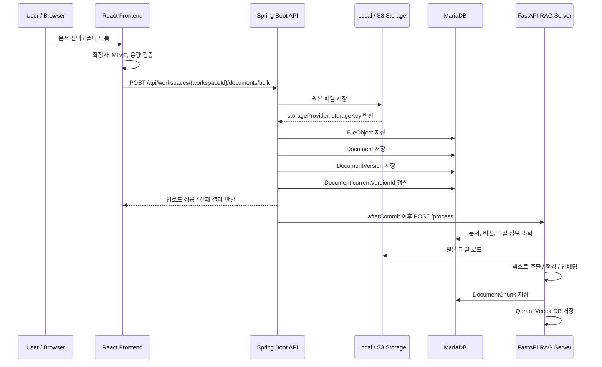

# 문서 관리

EVIDO AI에서 문서 관리는 사용자가 업로드한 PDF, DOCX, TXT, MD 파일을 워크스페이스 단위로 저장하고, 이후 RAG 검색에 사용할 수 있도록 문서 메타데이터와 파일 정보를 관리하는 기능입니다.

- 워크스페이스별로 문서를 분리하여 관리
- 원본 파일 정보와 문서 정보를 분리하여 저장
- 동일 문서의 새 버전 업로드를 고려한 버전 구조 제공
- 파일 저장소를 Local / S3로 교체할 수 있도록 추상화
- 업로드 성공 후 RAG 서버에 문서 처리 요청 전달
- 문서 삭제 시 RDB 청크와 Vector DB 데이터를 함께 정리할 수 있는 구조 마련
- PDF, TXT, MD 문서를 화면에서 바로 확인할 수 있는 문서 뷰어 제공

---

## 1. 전체 흐름

```text
워크스페이스 선택
→ 파일 선택 또는 드래그 앤 드롭
→ 프론트엔드 파일 검증
→ 문서 업로드 API 호출
→ 원본 파일 저장
→ FileObject 저장
→ Document 저장
→ DocumentVersion 저장
→ currentVersionId 갱신
→ 트랜잭션 커밋 이후 RAG 서버 /process 호출
→ 문서 목록 갱신
```



---

## 2. 주요 기능

| 기능 | 설명 |
| --- | --- |
| 단일 문서 업로드 | 하나의 파일을 문서로 등록하고 첫 번째 버전을 생성합니다. |
| 일괄 문서 업로드 | 여러 파일을 한 번에 업로드하고, 파일별 성공/실패 결과를 분리해서 반환합니다. |
| 문서 새 버전 업로드 | 기존 문서에 새 파일을 업로드하여 versionNo를 증가시키고 최신 버전을 교체합니다. |
| 문서 목록 조회 | 워크스페이스와 사용자 기준으로 활성 문서 목록을 페이지 단위로 조회합니다. |
| 문서 제목 검색 | 문서 제목을 기준으로 부분 검색을 지원합니다. |
| 문서 정렬 / 페이지네이션 | page, size, sort 파라미터를 기준으로 목록을 조회합니다. |
| 문서 파일 열기 | PDF는 브라우저 안에서 inline 방식으로 열고, 그 외 파일은 다운로드 URL 방식으로 처리합니다. |
| 텍스트 내용 조회 | TXT, MD 문서는 API로 원문 텍스트를 읽어 미리보기 화면에 표시합니다. |
| 문서 삭제 | 문서를 DELETED 상태로 변경하고, 커밋 이후 청크와 벡터 데이터를 정리합니다. |
| 저장소 추상화 | FileStoragePort를 통해 개발 환경은 Local, 운영 환경은 S3를 사용할 수 있도록 분리했습니다. |

---

## 3. 사용자 화면 흐름

문서 관리는 크게 두 화면에서 사용됩니다.

| 화면 | 역할 |
| --- | --- |
| 문서 업로드 페이지 | 파일/폴더 업로드, 선택 파일 검증, 업로드 진행률, 업로드 결과 확인 |
| 채팅 화면의 파일 패널 | 문서 목록 조회, 문서 검색, 문서 선택, PDF/TXT 미리보기, 문서 삭제 |

### 문서 업로드 페이지

프론트엔드의 DocumentsUploadPage는 파일 선택과 드래그 앤 드롭을 모두 지원합니다. 폴더를 드롭한 경우 내부 파일을 순회하여 업로드 가능한 파일만 선택 목록에 추가합니다.

```text
파일/폴더 선택
→ 확장자 검증
→ 용량 검증
→ MIME 타입 검증
→ 선택 파일 목록 표시
→ 업로드 진행률 표시
→ 성공/실패 결과 표시
→ 문서 목록 새로고침
```

현재 프론트엔드 검증 기준은 다음과 같습니다.

| 항목 | 기준 |
| --- | --- |
| 허용 확장자 | .pdf, .docx, .txt, .md |
| 최대 용량 | 20MB |
| 허용 MIME | application/pdf, text/plain, text/markdown, application/vnd.openxmlformats-officedocument.wordprocessingml.document |
| 중복 선택 방지 | 파일명, 크기, 마지막 수정 시간이 모두 같은 경우 중복으로 판단 |

### 채팅 화면 파일 패널

채팅 화면의 FileViewerPanel은 현재 워크스페이스의 문서 목록을 보여주고, 문서를 선택하면 확장자에 따라 뷰어를 분기합니다.

```text
문서 목록 조회
→ 문서명 검색
→ 문서 선택
→ 확장자 판별
→ PDF면 PdfViewer 표시
→ TXT/MD면 TextViewer 표시
→ 지원하지 않는 형식은 다운로드 또는 외부 열기 안내
```

검색어 입력은 짧은 시간 동안 debounce를 적용하여 불필요한 목록 조회 요청을 줄였습니다.

---

## 4. 주요 API

문서 API는 워크스페이스 하위 리소스로 구성했습니다.

```text
/api/workspaces/{workspaceId}/documents
```

| Method | URL | 설명 | 인증 |
| --- | --- | --- | --- |
| GET | /api/workspaces/{workspaceId}/documents | 문서 목록 조회 | 필요 |
| POST | /api/workspaces/{workspaceId}/documents | 단일 문서 업로드 | 필요 |
| POST | /api/workspaces/{workspaceId}/documents/bulk | 문서 일괄 업로드 | 필요 |
| POST | /api/workspaces/{workspaceId}/documents/{documentId}/versions | 문서 새 버전 업로드 | 필요 |
| GET | /api/workspaces/{workspaceId}/documents/{documentId}/file | 문서 파일 열기 | 필요 |
| GET | /api/workspaces/{workspaceId}/documents/{documentId}/content | TXT/MD 내용 조회 | 필요 |
| GET | /api/workspaces/{workspaceId}/documents/{documentId}/download | S3 다운로드 URL 조회 | 필요 |
| DELETE | /api/workspaces/{workspaceId}/documents/{documentId} | 문서 삭제 | 필요 |

---

## 5. API 상세

### 5.1 문서 목록 조회

```http
GET /api/workspaces/{workspaceId}/documents?q=manual&page=0&size=10&sort=createdAt,desc
```

| Query Parameter | 설명 | 기본값 |
| --- | --- | --- |
| q | 문서 제목 검색어 | 없음 |
| page | 페이지 번호 | 0 |
| size | 페이지 크기 | 10 |
| sort | 정렬 조건 | createdAt,desc |

응답 예시는 다음과 같습니다.

```json
{
  "success": true,
  "code": "SUCCESS",
  "message": "요청이 성공했습니다.",
  "data": {
    "content": [
      {
        "documentId": 10,
        "title": "HI-SCAN Manual",
        "latestVersionId": 31,
        "fileId": 52,
        "filename": "hi-scan-manual.pdf",
        "createdAt": "2026-04-20T14:00:00",
        "status": "ACTIVE"
      }
    ],
    "number": 0,
    "size": 10,
    "totalElements": 1,
    "totalPages": 1
  }
}
```

현재 목록 조회는 workspaceId, ownerUserId, status=ACTIVE 조건으로 조회합니다. 삭제된 문서는 목록에 노출하지 않습니다.

### 5.2 단일 문서 업로드

```http
POST /api/workspaces/{workspaceId}/documents
Content-Type: multipart/form-data
```

요청 필드는 다음과 같습니다.

| Field | 설명 | 필수 여부 |
| --- | --- | --- |
| title | 문서 제목 | 선택 |
| file | 업로드할 원본 파일 | 필수 |

title이 비어 있으면 원본 파일명에서 확장자를 제거한 값을 기본 제목으로 사용합니다.

응답 예시는 다음과 같습니다.

```json
{
  "success": true,
  "code": "SUCCESS",
  "message": "문서 업로드가 완료되었습니다.",
  "data": {
    "documentId": 10,
    "versionId": 31,
    "fileId": 52,
    "title": "HI-SCAN Manual",
    "status": "ACTIVE"
  }
}
```

### 5.3 일괄 문서 업로드

```http
POST /api/workspaces/{workspaceId}/documents/bulk
Content-Type: multipart/form-data
```

요청 필드는 다음과 같습니다.

| Field | 설명 | 필수 여부 |
| --- | --- | --- |
| titlePrefix | 문서 제목 앞에 붙일 접두어 | 선택 |
| files | 업로드할 파일 목록 | 필수 |

일괄 업로드는 파일별로 개별 트랜잭션을 사용합니다. 따라서 일부 파일이 실패해도 성공한 파일은 그대로 등록됩니다.

```json
{
  "success": true,
  "code": "SUCCESS",
  "message": "문서 일괄 업로드 처리가 완료되었습니다.",
  "data": {
    "success": [
      {
        "documentId": 10,
        "versionId": 31,
        "fileId": 52,
        "title": "HI-SCAN Manual",
        "status": "ACTIVE"
      }
    ],
    "failed": [
      {
        "filename": "empty.txt",
        "reason": "file is required"
      }
    ]
  }
}
```

### 5.4 문서 새 버전 업로드

```http
POST /api/workspaces/{workspaceId}/documents/{documentId}/versions
Content-Type: multipart/form-data
```

기존 문서에 새 파일을 연결합니다. 서버는 해당 문서의 최대 versionNo를 조회한 뒤 versionNo + 1로 새 버전을 생성합니다.

```text
기존 Document 조회
→ workspaceId 일치 여부 확인
→ 새 FileObject 저장
→ max(versionNo) + 1 계산
→ DocumentVersion 생성
→ Document.currentVersionId 갱신
→ RAG 문서 처리 요청
```

### 5.5 문서 파일 열기

```http
GET /api/workspaces/{workspaceId}/documents/{documentId}/file?versionId={versionId}
```

versionId는 선택값입니다. 값이 없으면 문서의 currentVersionId를 기준으로 파일을 조회합니다.

파일 열기 방식은 확장자와 저장소에 따라 달라집니다.

| 조건 | 처리 방식 |
| --- | --- |
| PDF | Content-Disposition: inline으로 브라우저 내 표시 |
| Local 저장소 PDF | API 서버가 UrlResource로 파일 리소스 반환 |
| S3 저장소 PDF | Presigned URL을 UrlResource로 감싸 반환 |
| PDF가 아닌 파일 | /download API 또는 외부 열기 방식 사용 |

### 5.6 텍스트 내용 조회

```http
GET /api/workspaces/{workspaceId}/documents/{documentId}/content?versionId={versionId}
```

TXT, MD, Markdown 파일의 원문 내용을 반환합니다.

| 항목 | 기준 |
| --- | --- |
| 지원 확장자 | txt, md, markdown |
| 최대 응답 크기 | 2MB |
| 인코딩 | UTF-8 |

응답은 text/plain; charset=UTF-8 형식으로 반환합니다.

### 5.7 문서 다운로드 URL 조회

```http
GET /api/workspaces/{workspaceId}/documents/{documentId}/download?versionId={versionId}
```

운영 환경에서 S3 저장소를 사용하는 경우 Presigned URL을 발급합니다. 현재 만료 시간은 300초로 설정되어 있습니다.

```json
{
  "success": true,
  "code": "SUCCESS",
  "message": "문서 다운로드 URL 조회에 성공했습니다.",
  "data": "https://bucket.s3.ap-northeast-2.amazonaws.com/..."
}
```

Local 저장소에서는 Presigned URL을 지원하지 않으므로 /file API를 통해 파일을 조회합니다.

### 5.8 문서 삭제

```http
DELETE /api/workspaces/{workspaceId}/documents/{documentId}
```

문서 삭제는 즉시 DB row를 제거하지 않고 먼저 상태를 변경합니다.

```text
Document 조회
→ workspaceId 확인
→ status = DELETED 변경
→ 트랜잭션 커밋
→ document_chunk 삭제
→ Qdrant vector 삭제
→ 연결된 FileObject / DocumentVersion 정리
```

문서 상태를 먼저 DELETED로 바꾸면 목록과 검색 대상에서 빠르게 제외할 수 있고, 실제 파일/청크/벡터 삭제는 커밋 이후 정리할 수 있습니다.

---

## 6. 백엔드 구조

```text
com.evido.api.document
├─ api
│  ├─ controller
│  │  └─ DocumentController
│  ├─ dto
│  │  ├─ request
│  │  │  ├─ UploadDocumentRequest
│  │  │  ├─ UploadDocumentVersionRequest
│  │  │  ├─ BulkUploadRequest
│  │  │  ├─ ListDocumentsRequest
│  │  │  ├─ DownloadDocumentRequest
│  │  │  └─ DocumentContentRequest
│  │  └─ response
│  │     ├─ DocumentCreateResponse
│  │     ├─ DocumentListItemResponse
│  │     ├─ BulkUploadResponse
│  │     ├─ BulkUploadFailedItemResponse
│  │     └─ PageResponse
│  └─ mapper
│     └─ DocumentResponseMapper
├─ application
│  ├─ port
│  │  ├─ in
│  │  │  └─ DocumentUseCase
│  │  └─ out
│  │     ├─ FileStoragePort
│  │     ├─ DocumentProcessPort
│  │     └─ VectorIndexPort
│  └─ service
│     ├─ DocumentService
│     └─ DefaultDocumentProvisionService
├─ domain
│  ├─ Document
│  ├─ DocumentVersion
│  ├─ FileObject
│  └─ DocumentChunk
└─ infrastructure
   ├─ rag
   │  ├─ adapter
   │  │  ├─ LocalFileStorageAdapter
   │  │  ├─ S3FileStorageAdapter
   │  │  └─ RagDocumentProcessAdapter
   │  └─ client
   │     ├─ RagProcessorClient
   │     └─ VectorIndexWebClient
   └─ repository
      ├─ DocumentRepository
      ├─ DocumentVersionRepository
      ├─ FileObjectRepository
      └─ DocumentChunkRepository
```

---

## 7. 도메인 설계

문서 관리는 Document, DocumentVersion, FileObject를 분리해서 관리합니다.

```text
Document
├─ documentId
├─ workspaceId
├─ ownerUserId
├─ title
├─ status
├─ currentVersionId
├─ createdAt
└─ updatedAt

DocumentVersion
├─ versionId
├─ documentId
├─ fileId
├─ versionNo
├─ extractedText
└─ createdAt

FileObject
├─ fileId
├─ workspaceId
├─ storageProvider
├─ storageKey
├─ originalName
├─ contentType
├─ sizeBytes
├─ checksumSha256
└─ createdAt
```

### Document

Document는 사용자가 보는 문서의 대표 정보를 저장합니다.

| 필드 | 설명 |
| --- | --- |
| documentId | 문서 ID |
| workspaceId | 문서가 속한 워크스페이스 ID |
| ownerUserId | 문서를 업로드한 사용자 ID |
| title | 문서 제목 |
| status | 문서 상태. 현재 ACTIVE, DELETED 중심으로 사용 |
| currentVersionId | 현재 최신 버전 ID |
| createdAt | 생성 일시 |
| updatedAt | 수정 일시 |

### DocumentVersion

DocumentVersion은 문서의 업로드 버전을 관리합니다. 같은 문서를 다시 업로드해도 기존 문서 ID는 유지하고, 새 버전만 추가할 수 있습니다.

| 필드 | 설명 |
| --- | --- |
| versionId | 버전 ID |
| documentId | 연결된 문서 ID |
| fileId | 연결된 파일 ID |
| versionNo | 문서 안에서의 버전 번호 |
| extractedText | 추출 텍스트 저장 영역 |
| createdAt | 버전 생성 일시 |

documentId + versionNo는 유니크 제약을 두어 같은 문서 안에서 버전 번호가 중복되지 않도록 했습니다.

### FileObject

FileObject는 실제 파일 저장 정보를 관리합니다. 문서 도메인과 저장소 구현을 분리하기 위해 파일의 물리적 위치를 별도 객체로 분리했습니다.

| 필드 | 설명 |
| --- | --- |
| fileId | 파일 ID |
| workspaceId | 파일이 속한 워크스페이스 ID |
| storageProvider | LOCAL 또는 S3 |
| storageKey | Local 파일 경로 또는 S3 object key |
| originalName | 업로드 당시 원본 파일명 |
| contentType | MIME 타입 |
| sizeBytes | 파일 크기 |
| checksumSha256 | 파일 내용 기반 SHA-256 해시 |
| createdAt | 생성 일시 |

---

## 8. 파일 저장소 구조

파일 저장은 FileStoragePort를 기준으로 추상화했습니다.

```text
DocumentService
→ FileStoragePort
   ├─ LocalFileStorageAdapter dev profile
   └─ S3FileStorageAdapter prod profile
```

### Local 저장소

개발 환경에서는 서버 로컬 디스크에 파일을 저장합니다.

```text
{basePath}/ws-{workspaceId}/{uuid}_{originalFilename}
```

특징은 다음과 같습니다.

- dev profile에서 사용
- 워크스페이스별 디렉터리 분리
- UUID를 파일명 앞에 붙여 이름 충돌 방지
- 파일 열기 시 UrlResource로 반환

### S3 저장소

운영 환경에서는 S3에 파일을 저장합니다.

```text
ws-{workspaceId}/{uuid}_{originalFilename}
```

특징은 다음과 같습니다.

- prod profile에서 사용
- S3 object key에 워크스페이스 ID 포함
- 다운로드 시 Presigned URL 발급
- 만료 시간이 있는 URL을 사용하여 원본 파일 접근 범위를 제한

---

## 9. 업로드 처리 상세

### 단일 업로드 처리

```text
MultipartFile 검증
→ 문서 제목 결정
→ 파일 byte 읽기
→ SHA-256 해시 계산
→ FileStoragePort.store 호출
→ FileObject 저장
→ Document 저장
→ DocumentVersion 저장
→ Document.currentVersionId 갱신
→ afterCommit으로 RAG 처리 요청
```

핵심은 문서 저장과 문서 처리 요청을 분리한 점입니다. 업로드 트랜잭션이 커밋되기 전에 RAG 서버가 문서를 읽으면 아직 DB 정보가 확정되지 않은 상태일 수 있습니다. 그래서 TransactionSynchronization의 afterCommit 시점에 RAG 서버 처리를 호출합니다.

```text
DB 저장 성공 후에만 RAG 처리 요청
DB 저장 실패 시 RAG 처리 요청 없음
```

### 일괄 업로드 처리

일괄 업로드는 여러 파일을 하나의 요청으로 받지만, 파일별로 성공/실패를 분리합니다.

```text
files 반복
→ 각 파일마다 개별 트랜잭션 실행
→ 성공 목록에 추가
→ 실패 시 실패 목록에 filename, reason 추가
→ 전체 결과 반환
```

이 방식의 장점은 다음과 같습니다.

- 하나의 파일 실패가 전체 업로드 실패로 이어지지 않음
- 사용자에게 어떤 파일이 실패했는지 구체적으로 안내 가능
- 업로드 결과 UI에서 성공/실패 항목을 분리해서 표시 가능

### 새 버전 업로드 처리

새 버전 업로드는 기존 문서의 제목과 문서 ID를 유지하면서 파일만 교체하는 구조입니다.

```text
Document 조회
→ workspaceId 검증
→ 새 FileObject 저장
→ 현재 최대 versionNo 조회
→ nextVersionNo 계산
→ 새 DocumentVersion 저장
→ Document.currentVersionId 변경
→ afterCommit으로 RAG 처리 요청
```

이 구조를 사용하면 향후 버전별 문서 비교, 이전 버전 복원, 버전별 검색 범위 지정 기능으로 확장할 수 있습니다.

---

## 10. 문서 목록과 검색

문서 목록은 ListDocumentsQuery를 통해 조회합니다.

```text
workspaceId
userId
q
page
size
sort
```

조회 조건은 다음과 같습니다.

```text
workspaceId 일치
ownerUserId 일치
status = ACTIVE
q가 있으면 title containing ignore case
```

목록 응답에는 문서 기본 정보뿐 아니라 최신 버전과 파일 정보도 함께 포함합니다.

```text
Document.currentVersionId
→ DocumentVersion 조회
→ FileObject 조회
→ DocumentListItemResponse 생성
```

프론트엔드는 이 응답을 사용해 문서명, 원본 파일명, 최신 버전 ID, 생성 일시, 상태를 화면에 표시합니다.

---

## 11. 문서 미리보기

문서 미리보기는 확장자에 따라 분기합니다.

| 확장자 | 프론트엔드 컴포넌트 | 백엔드 API |
| --- | --- | --- |
| .pdf | PdfViewer | /file |
| .txt | TextViewer | /content |
| .md | TextViewer | /content |
| 그 외 | 다운로드 또는 외부 열기 | /file 또는 /download |

### PDF 미리보기

PDF는 @react-pdf-viewer를 사용해서 브라우저 안에서 표시합니다.

```text
문서 선택
→ getDocumentFileUrl 생성
→ PdfViewer에 fileUrl 전달
→ API 서버가 PDF 리소스 반환
→ 브라우저 내 PDF 렌더링
```

### TXT / MD 미리보기

TXT, MD 파일은 API로 원문 텍스트를 받아 TextViewer에서 표시합니다.

TextViewer는 다음 기능을 제공합니다.

- 텍스트 로딩 상태 표시
- 줄번호 표시 On / Off
- 텍스트 검색
- 대소문자 구분 검색
- 복사 기능
- 긴 텍스트 일부 표시 및 다운로드 안내

백엔드에서는 TXT/MD 내용 조회 시 2MB 제한을 두어 너무 큰 텍스트 파일이 브라우저에 한 번에 로딩되는 것을 방지합니다.

---

## 12. 문서 삭제와 데이터 정리

문서 삭제는 두 단계로 처리합니다.

### 1단계: 문서 상태 변경

먼저 문서의 상태를 DELETED로 변경합니다.

```text
Document.status = DELETED
Document.updatedAt = now
```

이렇게 하면 사용자의 문서 목록에서 즉시 제외할 수 있습니다.

### 2단계: 관련 데이터 정리

트랜잭션 커밋 이후 다음 데이터를 정리합니다.

```text
document_chunk 삭제
Qdrant vector 삭제
Local 파일 삭제
FileObject 삭제
DocumentVersion 삭제
```

관련 데이터 정리는 외부 시스템과 파일 시스템을 함께 다루기 때문에, 문서 상태 변경 트랜잭션과 분리해서 수행합니다.

---

## 13. RAG 처리 연동 지점

문서 관리 기능은 문서의 메타데이터와 원본 파일 저장까지만 담당합니다. 실제 텍스트 추출, 청킹, 임베딩, Vector DB 저장은 RAG 서버가 담당합니다.

Spring Boot 서버는 업로드가 완료된 뒤 다음 요청을 RAG 서버로 전달합니다.

```http
POST /process
```

요청 데이터는 문서 ID와 버전 ID입니다.

```json
{
  "documentId": 10,
  "versionId": 31
}
```

RAG 서버는 이 값을 기준으로 DB에서 문서, 버전, 파일 정보를 조회하고 원본 파일을 읽어 처리합니다.

```text
DocumentService
→ RagDocumentProcessAdapter
→ RagProcessorClient
→ FastAPI RAG Server /process
```

자세한 문서 처리 과정은 [04-document-processing.md](04-document-processing.md)에서 다룹니다.

---

## 14. 프론트엔드 구조

문서 관리 관련 프론트엔드 코드는 다음과 같이 구성했습니다.

```text
src
├─ api
│  └─ documents.ts
├─ pages
│  ├─ documents
│  │  └─ DocumentsUploadPage.tsx
│  └─ conversation
│     └─ FileViewerPanel.tsx
└─ components
   └─ viewers
      ├─ PdfViewer.tsx
      └─ TextViewer.tsx
```

### documents.ts

문서 관련 API 호출을 모아둔 파일입니다.

| 함수 | 설명 |
| --- | --- |
| listDocuments | 문서 목록 조회 |
| deleteDocument | 문서 삭제 |
| uploadDocumentsBulk | 일괄 업로드 |
| getDocumentTextContent | TXT/MD 내용 조회 |
| getDocumentFileUrl | 파일 열기 URL 생성 |
| getDocumentDownloadUrl | 다운로드 URL 조회 |

### DocumentsUploadPage

문서 업로드 전용 화면입니다.

주요 역할은 다음과 같습니다.

- 드래그 앤 드롭 파일 추가
- 폴더 드롭 시 내부 파일 순회
- 확장자, MIME, 용량 검증
- 선택 파일 목록 표시
- 업로드 진행률 표시
- 성공/실패 결과 표시
- 업로드 후 문서 목록 갱신

### FileViewerPanel

채팅 화면 안에서 문서 목록과 미리보기를 담당합니다.

주요 역할은 다음과 같습니다.

- 현재 워크스페이스 문서 목록 조회
- 문서명 검색
- 문서 삭제
- 선택 문서 상태 관리
- 확장자 기반 뷰어 분기
- PDF / TXT / MD 미리보기 표시

---

## 15. 예외 처리

문서 관리에서 처리하는 주요 예외는 다음과 같습니다.

| 상황 | 처리 |
| --- | --- |
| 파일이 비어 있음 | file is required 예외 반환 |
| 원본 파일명이 없음 | original filename is required 예외 반환 |
| 다른 워크스페이스 문서 접근 | different workspace 예외 반환 |
| 삭제된 문서 접근 | 삭제된 문서입니다. 예외 반환 |
| 조회할 버전이 없음 | 조회할 버전이 없습니다. 예외 반환 |
| 문서와 버전이 연결되지 않음 | version does not belong to document 예외 반환 |
| TXT/MD가 아닌 파일 내용 조회 | 텍스트 미리보기 미지원 예외 반환 |
| 텍스트 파일 크기 초과 | 2MB 초과 예외 반환 |
| Local 파일이 없음 | 파일 미존재 예외 반환 |
| S3 Presigned URL 생성 실패 | 다운로드 URL 생성 실패 예외 반환 |

프론트엔드는 업로드 실패 항목을 failed 배열로 받아 사용자에게 파일별 실패 사유를 보여줄 수 있습니다.

---

## 16. 구현 포인트

### 16.1 문서와 파일 저장 정보 분리

문서와 파일을 직접 1:1로 묶지 않고 DocumentVersion을 사이에 두었습니다.

```text
Document
└─ DocumentVersion
   └─ FileObject
```

이 구조를 통해 다음 확장이 쉬워집니다.

- 문서 새 버전 업로드
- 버전별 문서 처리 상태 관리
- 이전 버전 조회
- 버전별 RAG 인덱싱
- 파일 저장소 변경

### 16.2 저장소 포트 분리

DocumentService는 Local 파일 시스템이나 S3 SDK를 직접 알지 않습니다. 파일 저장은 FileStoragePort를 통해 수행합니다.

```text
DocumentService는 FileStoragePort만 의존
Local / S3 구현체는 profile로 교체
```

이 방식 덕분에 개발 환경과 운영 환경의 저장 방식이 달라도 문서 업로드 로직은 유지할 수 있습니다.

### 16.3 afterCommit 기반 RAG 처리

RAG 서버 처리는 업로드 트랜잭션이 성공한 뒤 실행합니다.

```text
트랜잭션 안에서 DB 저장
→ 커밋 성공
→ afterCommit
→ RAG 서버 /process 호출
```

이 구조는 다음 문제를 줄입니다.

- RAG 서버가 아직 저장되지 않은 문서 정보를 조회하는 문제
- DB 저장은 실패했는데 RAG 처리만 실행되는 문제
- 업로드 트랜잭션과 외부 서버 호출이 강하게 결합되는 문제

### 16.4 파일별 개별 트랜잭션

일괄 업로드에서는 TransactionTemplate을 사용해 파일별로 트랜잭션을 분리했습니다.

```text
file A 성공
file B 실패
file C 성공
→ A, C는 등록
→ B만 실패 목록 반환
```

사용자 입장에서는 여러 문서를 올릴 때 일부 실패 때문에 전체 작업을 다시 할 필요가 줄어듭니다.

### 16.5 삭제 시 Vector DB 정리

문서를 삭제하면 RDB 문서 상태만 바꾸는 것이 아니라, 검색에 사용되는 청크와 벡터도 정리합니다.

```text
Document.status = DELETED
→ document_chunk delete
→ Qdrant point delete
```

이를 통해 삭제된 문서가 이후 검색 결과에 남는 문제를 줄일 수 있습니다.

---

## 17. 개선 예정

| 구분 | 개선 내용 |
| --- | --- |
| 서버 측 파일 검증 강화 | 프론트엔드뿐 아니라 백엔드에서도 확장자, MIME, 용량 제한을 검증하도록 보강 |
| 권한 검증 공통화 | 문서 조회, 파일 열기, 삭제에서 workspaceId + userId 또는 워크스페이스 멤버 권한 검증을 공통 컴포넌트로 분리 |
| 문서 처리 상태 관리 | PROCESSING, INDEXED, FAILED 같은 상태를 추가하여 사용자가 인덱싱 진행 상태를 확인할 수 있도록 개선 |
| 버전 목록 조회 | 현재 최신 버전 중심 구조에서 문서별 전체 버전 목록 조회 기능 추가 |
| 이전 버전 복원 | 특정 버전을 다시 최신 버전으로 지정하는 기능 추가 |
| 파일 중복 처리 | SHA-256 해시를 활용하여 동일 파일 중복 업로드 감지 및 저장소 중복 저장 방지 |
| S3 삭제 처리 | Local뿐 아니라 S3 저장소에서도 문서 삭제 시 원본 파일 정리 로직 명확화 |
| 문서별 검색 범위 지정 | 질문 시 특정 문서 또는 특정 폴더 범위만 검색하는 기능 추가 |
| 업로드 실패 재시도 | 일괄 업로드 실패 파일만 다시 업로드하는 UI 추가 |
| 대용량 업로드 | Multipart upload, 백그라운드 처리, 업로드 취소 기능 검토 |

---