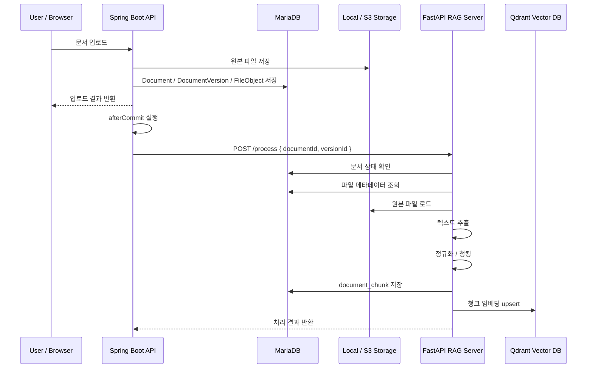

# 문서 처리 구조

EVIDO AI의 문서 처리 기능은 사용자가 업로드한 원본 문서를 RAG 검색에 사용할 수 있는 형태로 변환하는 파이프라인입니다.

문서 관리 기능이 Document, DocumentVersion, FileObject를 저장하는 역할이라면, 문서 처리 기능은 저장된 원본 파일을 읽어 **텍스트 추출 → 정규화 → 청킹 → 임베딩 → Vector DB 저장**까지 수행합니다.

- PDF, TXT, DOCX 등 다양한 문서에서 텍스트 추출
- 긴 문서를 검색 가능한 청크 단위로 분할
- 문서 청크를 RDB에 저장하여 원문 근거로 활용
- 청크 내용을 임베딩하여 Qdrant Vector DB에 저장
- 질문과 유사한 문서 조각을 빠르게 검색할 수 있는 구조 제공
- Local 저장소와 S3 저장소를 모두 처리할 수 있는 구조 제공
- 문서 삭제 시 RDB 청크와 Vector DB 데이터를 함께 정리할 수 있는 구조 마련

---

## 1. 전체 처리 흐름

```text
문서 업로드 완료
→ Spring Boot 트랜잭션 커밋
→ FastAPI RAG 서버 /process 호출
→ 문서 상태 확인
→ 문서 버전 기준 파일 메타데이터 조회
→ Local 또는 S3에서 원본 파일 로드
→ 파일 형식별 텍스트 추출
→ 텍스트 정규화
→ 토큰 기반 청킹
→ document_chunk 테이블 저장
→ 청크 임베딩 생성
→ Qdrant Vector DB upsert
→ 처리 결과 반환
```



---

## 2. Spring Boot와 FastAPI의 역할 분리

EVIDO AI는 문서 업로드와 문서 처리를 분리했습니다.

| 영역 | 담당 서버 | 역할 |
| --- | --- | --- |
| 문서 업로드 | Spring Boot API Server | 인증, 워크스페이스 검증, 원본 파일 저장, 문서 메타데이터 저장 |
| 문서 처리 요청 | Spring Boot API Server | 트랜잭션 커밋 이후 RAG 서버에 처리 요청 |
| 텍스트 추출 | FastAPI RAG Server | 파일 형식별 텍스트 추출 |
| 청킹 | FastAPI RAG Server | 정규화된 텍스트를 검색 단위로 분할 |
| 임베딩 | FastAPI RAG Server | 청크 텍스트를 벡터로 변환 |
| Vector DB 저장 | FastAPI RAG Server | Qdrant에 청크 벡터 저장 |

이 구조를 사용한 이유는 다음과 같습니다.

- Spring Boot 서버는 서비스 도메인과 인증/권한을 담당
- FastAPI 서버는 Python 기반 AI/RAG 처리에 집중
- 임베딩 모델, OCR, LLM 연동 등 AI 관련 변경을 API 서버와 분리
- 향후 RAG 서버만 별도 확장하거나 GPU 서버로 이전하기 쉬운 구조 확보

---

## 3. 처리 요청 시점

문서 처리는 문서 업로드 트랜잭션이 성공적으로 커밋된 이후 실행됩니다.

```text
Document 저장
→ DocumentVersion 저장
→ FileObject 저장
→ currentVersionId 갱신
→ 트랜잭션 커밋
→ FastAPI /process 비동기 호출
```

Spring Boot에서는 TransactionSynchronization의 afterCommit 시점에 RAG 서버 처리를 요청합니다.

```java
private void triggerProcessAfterCommit(Long documentId, Long versionId) {
    if (!TransactionSynchronizationManager.isActualTransactionActive()) {
        safeTrigger(documentId, versionId);
        return;
    }

    TransactionSynchronizationManager.registerSynchronization(new TransactionSynchronization() {
        @Override
        public void afterCommit() {
            safeTrigger(documentId, versionId);
        }
    });
}
```

이렇게 처리한 이유는 문서 메타데이터가 DB에 저장되기 전에 RAG 서버가 조회를 시도하는 문제를 막기 위해서입니다.

---

## 4. 문서 처리 API

문서 처리는 FastAPI RAG 서버의 /process 엔드포인트에서 수행됩니다.

```http
POST /process
Content-Type: application/json
```

### 요청 예시

```json
{
  "documentId": 10,
  "versionId": 31
}
```

| 필드 | 설명 |
| --- | --- |
| documentId | 처리할 문서 ID |
| versionId | 처리할 문서 버전 ID |

### 응답 예시

```json
{
  "documentId": 10,
  "versionId": 31,
  "filePath": "ws-1/abc-manual.pdf",
  "contentType": "application/pdf",
  "extractedTextChars": 15234,
  "chunkCount": 42,
  "upserted": 42,
  "preview": [
    {
      "chunkIndex": 0,
      "tokenCount": 118,
      "contentHead": "장비 점검 절차는 다음과 같습니다..."
    }
  ]
}
```

| 필드 | 설명 |
| --- | --- |
| extractedTextChars | 추출된 전체 텍스트 길이 |
| chunkCount | 생성된 청크 수 |
| upserted | Qdrant에 저장된 벡터 수 |
| preview | 처리 결과 확인용 상위 청크 미리보기 |

---

## 5. 파일 메타데이터 조회

FastAPI RAG 서버는 documentId, versionId를 기준으로 DB에서 파일 정보를 조회합니다.

```text
Document
→ DocumentVersion
→ FileObject
```

조회하는 주요 정보는 다음과 같습니다.

| 필드 | 설명 |
| --- | --- |
| workspace_id | Vector DB payload에 저장할 워크스페이스 ID |
| document_id | 문서 ID |
| version_id | 문서 버전 ID |
| file_id | 원본 파일 ID |
| storage_provider | LOCAL 또는 S3 |
| storage_key | Local 경로 또는 S3 object key |
| content_type | 파일 MIME 타입 |

문서가 이미 삭제된 상태라면 처리를 중단합니다.

```text
Document.status == DELETED → 410 Document is deleted
```

---

## 6. 원본 파일 로드

파일 로드는 storage_provider 기준으로 분기합니다.

| 저장소 | 처리 방식 |
| --- | --- |
| LOCAL | UPLOAD_BASE_DIR와 storage_key를 조합하거나, storage_key 경로를 직접 사용 |
| S3 | S3_BUCKET과 storage_key로 파일을 다운로드한 뒤 임시 파일로 저장 |

S3 파일은 텍스트 추출 라이브러리가 로컬 파일 경로를 필요로 하기 때문에 임시 파일로 저장한 뒤 처리합니다.

```text
S3 object download
→ tempfile 생성
→ 텍스트 추출
→ finally에서 임시 파일 삭제
```

---

## 7. 텍스트 추출

텍스트 추출은 파일 확장자 기준으로 분기합니다.

| 파일 형식 | 처리 방식 | parse_method |
| --- | --- | --- |
| .txt | 여러 인코딩을 순차 시도하여 텍스트 읽기 | plain:utf-8, plain:cp949 등 |
| .csv | 행 단위로 읽고 Row n: ... 형태로 변환 | csv:{encoding} |
| .pdf | PyMuPDF로 텍스트 추출 | pymupdf_text |
| .pdf 이미지 기반 | 추출 텍스트가 너무 적으면 OCR 시도 | ocr |
| .docx | 문단과 표 내용을 추출 | docx_paragraphs_tables |
| .xlsx, .xlsm | 시트와 행 단위로 값 추출 | openpyxl_values |
| .hwpx | 압축 내부 XML을 순회하며 텍스트 추출 | zip_xml |
| .hwp | hwp5txt 명령어를 통한 추출 시도 | hwp5txt |
| 이미지 파일 | Tesseract OCR로 텍스트 추출 | ocr |

현재 화면 업로드 검증에서는 PDF, TXT, MD, DOCX 중심으로 허용하지만, RAG 서버의 추출기는 확장 가능한 형태로 구성되어 있습니다.

### TXT 인코딩 처리

TXT 파일은 한글 문서에서 인코딩 문제가 자주 발생하기 때문에 여러 인코딩을 순차적으로 시도합니다.

```text
utf-8
→ utf-8-sig
→ cp949
→ euc-kr
```

### PDF 처리

PDF는 먼저 PyMuPDF를 이용해 텍스트를 추출합니다.

```text
PDF 파일
→ PyMuPDF page.get_text("text")
→ 페이지별 텍스트 병합
```

추출된 텍스트가 너무 짧은 경우 이미지 기반 PDF일 가능성이 있으므로 OCR로 재처리합니다.

```text
추출 텍스트 길이 < 기준값
→ pdf2image로 페이지 이미지 변환
→ Tesseract OCR
→ 페이지별 텍스트 병합
```

### DOCX 처리

DOCX는 문단과 표를 모두 추출합니다.

```text
문단 텍스트 추출
→ 표 순회
→ Row 단위 문자열 생성
→ 전체 텍스트 병합
```

표 데이터는 다음과 같이 검색 가능한 텍스트로 변환합니다.

```text
[Table 1]
Row 1: 점검항목 | 기준값 | 조치사항
Row 2: 전원상태 | 정상 | 이상 시 재부팅
```

---

## 8. 텍스트 정규화

추출된 텍스트는 청킹 전에 정규화합니다.

정규화의 목적은 불필요한 공백, 줄바꿈, OCR 노이즈를 줄여 검색 품질을 높이는 것입니다.

| source_type | 정규화 방식 |
| --- | --- |
| txt | 줄바꿈 통일, 연속 공백 정리 |
| pdf | 줄바꿈 통일, 단어 하이픈 연결 복구, 공백 정리 |
| docx | 일반 텍스트 기준 정리 |
| image | OCR 결과의 특수문자, 과도한 공백 정리 |
| 기타 | 공통 정규화 적용 |

공통 정규화 예시는 다음과 같습니다.

```text
\r\n, \r → \n
연속 공백 → 단일 공백
3개 이상 줄바꿈 → 2개 줄바꿈
앞뒤 공백 제거
```

---

## 9. 청킹 전략

EVIDO AI는 단순히 고정 길이로 자르는 방식이 아니라, 문서 유형에 따라 섹션을 먼저 나누고 토큰 기준으로 청크를 생성합니다.

```text
정규화된 텍스트
→ 섹션 분리
→ 문장 / 목록 단위 분리
→ 토큰 수 기준으로 청크 생성
→ overlap 적용
```

현재 /process에서 사용하는 기본 설정은 다음과 같습니다.

| 설정 | 값 | 설명 |
| --- | --- | --- |
| chunk_tokens | 120 | 하나의 청크 목표 토큰 수 |
| overlap_tokens | 20 | 인접 청크 간 유지할 문맥 토큰 수 |
| min_tokens | 40 | 너무 짧은 청크 생성을 줄이기 위한 최소 토큰 수 |

### 9.1 섹션 분리

문서 유형에 따라 섹션 분리 기준을 다르게 적용합니다.

| source_type | 섹션 분리 방식 |
| --- | --- |
| txt, docx | 제목 패턴 중심 분리 |
| pdf, image | 문단 중심 분리 |
| 기타 | 문단 중심 분리 |

제목 패턴은 다음과 같은 형태를 인식합니다.

```text
제 1 장
제 2 절
1. 개요
1.1. 세부 항목
1) 점검 절차
[장비 점검]
```

제목 패턴으로 충분히 분리되지 않으면 문단 기준으로 다시 분리합니다.

### 9.2 문장 / 목록 단위 분리

섹션 내부에서는 줄 단위로 텍스트를 확인한 뒤, 문장 또는 목록 단위로 나눕니다.

| 유형 | 처리 방식 |
| --- | --- |
| -, •, *로 시작하는 줄 | 하나의 목록 단위로 유지 |
| 일반 문장 | 마침표, 물음표, 느낌표, 다. 기준으로 분리 |

이 방식은 매뉴얼 문서에서 점검 절차나 조치 항목이 중간에 끊기는 문제를 줄이기 위한 처리입니다.

### 9.3 Overlap 처리

청크가 목표 토큰 수를 초과하면 버퍼를 flush하고, 직전 문장 일부를 다음 청크에 carry합니다.

```text
Chunk 1: A B C D
Chunk 2: D E F G
```

이렇게 하면 청크 경계에서 문맥이 끊기는 문제를 줄일 수 있습니다.

### 9.4 긴 문장 처리

하나의 문장 또는 한 줄이 chunk_tokens보다 긴 경우에는 토큰 단위로 강제 분할합니다.

tiktoken을 사용할 수 있으면 토큰 기준으로 분할하고, 사용할 수 없으면 단어 수 기준으로 대체합니다.

---

## 10. 청크 저장 구조

생성된 청크는 document_chunk 테이블에 저장합니다.

```text
DocumentVersion
└─ DocumentChunk 1
└─ DocumentChunk 2
└─ DocumentChunk 3
```

| 컬럼 | 설명 |
| --- | --- |
| chunk_id | 청크 ID |
| document_id | 문서 ID |
| version_id | 문서 버전 ID |
| chunk_index | 문서 내 청크 순서 |
| token_count | 청크 토큰 수 |
| content | 청크 원문 |
| heading | 향후 제목 기반 검색을 위한 필드 |
| created_at | 생성 시간 |

content는 RAG 답변에서 사용자가 확인할 수 있는 근거 문단으로 활용됩니다.

---

## 11. 임베딩 및 Vector DB 저장

청크가 RDB에 저장되면, 같은 청크 내용을 임베딩하여 Qdrant에 저장합니다.

```text
DocumentChunk.content
→ FastEmbed TextEmbedding
→ vector
→ Qdrant upsert
```

현재 기본 임베딩 모델은 다음 환경변수로 설정합니다.

```text
EMBED_MODEL=sentence-transformers/paraphrase-multilingual-MiniLM-L12-v2
```

Qdrant 설정은 다음 환경변수를 사용합니다.

```text
QDRANT_HOST=127.0.0.1
QDRANT_PORT=6333
QDRANT_COLLECTION=document_chunks
```

Qdrant Collection은 서버 시작 시 확인합니다.

```text
컬렉션 없음 → 생성
컬렉션 있음 → vector size / distance 검증
```

거리 기준은 COSINE을 사용합니다.

---

## 12. Qdrant Payload 구조

Qdrant에는 벡터와 함께 최소한의 식별 정보만 payload로 저장합니다.

```json
{
  "workspaceId": 1,
  "documentId": 10,
  "versionId": 31,
  "chunkIndex": 0
}
```

| 필드 | 사용 목적 |
| --- | --- |
| workspaceId | 워크스페이스별 검색 범위 제한 |
| documentId | 특정 문서 기준 검색 / 삭제 |
| versionId | 특정 문서 버전 기준 검색 / 삭제 |
| chunkIndex | 문서 내 청크 순서 확인 |

Qdrant point id는 chunkId를 사용합니다.

```text
Qdrant point id = document_chunk.chunk_id
```

이렇게 구성하면 Vector DB 검색 결과에서 chunkId를 기준으로 RDB의 실제 청크 내용을 다시 조회할 수 있습니다.

---

## 13. 검색과의 연결

문서 처리 결과는 질문 답변 단계에서 사용됩니다.

```text
사용자 질문
→ 질문 임베딩 생성
→ Qdrant 검색
→ workspaceId 기준 필터링
→ 유사한 chunkId 목록 획득
→ document_chunk 테이블에서 content 조회
→ LLM 프롬프트에 근거 문단으로 삽입
→ 답변 생성
```

검색 시 기본적으로 workspaceId 필터를 적용하기 때문에 다른 워크스페이스의 문서 청크가 검색 결과에 섞이지 않습니다.

필요하면 documentId, versionId 조건도 함께 적용할 수 있습니다.

---

## 14. 삭제 처리

문서를 삭제하면 문서 상태를 DELETED로 변경한 뒤, 커밋 이후 청크와 벡터 데이터를 정리합니다.

```text
Document.status = DELETED
→ afterCommit
→ document_chunk 삭제
→ Qdrant vector 삭제
→ Local 파일 삭제
→ FileObject 삭제
→ DocumentVersion 삭제
```

Vector DB 삭제는 RAG 서버의 /vectors 삭제 API를 호출하여 처리합니다.

```http
DELETE /vectors?documentId=10
DELETE /vectors?documentId=10&versionId=31
```

---

## 15. 예외 처리

문서 처리 중 발생할 수 있는 주요 예외는 다음과 같습니다.

| 상황 | 처리 |
| --- | --- |
| 문서를 찾을 수 없음 | 404 Document를 찾을 수 없습니다 |
| 삭제된 문서 처리 요청 | 410 Document is deleted |
| 파일 메타데이터 없음 | 404 Document/version을 찾을 수 없습니다 |
| storage_key 없음 | 400 storage_key 없음 |
| Local 파일 없음 | 404 파일이 존재하지 않음 |
| 지원하지 않는 저장소 | 400 지원하지 않는 storage_provider |
| 지원하지 않는 파일 형식 | 400 지원하지 않는 파일 형식 |
| 추출 텍스트 없음 | 400 추출된 텍스트가 비어있음 |
| 청크 생성 실패 | 400 Chunking produced no chunks |
| Qdrant Collection 불일치 | 서버 실행 시 예외 발생 |

현재 Spring Boot에서 RAG 처리 요청은 비동기로 호출하고, 실패 시 업로드 응답 자체는 실패시키지 않습니다.

```text
업로드 성공
→ RAG 처리 실패 가능
→ 추후 처리 상태 관리 필요
```

---

## 16. 현재 구조의 장점

| 항목 | 설명 |
| --- | --- |
| 서버 역할 분리 | Spring Boot는 서비스 도메인, FastAPI는 AI 처리 담당 |
| 저장소 확장성 | Local / S3 저장소를 동일한 처리 흐름으로 지원 |
| 문서 버전 대응 | documentId, versionId 기준으로 청크와 벡터 관리 가능 |
| 근거 추적 가능 | RDB에 청크 원문을 저장하여 답변 근거로 표시 가능 |
| 워크스페이스 격리 | Vector payload에 workspaceId를 저장하여 검색 범위 제한 가능 |
| 임베딩 모델 교체 가능 | 환경변수로 임베딩 모델 변경 가능 |
| 삭제 동기화 구조 | 문서 삭제 시 RDB 청크와 Vector DB 데이터를 함께 정리 가능 |

---

## 17. 개선 예정

현재 문서 처리 구조는 기본적인 RAG 검색에는 사용할 수 있지만, 운영 품질을 높이기 위해 다음 개선이 필요합니다.

| 구분 | 개선 내용 |
| --- | --- |
| 처리 상태 관리 | 문서별 PROCESSING, READY, FAILED 상태 추가 |
| 재처리 기능 | 실패한 문서를 다시 처리하는 API 추가 |
| 중복 처리 방지 | 같은 documentId, versionId 재처리 시 기존 청크/벡터 삭제 후 재생성 |
| OCR 고도화 | 이미지 PDF, 스캔 문서의 OCR 정확도 개선 |
| 표 처리 개선 | PDF/Excel 표 구조를 더 의미 있는 텍스트로 변환 |
| 청킹 개선 | 제목, 페이지 번호, 섹션 정보를 청크 metadata로 저장 |
| 검색 품질 개선 | Hybrid Search, BM25, reranking 적용 검토 |
| 비동기 처리 | 문서 처리 작업을 Queue 기반으로 분리 |
| 진행률 표시 | 프론트엔드에서 문서 처리 진행 상태 표시 |
| 보안 강화 | S3 접근 권한, presigned URL 만료 정책, 파일 확장자 검증 강화 |
