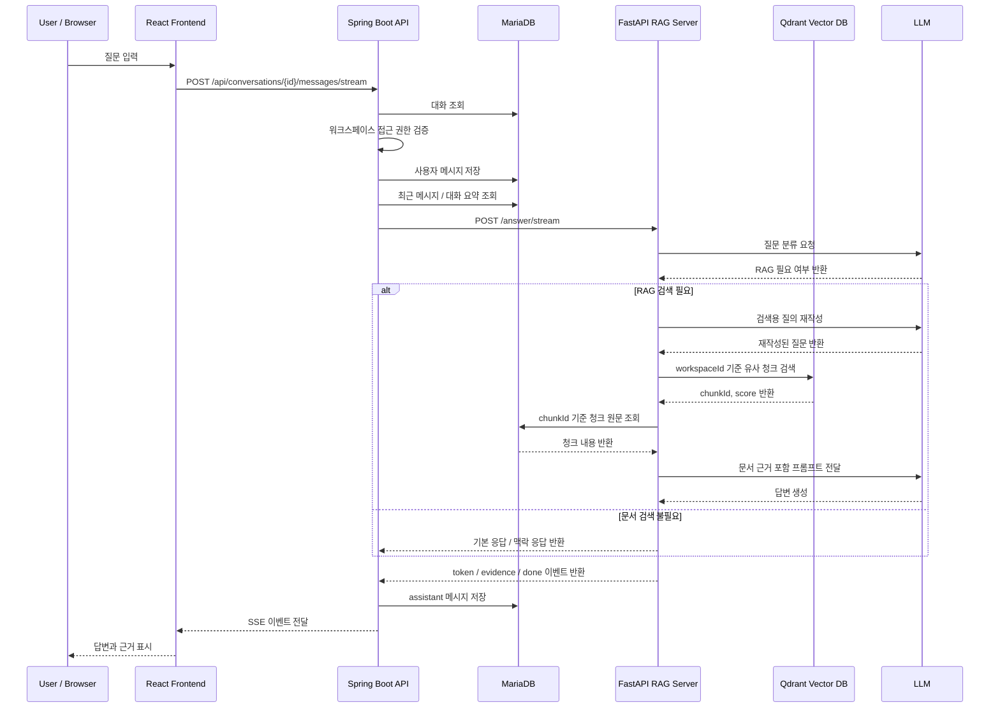

# RAG 답변 생성 기능

EVIDO AI의 RAG 답변 생성 기능은 사용자가 입력한 질문을 업로드된 문서와 연결하여 답변하는 핵심 기능입니다.

일반적인 AI 챗봇처럼 질문을 바로 LLM에 전달하지 않고, **질문 분류 → 대화 맥락 구성 → 질의 재작성 → 문서 검색 → 근거 조회 → LLM 답변 생성 → 근거 반환** 흐름을 거쳐 답변을 생성합니다.

이 기능은 Spring Boot API 서버와 FastAPI RAG 서버를 분리하여 구현했습니다.

- Spring Boot API Server: 인증, 워크스페이스 권한 검증, 대화/메시지 저장, RAG 서버 호출
- FastAPI RAG Server: 질문 분류, 질의 재작성, Qdrant 검색, LLM 답변 생성
- Qdrant Vector DB: 문서 청크 벡터 검색
- MariaDB: 대화, 메시지, 문서 청크 원문 저장

---

## 1. 기능 목적

- 업로드된 문서 내용을 기반으로 답변 생성
- 답변의 근거가 되는 문서 청크를 함께 반환
- 문서 근거가 부족한 경우 임의로 답변하지 않도록 제어
- 이전 대화 맥락을 반영한 후속 질문 처리
- 질문 유형에 따라 문서 검색 여부 판단
- 답변 스타일과 근거 표시 방식을 사용자 설정에 따라 조정
- 일반 응답과 스트리밍 응답을 모두 지원할 수 있는 구조 구성

---

## 2. 전체 답변 생성 흐름

```text
사용자 질문 입력
→ Spring Boot API Server에서 워크스페이스 접근 권한 검증
→ 사용자 메시지 저장
→ 최근 대화 / 대화 요약 기반 ConversationContext 생성
→ FastAPI RAG Server /answer 또는 /answer/stream 호출
→ 질문 분류
→ RAG 필요 여부 판단
→ 후속 질문이면 검색용 질의로 재작성
→ Qdrant Vector DB에서 유사 문서 청크 검색
→ 검색된 chunkId 기준으로 MariaDB에서 청크 원문 조회
→ 문서 근거를 프롬프트에 포함
→ LLM 답변 생성
→ 답변과 근거 반환
→ assistant 메시지 저장
→ 필요 시 대화 요약 갱신
```



---

## 3. 주요 사용자 흐름

### 3.1 새 대화에서 첫 질문

새 대화 화면에서 첫 질문을 보내면 서버가 대화를 먼저 생성한 뒤 질문을 처리합니다.

```text
새 대화 페이지
→ 첫 질문 입력
→ Conversation 생성
→ User Message 저장
→ RAG 답변 생성
→ Assistant Message 저장
→ 생성된 conversationId로 이동
```

사용 API는 다음과 같습니다.

| Method | URL | 설명 |
| --- | --- | --- |
| POST | /api/conversations/workspaces/{workspaceId}/first-message | 첫 메시지 전송 |
| POST | /api/conversations/workspaces/{workspaceId}/first-message/stream | 첫 메시지 스트리밍 전송 |

### 3.2 기존 대화에서 이어서 질문

기존 대화에서는 현재 conversationId를 기준으로 질문을 이어서 저장합니다.

```text
기존 대화 선택
→ 질문 입력
→ User Message 저장
→ 이전 대화 요약 + 최근 메시지 조회
→ RAG 답변 생성
→ Assistant Message 저장
```

사용 API는 다음과 같습니다.

| Method | URL | 설명 |
| --- | --- | --- |
| POST | /api/conversations/{conversationId}/messages | 메시지 전송 |
| POST | /api/conversations/{conversationId}/messages/stream | 메시지 스트리밍 전송 |
| GET | /api/conversations/{conversationId}/messages | 메시지 목록 조회 |

### 3.3 직접 QA 호출

대화 저장 흐름과 별도로 문서 기반 질문/답변 API도 제공합니다.

| Method | URL | 설명 |
| --- | --- | --- |
| POST | /api/qa/answer | 문서 기반 질문/답변 |

현재 실제 채팅 화면에서는 주로 /api/conversations/.../messages/stream 흐름을 사용합니다.

---

## 4. Spring Boot API Server 역할

Spring Boot 서버는 AI 답변을 직접 생성하지 않고, 서비스 도메인 흐름을 담당합니다.

| 역할 | 설명 |
| --- | --- |
| 인증 확인 | JWT 기반 인증 사용자 확인 |
| 권한 검증 | 사용자가 해당 워크스페이스에 접근 가능한지 확인 |
| 대화 관리 | Conversation 생성, 조회, 삭제, 제목 관리 |
| 메시지 저장 | 사용자 메시지와 AI 메시지 저장 |
| 대화 맥락 구성 | 대화 요약과 최근 메시지를 RAG 서버 요청에 포함 |
| 사용자 설정 적용 | 답변 스타일, 근거 표시 방식을 RAG 요청에 포함 |
| RAG 서버 호출 | WebClient로 FastAPI /answer, /answer/stream 호출 |
| 스트리밍 중계 | FastAPI SSE 이벤트를 React 클라이언트로 다시 전달 |

### 관련 클래스

| 클래스 | 역할 |
| --- | --- |
| MessageController | 메시지 전송, 메시지 스트리밍, 첫 메시지 전송 API 제공 |
| MessageService | 일반 메시지 전송과 답변 저장 처리 |
| MessageStreamService | SSE 기반 스트리밍 답변 처리 |
| QaController | 직접 QA API 제공 |
| QaService | QA UseCase 구현 |
| RagQaAdapter | FastAPI RAG 서버 호출 어댑터 |
| RagAnswerRequest | RAG 서버 요청 DTO |
| RagAnswerResponse | RAG 서버 응답 DTO |

---

## 5. FastAPI RAG Server 역할

FastAPI RAG 서버는 질문을 분석하고 실제 RAG 답변을 생성합니다.

| 역할 | 설명 |
| --- | --- |
| 질문 분류 | 질문이 문서 검색이 필요한지 판단 |
| 맥락 응답 | 이전 대화 내용을 묻는 질문은 문서 검색 없이 답변 |
| 질의 재작성 | 후속 질문을 검색 가능한 독립 질문으로 변환 |
| 벡터 검색 | Qdrant에서 질문과 유사한 문서 청크 검색 |
| 청크 원문 조회 | 검색 결과의 chunkId로 MariaDB에서 원문 조회 |
| 프롬프트 생성 | 대화 맥락, 재작성 질문, 문서 근거를 프롬프트에 포함 |
| LLM 호출 | Groq 기반 LLM으로 답변 생성 |
| 스트리밍 이벤트 생성 | status, evidence, token, done, error 이벤트 반환 |

### 관련 파일

| 파일 | 역할 |
| --- | --- |
| app/api/answer.py | /answer, /answer/stream API |
| app/services/answer_orchestrator.py | RAG 답변 생성 전체 흐름 조율 |
| app/services/question_router.py | 질문 분류 |
| app/services/query_rewriter.py | 후속 질문 재작성 |
| app/services/vector_index.py | Qdrant 검색 / 임베딩 처리 |
| app/services/llm_groq.py | Groq LLM 답변 생성 |
| app/schemas/answer.py | 답변 요청/응답 스키마 |
| app/schemas/router.py | 질문 분류 결과 스키마 |

---

## 6. 질문 분류

사용자 질문은 먼저 QuestionRouter를 통해 분류됩니다.

분류 결과에 따라 문서 검색을 수행할지, 기본 응답을 반환할지 결정합니다.

| action | 설명 | 처리 방식 |
| --- | --- | --- |
| BASIC_RESPONSE | 인사, 감사, 서비스 사용법 등 | 문서 검색 없이 기본 응답 |
| CONTEXT_RESPONSE | 이전 대화, 방금 한 말, 최근 대화 질문 | 최근 메시지 / 대화 요약 기반 응답 |
| RAG_REQUIRED | 업로드 문서 내용에 대한 질문 | Qdrant 검색 후 LLM 답변 생성 |
| CLARIFY | 의도가 불명확한 질문 | 추가 질문 요청 |
| OUT_OF_SCOPE | 문서와 무관한 최신 정보, 일반 지식 질문 | 문서 기반 답변 불가 안내 |

질문 분류 결과 예시는 다음과 같습니다.

```json
{
  "action": "RAG_REQUIRED",
  "reason": "업로드된 문서의 내용을 묻는 질문입니다.",
  "response": null,
  "top_k": 5,
  "prompt_type": "qa",
  "confidence": 0.8
}
```

### Fallback 처리

라우터 호출에 실패하거나 신뢰도가 낮은 경우, 답변 누락을 줄이기 위해 RAG_REQUIRED로 fallback합니다.

```text
질문 분류 실패
→ RAG_REQUIRED 처리
→ 문서 검색 시도
```

이 방식은 잘못된 기본 응답보다 문서 검색을 우선하기 위한 선택입니다.

---

## 7. 대화 맥락 구성

후속 질문 처리를 위해 Spring Boot 서버는 RAG 서버 요청에 대화 맥락을 포함합니다.

대화 맥락은 다음 두 가지로 구성됩니다.

| 데이터 | 설명 |
| --- | --- |
| conversationSummary | 이전 대화의 요약 내용 |
| recentMessages | 최근 메시지 목록 |

현재 최근 메시지는 최대 6개까지 포함합니다.

```text
최근 메시지 조회
→ 현재 사용자 메시지 제외
→ 생성일 기준 최신 6개 선택
→ 다시 시간순 정렬
→ role, content 형태로 RAG 서버에 전달
```

요청 DTO 구조는 다음과 같습니다.

```json
{
  "workspaceId": 1,
  "conversationId": 10,
  "queryText": "그럼 이건 어떻게 조치해?",
  "topK": 5,
  "conversationSummary": "사용자는 HI-SCAN 에러코드 2067에 대해 질문했다.",
  "recentMessages": [
    {
      "role": "user",
      "content": "HI-SCAN 에러코드 2067이 뭐야?"
    },
    {
      "role": "assistant",
      "content": "갠트리 주파수 컨버터 관련 오류입니다."
    }
  ],
  "answerStyle": "EVIDENCE",
  "evidenceMode": "SIMPLE"
}
```

---

## 8. 질의 재작성

후속 질문은 단독으로 검색하기 어렵기 때문에 QueryRewriter에서 검색용 질문으로 변환합니다.

예를 들어 사용자가 다음처럼 질문할 수 있습니다.

```text
그럼 이건 어떻게 조치해?
```

이 질문만으로는 검색에 필요한 키워드가 부족합니다. 따라서 최근 대화와 대화 요약을 활용해 다음처럼 변환합니다.

```text
HI-SCAN 장비에서 에러코드 2067이 발생했을 때 조치 방법은 무엇인가?
```

질의 재작성은 다음 기준으로 동작합니다.

- 이전 대화에 의존하는 표현을 구체화
- 문서 검색에 필요한 핵심 키워드 포함
- 이미 독립적인 질문이면 원문을 거의 유지
- 답변을 생성하지 않고 검색용 질문만 반환
- 재작성 실패 시 원본 질문으로 fallback

---

## 9. 문서 청크 검색

재작성된 질문은 임베딩된 뒤 Qdrant Vector DB에서 검색됩니다.

검색 조건에는 반드시 workspaceId가 포함됩니다.

```text
질문 텍스트
→ FastEmbed 임베딩 생성
→ Qdrant collection 검색
→ workspaceId 필터 적용
→ 유사도 상위 청크 반환
```

Qdrant point 구조는 다음과 같습니다.

```json
{
  "id": 1001,
  "vector": [0.01, 0.23, -0.11],
  "payload": {
    "workspaceId": 1,
    "documentId": 20,
    "versionId": 31,
    "chunkIndex": 3
  }
}
```

검색 결과에서는 point id를 chunkId로 사용합니다.

```text
Qdrant 검색 결과 point.id
→ chunkId로 변환
→ MariaDB document_chunk 테이블에서 원문 조회
```

현재 기본 검색 개수는 topK = 5입니다. 라우터 결과나 요청 값에 따라 변경할 수 있습니다.

---

## 10. 근거 조회와 응답 데이터 구성

Qdrant는 벡터와 payload 중심으로 저장하고, 실제 청크 원문은 MariaDB에서 조회합니다.

```text
Qdrant 검색 결과
→ chunkId 추출
→ MariaDB에서 chunkId 목록 조회
→ 검색 점수와 원문 청크 매칭
→ LLM context 생성
→ 사용자에게 표시할 evidence 생성
```

근거 응답 구조는 다음과 같습니다.

```json
{
  "chunkId": 1001,
  "score": 0.83,
  "chunkIndex": 3,
  "contentHead": "에러코드 2067은 갠트리 주파수 컨버터 관련 오류로..."
}
```

현재 일반 QA 응답의 근거 정보는 다음 필드를 중심으로 제공합니다.

| 필드 | 설명 |
| --- | --- |
| chunkId | 문서 청크 ID |
| score | Qdrant 유사도 점수 |
| chunkIndex | 문서 내 청크 순서 |
| contentHead | 청크 내용 일부 |

스트리밍 이벤트 타입에는 documentId, versionId 필드도 확장 가능하도록 포함되어 있습니다.

---

## 11. LLM 프롬프트 구성

LLM에는 사용자 질문만 전달하지 않고, 다음 정보를 함께 전달합니다.

- 대화 요약
- 최근 대화
- 현재 질문
- 검색용으로 재작성된 질문
- 문서 근거
- 답변 스타일 설정
- 근거 표시 설정

프롬프트 구성 예시는 다음과 같습니다.

```text
[대화 요약]
사용자는 HI-SCAN 장비 오류 조치에 대해 질문하고 있다.

[최근 대화]
user: HI-SCAN 에러코드 2067이 뭐야?
assistant: 갠트리 주파수 컨버터 관련 오류입니다.

[현재 질문]
그럼 이건 어떻게 조치해?

[검색용으로 재작성된 질문]
HI-SCAN 장비에서 에러코드 2067 발생 시 조치 방법은 무엇인가?

[문서 근거]
[근거 1] chunkId=1001 chunkIndex=3 score=0.83
에러코드 2067 발생 시 장비 전원을 확인하고...

[답변]
```

LLM 시스템 프롬프트에는 다음 원칙을 포함합니다.

- 제공된 문서 근거를 최우선으로 사용
- 대화 요약과 최근 대화는 질문 의도 파악에만 사용
- 문서 근거에 없는 내용은 추측하지 않음
- 문서에 명시된 수치, 조건, 절차를 정확히 유지
- 답변은 한국어로 작성

---

## 12. 답변 스타일과 근거 표시 방식

사용자는 답변 스타일과 근거 표시 방식을 설정할 수 있습니다.

### 답변 스타일

| 값 | 설명 |
| --- | --- |
| EVIDENCE | 문서 근거 중심으로 답변 |
| SIMPLE | 핵심만 짧게 답변 |
| DETAILED | 배경과 이유를 포함해 자세히 답변 |
| BUSINESS | 실무 적용 관점으로 답변 |

### 근거 표시 방식

| 값 | 설명 |
| --- | --- |
| SIMPLE | 핵심 근거를 간단히 표시 |
| DETAILED | 문서명, 문서 조각, 관련도 등 상세 근거 표시 목표 |

Spring Boot의 RagAnswerRequest는 사용자 설정을 기반으로 answerStyleInstruction을 생성해 RAG 서버에 전달합니다.

```text
answerStyle = EVIDENCE
→ 문서 근거를 우선으로 답변하세요. 추측은 피하고, 근거가 부족한 내용은 부족하다고 말하세요.

answerStyle = BUSINESS
→ 실무 적용 관점에서 답변하세요. 실제 업무에서 확인할 점, 주의사항, 활용 방법을 중심으로 정리하세요.
```

---

## 13. 스트리밍 답변 처리

EVIDO AI는 일반 응답뿐 아니라 SSE 기반 스트리밍 응답을 지원합니다.

스트리밍 흐름은 다음과 같습니다.

```text
React fetch 요청
→ Spring Boot SseEmitter 생성
→ 별도 TaskExecutor에서 RAG 서버 호출
→ FastAPI /answer/stream 응답 수신
→ status / evidence / token / done 이벤트 변환
→ React 화면에 실시간 반영
→ 답변 완료 후 assistant 메시지 저장
```

### 스트리밍 이벤트 타입

| type | 설명 |
| --- | --- |
| user_message | 사용자 메시지가 DB에 저장되었음을 알림 |
| status | 현재 처리 상태 표시 |
| evidence | 검색된 문서 근거 목록 전달 |
| token | LLM 답변 토큰 전달 |
| done | 답변 생성 완료 |
| error | 오류 발생 |

### 이벤트 예시

```json
{
  "type": "status",
  "message": "관련 문서를 검색하고 있습니다."
}
```

```json
{
  "type": "evidence",
  "evidences": [
    {
      "chunkId": 1001,
      "score": 0.83,
      "chunkIndex": 3,
      "contentHead": "에러코드 2067은 갠트리 주파수 컨버터 관련 오류로..."
    }
  ]
}
```

```json
{
  "type": "token",
  "role": "assistant",
  "content": "먼저 장비 상태를 확인하고"
}
```

```json
{
  "type": "done",
  "conversationId": 10,
  "messageId": 55,
  "role": "assistant",
  "createdAt": "2026-07-07T12:00:00"
}
```

---

## 14. React Frontend 처리

프론트엔드는 fetch로 SSE 응답을 직접 읽습니다.

Axios 대신 fetch를 사용하는 이유는 브라우저의 ReadableStream을 통해 스트리밍 응답을 직접 처리하기 위해서입니다.

프론트엔드 처리 흐름은 다음과 같습니다.

```text
사용자 질문 입력
→ 임시 user 메시지와 assistant 메시지 추가
→ /messages/stream 요청
→ data: 라인 단위로 SSE 파싱
→ token 이벤트마다 assistant 메시지에 텍스트 누적
→ evidence 이벤트 수신 시 근거 목록 저장
→ done 이벤트 수신 시 loading 해제
→ 첫 메시지인 경우 생성된 conversationId로 이동
```

관련 파일은 다음과 같습니다.

| 파일 | 역할 |
| --- | --- |
| src/pages/conversation/ConversationPage.tsx | 채팅 화면, 스트리밍 이벤트 반영 |
| src/api/conversations.ts | 메시지 API, SSE 요청 및 파싱 |
| src/types/ChatStream.ts | 스트리밍 이벤트 타입 정의 |
| src/types/Conversation.ts | 메시지 타입 정의 |

---

## 15. 일반 응답과 스트리밍 응답 비교

| 구분 | 일반 응답 | 스트리밍 응답 |
| --- | --- | --- |
| API | /messages, /qa/answer | /messages/stream, /first-message/stream |
| 응답 방식 | 답변 생성 완료 후 한 번에 반환 | 토큰 단위로 실시간 반환 |
| 사용자 경험 | 답변 완료까지 대기 | 생성 과정을 실시간 확인 가능 |
| 서버 처리 | Mono 기반 WebClient 호출 | SseEmitter + RAG SSE 중계 |
| 메시지 저장 | 답변 생성 후 user/assistant 저장 | user 저장 후 token 누적, 완료 시 assistant 저장 |
| 근거 표시 | 응답 body의 evidences | evidence 이벤트로 먼저 표시 가능 |

---

## 16. 예외 처리

### 16.1 문서 근거 없음

Qdrant 검색 결과가 없으면 다음 메시지를 반환합니다.

```text
문서에서 근거를 찾지 못했습니다.
```

### 16.2 chunkId 파싱 실패

Qdrant point id를 chunkId로 변환하지 못하면 다음 메시지를 반환합니다.

```text
문서에서 근거를 찾지 못했습니다. 검색 결과의 chunk_id를 확인하지 못했습니다.
```

### 16.3 DB 청크 조회 실패

검색 결과는 있지만 MariaDB에서 청크 원문을 찾지 못하면 다음 메시지를 반환합니다.

```text
문서에서 근거를 찾지 못했습니다. DB에서 청크를 가져오지 못했거나 chunk_id 매칭에 실패했습니다.
```

### 16.4 LLM 호출 실패

LLM 호출이 실패하면 근거는 유지하고, 답변 생성 실패 메시지를 반환합니다.

```text
현재 LLM 호출이 불가하여 답변을 생성하지 못했습니다.
아래 근거를 확인해 주세요.
```

### 16.5 클라이언트 연결 종료

스트리밍 중 사용자가 페이지를 이동하거나 연결이 끊기면 다음 방식으로 처리합니다.

```text
연결 종료 감지
→ 현재까지 생성된 답변이 있으면 partial assistant message 저장
→ 내용 뒤에 [응답 생성이 중단되었습니다.] 표시
→ 대화 요약 갱신 시도
```

이 처리를 통해 사용자가 중간에 화면을 벗어나도 생성된 답변 일부를 보존할 수 있습니다.

---

## 17. 주요 요청 / 응답 예시

### 17.1 메시지 스트리밍 요청

```http
POST /api/conversations/10/messages/stream
Content-Type: application/json
Accept: text/event-stream
```

```json
{
  "content": "이 문서의 핵심 내용을 요약해줘",
  "answerStyle": "EVIDENCE",
  "evidenceMode": "SIMPLE"
}
```

### 17.2 직접 QA 요청

```http
POST /api/qa/answer
Content-Type: application/json
```

```json
{
  "workspaceId": 1,
  "conversationId": 10,
  "queryText": "에러코드 2067 조치 방법 알려줘",
  "topK": 5,
  "answerStyle": "EVIDENCE",
  "evidenceMode": "SIMPLE"
}
```

### 17.3 직접 QA 응답

```json
{
  "success": true,
  "code": null,
  "message": "질문 처리가 완료되었습니다.",
  "data": {
    "queryText": "에러코드 2067 조치 방법 알려줘",
    "answer": "문서 기준으로 에러코드 2067은 갠트리 주파수 컨버터 관련 오류입니다...",
    "evidences": [
      {
        "chunkId": 1001,
        "score": 0.83,
        "chunkIndex": 3,
        "contentHead": "Error 2067 indicates a gantry frequency converter issue..."
      }
    ]
  }
}
```

---

## 18. 현재 구현 기준 정리

현재 코드 기준 주요 구현 상태는 다음과 같습니다.

| 항목 | 구현 상태 |
| --- | --- |
| 문서 기반 Q&A | 구현 |
| 질문 분류 | 구현 |
| 후속 질문 재작성 | 구현 |
| Qdrant 유사도 검색 | 구현 |
| workspaceId 기반 검색 필터 | 구현 |
| MariaDB 청크 원문 조회 | 구현 |
| 근거 반환 | 구현 |
| 답변 스타일 설정 | 구현 |
| 근거 표시 방식 설정 | 구현 |
| SSE 스트리밍 답변 | 구현 |
| 스트리밍 중 partial 저장 | 구현 |
| 대화 요약 기반 맥락 전달 | 구현 |
| 캐시 조회 | 응답 필드는 있으나 현재 실제 캐시 로직은 미적용 |
| 문서명 표시 | 현재 근거 응답에는 chunk 중심 정보 제공, 문서명 연결 개선 예정 |
| 내부 LLM 전환 | Ollama/Gemini 파일은 존재하지만 현재 Orchestrator는 Groq 중심 사용 |

---

## 19. 설계 포인트

### 19.1 Spring Boot와 FastAPI 분리

AI/RAG 처리는 Python 생태계와 잘 맞기 때문에 FastAPI 서버로 분리했습니다.

이를 통해 Spring Boot 서버는 인증, 권한, 도메인 로직에 집중하고, RAG 서버는 임베딩, 검색, LLM 호출에 집중할 수 있습니다.

### 19.2 Vector DB와 RDB 역할 분리

Qdrant에는 검색에 필요한 벡터와 최소 payload를 저장하고, 실제 청크 원문은 MariaDB에서 관리합니다.

이 구조를 사용하면 다음 장점이 있습니다.

- Vector DB에는 검색에 필요한 데이터만 저장
- 원문 청크는 RDB에서 관리하여 조회와 검증이 쉬움
- 문서, 버전, 청크 관계를 RDB에서 안정적으로 관리
- 검색 결과의 chunkId를 기준으로 원문 근거를 다시 확인 가능

### 19.3 문서 근거 우선 프롬프트

LLM 답변은 항상 문서 근거를 우선하도록 프롬프트를 구성했습니다.

특히 다음 원칙을 명시했습니다.

```text
문서 근거에 없는 내용은 추측하지 말고,
문서에서 확인되지 않는다고 말한다.
```

이를 통해 AI 답변의 환각 가능성을 줄이고, 문서 기반 서비스의 신뢰성을 높이고자 했습니다.

### 19.4 사용자 설정 기반 답변 제어

같은 질문이라도 사용자가 원하는 답변 방식이 다를 수 있습니다.

따라서 답변 스타일과 근거 표시 방식을 별도로 두어 다음과 같은 사용 시나리오를 지원합니다.

- 빠르게 핵심만 보고 싶은 경우: SIMPLE
- 학습 목적으로 자세히 알고 싶은 경우: DETAILED
- 실제 업무 적용 포인트가 필요한 경우: BUSINESS
- 문서 근거 확인이 중요한 경우: EVIDENCE

---

## 20. 개선 예정

향후 RAG 답변 생성 기능은 다음 방향으로 개선할 수 있습니다.

| 구분 | 개선 내용 |
| --- | --- |
| 근거 표시 개선 | 문서명, 페이지 번호, 문서 버전, 원문 위치 표시 |
| 검색 품질 개선 | 문서별 필터, 하이브리드 검색, reranking 적용 |
| 캐싱 | 동일 질문 / 유사 질문에 대한 답변 캐싱 적용 |
| 스트리밍 개선 | FastAPI 이벤트명과 Spring 이벤트명 정합성 개선 |
| LLM 전환 | Groq, Gemini, Ollama를 설정 기반 Adapter로 전환 |
| 내부 LLM | 폐쇄망 또는 온프레미스 LLM 사용 구조 구체화 |
| 답변 검증 | 생성 답변이 실제 근거 청크를 반영했는지 검증 단계 추가 |
| 출처 UX | 답변 문장과 근거 청크를 연결하여 표시 |
| 요약 품질 | 대화 요약 생성 기준과 갱신 조건 고도화 |
| 오류 복구 | RAG 서버 장애 시 사용자 친화적인 fallback 응답 제공 |
