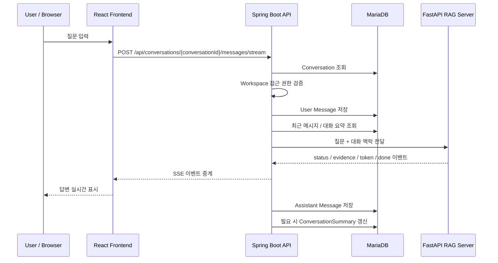

# 대화 관리 기능

EVIDO AI의 대화 관리 기능은 사용자가 워크스페이스 안에서 문서 기반 질문을 이어갈 수 있도록 **대화 생성, 메시지 저장, RAG 답변 연동, SSE 스트리밍 응답, 대화 요약**을 담당하는 기능입니다.

단순히 채팅 UI만 제공하는 것이 아니라, 각 대화를 워크스페이스와 연결하고, 이전 대화 맥락을 RAG 서버에 전달하여 후속 질문도 자연스럽게 처리할 수 있도록 설계했습니다.

---

## 1. 기능 목적

대화 관리 기능은 다음 목적을 기준으로 구현했습니다.

- 워크스페이스별 대화 목록 관리
- 새 대화 생성 및 첫 메시지 전송 처리
- 기존 대화에서 사용자 메시지와 AI 메시지 이어서 저장
- 이전 대화 맥락을 RAG 답변 생성에 활용
- SSE 기반 실시간 답변 스트리밍 지원
- 답변 생성 중 근거 문서 조각을 함께 전달
- 긴 대화에서 최근 메시지와 요약 정보를 조합해 컨텍스트 관리
- 사용자 중단, 네트워크 끊김 등 스트리밍 예외 상황 대응

---

## 2. 전체 구조

대화 기능은 크게 Conversation, Message, ConversationSummary 세 가지 도메인으로 구성됩니다.

```text
Workspace
└─ Conversation
   ├─ Message
   └─ ConversationSummary
```

| 도메인 | 역할 |
| --- | --- |
| Conversation | 워크스페이스 안에서 하나의 대화방을 의미합니다. |
| Message | 사용자 질문과 AI 답변을 순서대로 저장합니다. |
| ConversationSummary | 오래된 메시지를 요약하여 후속 질문 처리에 활용합니다. |

대화는 항상 워크스페이스에 속합니다. 따라서 대화 목록 조회, 메시지 조회, 메시지 전송, 대화 삭제 모두 워크스페이스 접근 권한을 확인한 뒤 처리합니다.

---

## 3. 전체 사용자 흐름

```text
워크스페이스 선택
→ 대화 목록 조회
→ 새 대화 시작 또는 기존 대화 선택
→ 사용자 질문 입력
→ 사용자 메시지 저장
→ 최근 메시지 / 대화 요약 조회
→ FastAPI RAG 서버에 질문 전달
→ RAG 답변 생성
→ assistant 메시지 저장
→ 답변과 근거를 화면에 표시
→ 필요 시 대화 요약 갱신
```



---

## 4. 주요 기능

## 4.1 대화 목록 조회

사용자는 워크스페이스에 속한 대화 목록을 확인할 수 있습니다.

```text
워크스페이스 진입
→ conversation 목록 조회
→ 생성일 기준 최신순 정렬
→ 대화 카드 목록 표시
```

백엔드에서는 workspaceId 기준으로 대화를 조회하며, 접근 권한이 없는 사용자는 조회할 수 없습니다.

```java
public List<Conversation> getConversation(GetConversationsQuery query) {
    validateWorkspaceAccess(query.workspaceId(), query.userId());
    return conversationRepositoryPort.findByWorkspaceId(query.workspaceId());
}
```

프론트엔드에서는 ConversationListPage에서 대화 목록과 문서 목록을 함께 조회하여 워크스페이스 홈 화면을 구성합니다.

---

## 4.2 새 대화 생성

새 대화는 두 가지 방식으로 생성됩니다.

| 방식 | 설명 |
| --- | --- |
| 수동 생성 | 새 대화 버튼을 누르면 빈 대화 화면으로 이동합니다. |
| 첫 메시지 전송 | 첫 질문을 보내는 순간 서버에서 대화를 생성합니다. |

실제 채팅 흐름에서는 빈 대화를 미리 저장하지 않고, 사용자가 첫 메시지를 보냈을 때 대화를 생성하는 방식을 사용합니다.

```text
/workspace/{workspaceId}/conversation/new
→ 첫 질문 입력
→ POST /first-message/stream
→ Conversation 생성
→ User Message 저장
→ RAG 답변 생성
→ Assistant Message 저장
→ /conversation/{conversationId}로 이동
```

첫 메시지 기반 생성 방식을 사용한 이유는 다음과 같습니다.

- 질문 없이 생성된 빈 대화가 DB에 쌓이는 것을 방지
- 첫 질문 내용을 기반으로 대화 제목 자동 생성 가능
- 사용자가 실제로 대화를 시작한 시점에만 대화 저장

---

## 4.3 대화 제목 자동 생성

첫 메시지로 대화가 생성될 때, 사용자 질문을 기반으로 제목을 생성합니다.

현재는 별도의 LLM 제목 생성 없이 첫 질문 앞부분을 잘라 제목으로 사용합니다.

```java
private String generateTitle(String content) {
    if (content == null || content.isBlank()) {
        return "새 대화";
    }

    String normalized = content.replaceAll("\\s+", " ").trim();
    int maxLength = 20;

    if (normalized.length() <= maxLength) {
        return normalized;
    }

    return normalized.substring(0, maxLength).trim() + "...";
}
```

예시는 다음과 같습니다.

```text
사용자 질문:
업로드한 장비 매뉴얼에서 에러코드 2067 조치 방법 알려줘

생성 제목:
업로드한 장비 매뉴얼에서 에...
```

---

## 4.4 기존 대화 메시지 조회

기존 대화를 열면 해당 대화에 저장된 메시지 목록을 조회합니다.

```text
대화 선택
→ conversationId 기준 메시지 조회
→ createdAt 오름차순 정렬
→ user / assistant 메시지 구분 표시
```

백엔드에서는 conversationId로 대화를 먼저 조회하고, 해당 대화의 workspaceId에 대해 접근 권한을 검증합니다.

```java
Conversation conversation = getConversation(query.conversationId());
validateAccess(conversation.getWorkspaceId(), query.userId());

return messageRepositoryPort.findByConversationId(query.conversationId())
        .stream()
        .map(this::toResult)
        .toList();
```

메시지는 생성일 기준 오름차순으로 조회합니다.

```java
List<MessageEntity> findByConversationIdOrderByCreatedAtAsc(Long conversationId);
```

---

## 4.5 메시지 전송

기존 대화에서 메시지를 전송하면 다음 순서로 처리합니다.

```text
Conversation 조회
→ Workspace 접근 권한 검증
→ User Message 저장
→ 대화 요약 + 최근 메시지 조회
→ AskCommand 생성
→ RAG 답변 생성
→ Assistant Message 저장
→ 필요 시 대화 요약 갱신
```

일반 응답 방식에서는 Spring Boot 서버가 RAG 서버 응답을 받은 뒤, user 메시지와 assistant 메시지를 함께 반환합니다.

```java
return qaUseCase.answer(askCommand, context)
        .flatMap(result -> {
            Message assistantMessage = saveAssistantMessage(
                    conversation.getId(),
                    result.answer()
            );

            SendMessageResult sendMessageResult = new SendMessageResult(
                    conversation.getId(),
                    List.of(
                            toResult(userMessage),
                            toResult(assistantMessage)
                    )
            );

            return conversationSummaryService.updateIfNeeded(conversation.getId())
                    .onErrorResume(e -> Mono.empty())
                    .thenReturn(sendMessageResult);
        });
```

현재 채팅 화면에서는 주로 SSE 스트리밍 방식을 사용합니다.

---

## 5. SSE 스트리밍 응답

EVIDO AI는 답변을 한 번에 반환하지 않고, 토큰 단위로 실시간 표시할 수 있도록 SSE 스트리밍을 지원합니다.

### 스트리밍 처리 흐름

```text
사용자 질문 입력
→ 프론트엔드 임시 user / assistant 메시지 추가
→ Spring Boot SSE 요청
→ User Message 저장 이벤트 수신
→ status 이벤트로 처리 상태 표시
→ evidence 이벤트로 근거 문서 표시
→ token 이벤트로 답변 누적 표시
→ done 이벤트로 실제 assistant messageId 반영
```

### 백엔드 처리 방식

MessageStreamService는 SseEmitter를 사용해 클라이언트와 스트리밍 연결을 유지합니다.

```java
public SseEmitter streamMessage(SendMessageCommand command) {
    SseEmitter emitter = new SseEmitter(0L);
    messageStreamTaskExecutor.execute(() -> runStream(command, emitter));
    return emitter;
}
```

RAG 서버에서 받은 스트림 이벤트는 Spring Boot 서버에서 다시 프론트엔드 이벤트 형식으로 변환합니다.

| RAG 이벤트 | 프론트 이벤트 | 설명 |
| --- | --- | --- |
| status | status | 질문 분석, 검색 진행 등 현재 상태 표시 |
| evidence | evidence | 검색된 근거 문서 청크 전달 |
| token | token | LLM 답변 토큰 전달 |
| error | error | RAG 처리 오류 전달 |
| 완료 | done | assistant 메시지 저장 완료 알림 |

---

## 6. 스트리밍 이벤트 구조

프론트엔드에서 처리하는 스트리밍 이벤트 타입은 다음과 같습니다.

```ts
type ChatStreamEventType =
    | "user_message"
    | "status"
    | "evidence"
    | "token"
    | "done"
    | "error";
```

### 6.1 user_message

사용자 메시지가 서버에 저장되면 실제 messageId를 전달합니다.

```json
{
  "type": "user_message",
  "conversationId": 1,
  "messageId": 100,
  "role": "user",
  "content": "문서 내용을 요약해줘",
  "createdAt": "2026-04-20T14:31:00"
}
```

프론트엔드는 임시 user 메시지 ID를 실제 서버 메시지 ID로 교체합니다.

---

### 6.2 status

답변 생성 중 현재 처리 상태를 보여줍니다.

```json
{
  "type": "status",
  "message": "질문을 분석하고 있습니다"
}
```

프론트엔드는 assistant 임시 메시지에 상태 문구를 표시합니다.

---

### 6.3 evidence

RAG 검색 결과로 사용된 근거 청크를 전달합니다.

```json
{
  "type": "evidence",
  "evidences": [
    {
      "chunkId": 12,
      "score": 0.86,
      "chunkIndex": 3,
      "contentHead": "에러코드 2067은 갠트리 주파수 컨버터 관련 오류입니다...",
      "documentId": 5,
      "versionId": 8
    }
  ]
}
```

근거는 답변 메시지 아래에 표시됩니다.

---

### 6.4 token

LLM 답변이 토큰 단위로 전달됩니다.

```json
{
  "type": "token",
  "role": "assistant",
  "content": "문서에 따르면"
}
```

프론트엔드는 token 이벤트를 받을 때마다 assistant 메시지 텍스트에 이어 붙입니다.

---

### 6.5 done

답변 생성이 완료되고 assistant 메시지가 DB에 저장되면 전달됩니다.

```json
{
  "type": "done",
  "conversationId": 1,
  "messageId": 101,
  "role": "assistant",
  "createdAt": "2026-04-20T14:31:12"
}
```

프론트엔드는 임시 assistant 메시지 ID를 실제 서버 메시지 ID로 교체하고 로딩 상태를 종료합니다.

---

### 6.6 error

스트리밍 중 오류가 발생하면 전달됩니다.

```json
{
  "type": "error",
  "code": "RAG_STREAM_ERROR",
  "message": "RAG 서버 오류가 발생했습니다."
}
```

프론트엔드는 assistant 메시지 영역에 오류 메시지를 표시합니다.

---

## 7. 대화 맥락 구성

후속 질문을 처리하려면 이전 대화 내용을 함께 전달해야 합니다.

EVIDO AI는 전체 메시지를 모두 전달하지 않고, 다음 두 가지를 조합해 ConversationContext를 구성합니다.

```text
ConversationContext
├─ summary: 오래된 대화 요약
└─ recentMessages: 최근 메시지 6개
```

### 최근 메시지 조회 기준

```java
private static final int RECENT_MESSAGE_LIMIT = 6;
```

현재 방금 저장한 user message는 제외하고, 그 이전 메시지 중 최신 6개를 다시 시간순으로 정렬해 전달합니다.

```java
messageRepositoryPort.findByConversationId(conversationId)
        .stream()
        .filter(message -> !message.getId().equals(currentMessageId))
        .sorted(Comparator.comparing(Message::getCreatedAt).reversed())
        .limit(RECENT_MESSAGE_LIMIT)
        .sorted(Comparator.comparing(Message::getCreatedAt))
        .map(message -> new ConversationContext.RecentMessage(
                message.getRole().name().toLowerCase(),
                message.getContent()
        ))
        .toList();
```

이 구조를 사용한 이유는 다음과 같습니다.

- 전체 대화를 매번 LLM에 보내면 비용과 토큰 사용량 증가
- 최근 대화는 정확한 문맥 유지에 필요
- 오래된 대화는 요약으로 압축하여 후속 질문 처리 가능
- RAG 서버에서 질문 재작성 시 대화 맥락 활용 가능

---

## 8. 대화 요약 기능

대화가 길어지면 오래된 메시지를 요약하여 저장합니다.

```text
메시지 저장 완료
→ 전체 메시지 조회
→ 최근 6개 메시지는 유지
→ 오래된 메시지 중 아직 요약되지 않은 메시지 추출
→ 최소 10개 이상이면 요약 생성
→ conversation_summary 저장 또는 갱신
```

### 요약 기준

| 기준 | 값 | 설명 |
| --- | --- | --- |
| RECENT_MESSAGE_KEEP_COUNT | 6 | 최근 메시지는 원문 그대로 유지 |
| MIN_MESSAGES_TO_SUMMARIZE | 10 | 새로 요약할 메시지가 10개 이상일 때 요약 실행 |

```java
private static final int RECENT_MESSAGE_KEEP_COUNT = 6;
private static final int MIN_MESSAGES_TO_SUMMARIZE = 10;
```

### 요약 저장 구조

```text
conversation_summary
├─ summary_id
├─ conversation_id
├─ summary
├─ last_message_id
├─ created_at
└─ updated_at
```

last_message_id를 저장하는 이유는 이미 요약한 메시지를 다시 요약하지 않기 위해서입니다.

---

## 9. FastAPI 대화 요약 연동

대화 요약은 Spring Boot 서버가 직접 생성하지 않고, FastAPI RAG 서버의 /conversation/summary API를 호출합니다.

```http
POST /conversation/summary
Content-Type: application/json
```

### 요청 예시

```json
{
  "oldSummary": "사용자는 EVIDO 프로젝트에서 RAG 답변 흐름을 구현 중이다.",
  "messages": [
    {
      "role": "user",
      "content": "문서 업로드 후 청킹은 어떻게 처리해?"
    },
    {
      "role": "assistant",
      "content": "문서 업로드 후 FastAPI 서버에서 텍스트 추출과 청킹을 수행합니다."
    }
  ]
}
```

### 응답 예시

```json
{
  "summary": "사용자는 EVIDO의 문서 업로드 이후 FastAPI 기반 텍스트 추출, 청킹, 임베딩 흐름을 구현하고 있다."
}
```

Spring Boot의 RagConversationSummaryAdapter는 WebClient로 FastAPI 서버를 호출합니다.

```java
return ragApiWebClient.post()
        .uri("/conversation/summary")
        .contentType(MediaType.APPLICATION_JSON)
        .bodyValue(request)
        .retrieve()
        .bodyToMono(ConversationSummaryGenerateResponse.class)
        .timeout(Duration.ofSeconds(timeoutSeconds))
        .map(ConversationSummaryGenerateResponse::summary);
```

---

## 10. 프론트엔드 구현

프론트엔드에서는 ConversationPage와 ConversationListPage를 중심으로 대화 기능을 구성했습니다.

| 파일 | 역할 |
| --- | --- |
| src/pages/conversation/ConversationListPage.tsx | 워크스페이스 홈, 대화 목록, 문서 목록 표시 |
| src/pages/conversation/ConversationPage.tsx | 채팅 화면, 메시지 조회, SSE 스트리밍 처리 |
| src/api/conversations.ts | 대화/메시지 API 호출 함수 |
| src/types/Conversation.ts | 대화와 메시지 타입 정의 |
| src/types/ChatStream.ts | SSE 이벤트 타입 정의 |

### 프론트엔드 메시지 처리 방식

질문 전송 시 서버 응답을 기다리지 않고 먼저 임시 메시지를 화면에 추가합니다.

```text
질문 입력
→ tempUserId 생성
→ tempAssistantId 생성
→ 화면에 임시 user / assistant 메시지 추가
→ SSE 이벤트 수신
→ 실제 messageId로 교체
```

이 방식을 사용하면 사용자는 질문을 보낸 즉시 화면에서 자신의 메시지와 AI 응답 생성 상태를 확인할 수 있습니다.

---

## 11. 프론트엔드 SSE 파싱

일반 Axios 요청이 아니라 fetch로 text/event-stream 응답을 읽습니다.

```ts
const response = await fetch(${API_BASE}${path}, {
    method: "POST",
    headers: {
        "Content-Type": "application/json",
        Accept: "text/event-stream",
    },
    credentials: "include",
    body: JSON.stringify(body),
    signal: options.signal,
});
```

응답 바디를 ReadableStream으로 읽고, \n\n 기준으로 SSE 이벤트를 분리합니다.

```ts
const rawEvents = buffer.split("\n\n");
buffer = rawEvents.pop() ?? "";

for (const rawEvent of rawEvents) {
    const event = parseSseEvent(rawEvent);

    if (event) {
        onEvent(event);
    }
}
```

SSE 응답에서 data: 라인을 추출한 뒤 JSON으로 파싱합니다.

```ts
const dataLines = rawEvent
    .split("\n")
    .map((line) => line.trimEnd())
    .filter((line) => line.startsWith("data:"))
    .map((line) => line.slice("data:".length).trimStart());
```

---

## 12. 답변 중단 처리

프론트엔드는 AbortController를 사용해 진행 중인 스트리밍 요청을 중단할 수 있습니다.

```ts
const abortController = new AbortController();
streamAbortRef.current = abortController;
```

사용자가 페이지를 벗어나거나 요청을 중단하면 기존 스트림을 abort합니다.

```ts
useEffect(() => {
    return () => {
        streamAbortRef.current?.abort();
    };
}, []);
```

백엔드에서는 클라이언트 연결 종료를 감지하고, 이미 생성된 답변이 있다면 부분 답변을 저장합니다.

```java
private Message savePartialAssistantMessageIfPossible(
        Long conversationId,
        StringBuilder answerBuffer
) {
    if (conversationId == null) {
        return null;
    }

    String content = answerBuffer.toString().trim();

    if (content.isBlank()) {
        return null;
    }

    String interruptedContent = content.endsWith("[응답 생성이 중단되었습니다.]")
            ? content
            : content + INTERRUPTED_SUFFIX;

    return saveAssistantMessage(conversationId, interruptedContent);
}
```

이를 통해 사용자가 중간에 응답을 끊어도 생성된 내용 일부를 잃지 않을 수 있습니다.

---

## 13. 주요 API

## 13.1 대화 API

| Method | URL | 설명 |
| --- | --- | --- |
| GET | /api/conversations/{workspaceId}/conversations | 워크스페이스별 대화 목록 조회 |
| POST | /api/conversations/{workspaceId}/conversations | 대화 생성 |
| PATCH | /api/conversations/{conversationId} | 대화 제목 수정 |
| DELETE | /api/conversations/{conversationId} | 대화 삭제 |

## 13.2 메시지 API

| Method | URL | 설명 |
| --- | --- | --- |
| GET | /api/conversations/{conversationId}/messages | 메시지 목록 조회 |
| POST | /api/conversations/{conversationId}/messages | 기존 대화에 메시지 전송 |
| POST | /api/conversations/{conversationId}/messages/stream | 기존 대화에 메시지 스트리밍 전송 |
| POST | /api/conversations/workspaces/{workspaceId}/first-message | 새 대화 첫 메시지 전송 |
| POST | /api/conversations/workspaces/{workspaceId}/first-message/stream | 새 대화 첫 메시지 스트리밍 전송 |

## 13.3 RAG 서버 요약 API

| Method | URL | 설명 |
| --- | --- | --- |
| POST | /conversation/summary | 오래된 대화 메시지 요약 생성 |

---

## 14. 요청 / 응답 구조

## 14.1 메시지 전송 요청

```json
{
  "content": "업로드한 문서 내용을 요약해줘",
  "answerStyle": "EVIDENCE",
  "evidenceMode": "SIMPLE"
}
```

| 필드 | 설명 |
| --- | --- |
| content | 사용자 질문 내용 |
| answerStyle | 답변 스타일 설정 |
| evidenceMode | 근거 표시 방식 설정 |

answerStyle, evidenceMode가 없는 경우 기본값을 사용합니다.

```java
public AnswerStyle effectiveAnswerStyle() {
    return answerStyle == null ? AnswerStyle.EVIDENCE : answerStyle;
}

public EvidenceMode effectiveEvidenceMode() {
    return evidenceMode == null ? EvidenceMode.SIMPLE : evidenceMode;
}
```

## 14.2 메시지 전송 응답

```json
{
  "conversationId": 1,
  "messages": [
    {
      "id": 100,
      "role": "user",
      "content": "업로드한 문서 내용을 요약해줘",
      "createdAt": "2026-04-20T14:31:00"
    },
    {
      "id": 101,
      "role": "assistant",
      "content": "문서의 핵심 내용은 다음과 같습니다...",
      "createdAt": "2026-04-20T14:31:12"
    }
  ]
}
```

---

## 15. 데이터 구조

## 15.1 conversations

| 컬럼 | 설명 |
| --- | --- |
| id | 대화 ID |
| workspace_id | 소속 워크스페이스 ID |
| title | 대화 제목 |
| created_at | 생성 일시 |

## 15.2 messages

| 컬럼 | 설명 |
| --- | --- |
| id | 메시지 ID |
| conversation_id | 소속 대화 ID |
| role | USER 또는 ASSISTANT |
| content | 메시지 내용 |
| created_at | 생성 일시 |

## 15.3 conversation_summary

| 컬럼 | 설명 |
| --- | --- |
| summary_id | 요약 ID |
| conversation_id | 대화 ID |
| summary | 요약 내용 |
| last_message_id | 마지막으로 요약된 메시지 ID |
| created_at | 생성 일시 |
| updated_at | 수정 일시 |

---

## 16. 예외 처리

| 상황 | 처리 방식 |
| --- | --- |
| 워크스페이스 접근 권한 없음 | WORKSPACE_ACCESS_DENIED 발생 |
| 메시지 내용 없음 | @NotBlank 검증 실패 |
| 메시지 길이 초과 | 5000자 초과 시 검증 실패 |
| 제목 없음 | @NotBlank 검증 실패 또는 도메인에서 새 대화 처리 |
| 제목 길이 초과 | 100자 초과 시 검증 실패 |
| RAG 스트리밍 오류 | error SSE 이벤트 전달 |
| 답변 내용 비어 있음 | EMPTY_ASSISTANT_ANSWER 이벤트 전달 |
| 클라이언트 연결 종료 | 생성된 부분 답변 저장 후 종료 |
| 대화 요약 실패 | 메시지 전송 흐름은 유지하고 요약 오류만 무시 |

대화 요약은 부가 기능이므로 실패해도 사용자 답변 흐름이 중단되지 않도록 처리했습니다.

```java
conversationSummaryService.updateIfNeeded(conversation.getId())
        .onErrorResume(e -> {
            System.out.println("[SUMMARY UPDATE ERROR] " + e.getMessage());
            return Mono.empty();
        })
```

---

## 17. 구현 포인트

## 17.1 사용자 메시지를 먼저 저장

RAG 답변을 생성하기 전에 사용자 메시지를 먼저 저장합니다.

이렇게 하면 다음 장점이 있습니다.

- 답변 생성 중 오류가 발생해도 사용자의 질문 기록은 남음
- 스트리밍 시작 시 실제 user messageId를 프론트엔드에 전달 가능
- 후속 질문 처리 시 현재 질문과 이전 대화를 명확히 분리 가능

---

## 17.2 최근 메시지와 요약을 분리

전체 메시지를 매번 전달하지 않고 최근 메시지와 요약을 나누어 전달합니다.

```text
최근 메시지 6개: 정확한 직전 문맥 유지
요약: 오래된 대화의 핵심 맥락 유지
```

이 구조는 긴 대화에서도 RAG 서버에 전달하는 컨텍스트 크기를 제한하면서 후속 질문 처리 품질을 유지하기 위한 설계입니다.

---

## 17.3 스트리밍 이벤트와 DB 저장 분리

토큰은 사용자에게 실시간 전달하지만, DB에는 토큰마다 저장하지 않습니다.

```text
token 이벤트 수신
→ answerBuffer에 누적
→ done 시점에 assistant message 1건으로 저장
```

이렇게 처리한 이유는 다음과 같습니다.

- 토큰마다 DB 저장 시 쓰기 부하 증가
- 메시지는 최종 답변 단위로 저장하는 것이 조회와 관리에 적합
- 스트리밍 중단 시에는 부분 답변만 예외적으로 저장

---

## 17.4 프론트엔드 임시 메시지 ID 사용

스트리밍 요청 직후에는 서버 메시지 ID를 아직 알 수 없기 때문에 임시 ID를 사용합니다.

```text
tempUserId
→ user_message 이벤트 수신
→ 실제 user messageId로 교체

tempAssistantId
→ token 누적 표시
→ done 이벤트 수신
→ 실제 assistant messageId로 교체
```

근거 데이터도 처음에는 tempAssistantId 기준으로 저장했다가, done 이벤트 이후 실제 assistant 메시지 ID로 옮깁니다.

---

## 18. 관련 파일

## 18.1 Backend

| 파일 | 역할 |
| --- | --- |
| ConversationController.java | 대화 목록 조회, 생성, 이름 수정, 삭제 API |
| MessageController.java | 메시지 조회, 전송, 스트리밍 전송 API |
| ConversationService.java | 대화 생성, 조회, 수정, 삭제 비즈니스 로직 |
| MessageService.java | 일반 메시지 전송과 RAG 답변 저장 처리 |
| MessageStreamService.java | SSE 기반 스트리밍 메시지 처리 |
| ConversationSummaryService.java | 대화 요약 생성 조건 판단 및 저장 |
| RagConversationSummaryAdapter.java | FastAPI 요약 API 호출 |
| Conversation.java | 대화 도메인 |
| Message.java | 메시지 도메인 |
| ConversationSummary.java | 대화 요약 도메인 |
| ConversationEntity.java | 대화 JPA Entity |
| MessageEntity.java | 메시지 JPA Entity |
| ConversationSummaryJpaEntity.java | 대화 요약 JPA Entity |

## 18.2 Frontend

| 파일 | 역할 |
| --- | --- |
| src/api/conversations.ts | 대화/메시지 API, SSE fetch 처리 |
| src/types/Conversation.ts | 대화/메시지 타입 정의 |
| src/types/ChatStream.ts | 스트리밍 이벤트 타입 정의 |
| src/pages/conversation/ConversationListPage.tsx | 대화 목록 화면 |
| src/pages/conversation/ConversationPage.tsx | 채팅 화면, 스트리밍 응답 처리 |
| src/pages/conversation/FileViewerPanel.tsx | 채팅 화면 내 문서 뷰어 패널 |

## 18.3 RAG Server

| 파일 | 역할 |
| --- | --- |
| app/api/conversation_summary.py | /conversation/summary API |
| app/schemas/conversation_summary.py | 요약 요청/응답 스키마 |
| app/services/conversation_summarizer.py | Groq 기반 대화 요약 생성 |

---

## 19. 개선 예정

| 개선 항목 | 설명 |
| --- | --- |
| 대화 목록 페이지네이션 | 대화가 많아질 경우 무한 스크롤 또는 페이지네이션 적용 |
| 메시지 페이지네이션 | 긴 대화에서 전체 메시지를 한 번에 불러오지 않도록 개선 |
| 대화 삭제 시 연관 데이터 정리 | messages, conversation_summary를 함께 삭제하거나 soft delete 적용 |
| 근거 데이터 저장 | 현재 근거는 스트리밍 중 화면 표시 중심이므로, 새로고침 후에도 보이도록 별도 저장 구조 검토 |
| 제목 생성 고도화 | 첫 질문 자르기 방식에서 LLM 기반 제목 요약으로 개선 |
| 응답 필드명 통일 | 백엔드 ConversationResponse의 createAt 필드를 프론트 타입의 createdAt과 통일 필요 |
| 스트리밍 재시도 정책 | 네트워크 오류 발생 시 재연결 또는 재시도 UX 개선 |
| 메시지 검색 | 대화 내부 메시지 검색 기능 추가 |
| 대화 공유 | 워크스페이스 멤버 간 대화 공유 기능 확장 |
| 대화 보관 / 즐겨찾기 | 중요한 대화를 고정하거나 보관하는 기능 추가 |
