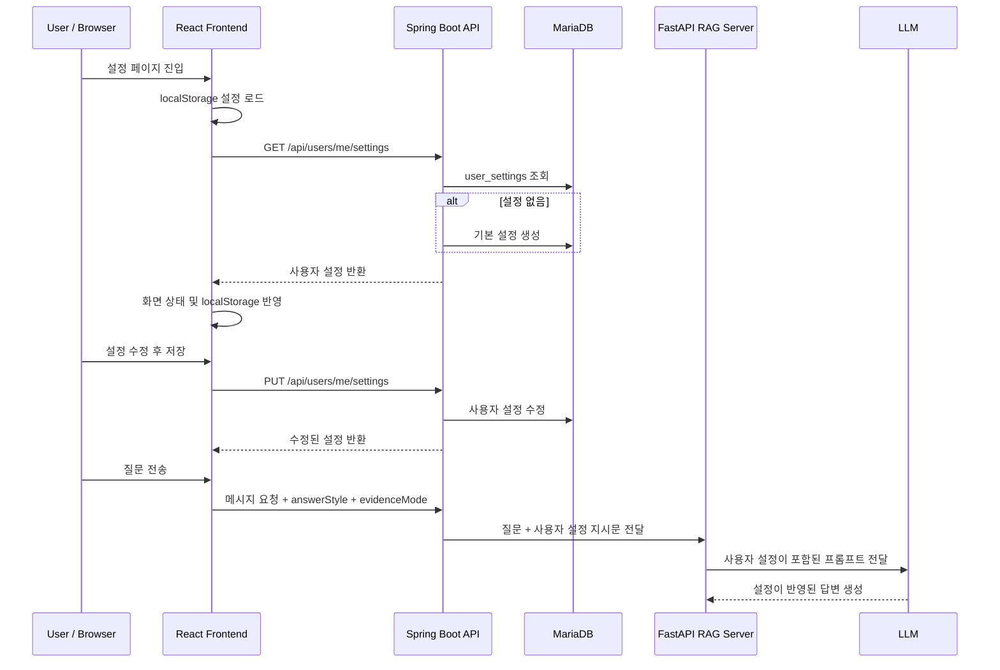

# 사용자 설정 기능

EVIDO AI의 사용자 설정 기능은 사용자가 서비스에서 사용할 표시 이름, 답변 스타일, 근거 표시 방식, 화면 테마를 관리하는 기능입니다.

단순히 화면 옵션을 저장하는 기능이 아니라, 사용자가 선택한 답변 스타일과 근거 표시 방식을 실제 질문 요청에 함께 전달하여 RAG 답변 생성 방식에 반영할 수 있도록 구성했습니다.

- Backend: 사용자별 설정 조회, 기본 설정 자동 생성, 설정 수정 및 검증
- Frontend: 설정 화면, 로컬 캐시, 저장 상태 관리, 채팅 요청 시 설정값 전달
- RAG 연동: 답변 스타일과 근거 표시 방식을 프롬프트 지시문으로 변환

---

## 1. 기능 목적

사용자 설정 기능은 다음 목적을 기준으로 구현했습니다.

- 사용자별 표시 이름 관리
- 답변 스타일 선택
- 근거 표시 방식 선택
- 화면 테마 설정값 저장
- 설정값을 서버에 저장하여 로그인 후에도 유지
- 서버 설정 조회 실패 시 브라우저 로컬 설정으로 대체
- 채팅 요청 시 사용자 설정을 함께 전달
- RAG 서버가 사용자 설정을 프롬프트에 반영할 수 있는 구조 구성

---

## 2. 전체 사용자 흐름

```text
설정 페이지 진입
→ 로컬 설정값 우선 표시
→ 서버에서 사용자 설정 조회
→ 서버 설정을 화면 상태와 localStorage에 반영
→ 사용자가 표시 이름 / 답변 스타일 / 근거 표시 / 테마 수정
→ 저장 버튼 클릭
→ PUT /api/users/me/settings 요청
→ 서버에서 설정 저장
→ 최신 설정을 localStorage에 캐시
→ 채팅 질문 전송 시 answerStyle / evidenceMode 함께 전달
→ RAG 서버 프롬프트에 사용자 설정 반영
```



---

## 3. 설정 항목

사용자 설정은 displayName, theme, answerStyle, evidenceMode 네 가지 항목으로 구성됩니다.

| 항목 | 설명 | 기본값 |
| --- | --- | --- |
| displayName | 서비스 화면에서 표시할 사용자 이름 | 사용자 이름 또는 이메일 앞부분 |
| theme | 화면 테마 설정 | SYSTEM |
| answerStyle | AI 답변 스타일 | EVIDENCE |
| evidenceMode | 근거 표시 방식 | SIMPLE |

---

## 4. 답변 스타일

답변 스타일은 RAG 답변 생성 시 LLM 프롬프트에 반영됩니다.

| 값 | 화면 표시 | 설명 |
| --- | --- | --- |
| EVIDENCE | 근거 중심 | 문서 근거를 우선으로 보여주고 신뢰성 있게 답변합니다. |
| SIMPLE | 간단히 요약 | 핵심 내용만 짧고 빠르게 답변합니다. |
| DETAILED | 자세히 설명 | 배경과 이유까지 포함해서 자세히 설명합니다. |
| BUSINESS | 실무 중심 | 실제 업무 적용 방법과 주의사항 중심으로 답변합니다. |

백엔드에서는 답변 스타일을 다음과 같은 지시문으로 변환해 RAG 서버에 전달합니다.

```java
String styleInstruction = switch (answerStyle) {
    case SIMPLE -> "핵심만 짧고 명확하게 답변하세요. 불필요한 배경 설명은 줄이세요.";
    case DETAILED -> "배경, 이유, 흐름을 포함해서 자세히 설명하세요. 사용자가 이해하기 쉽게 단계적으로 답변하세요.";
    case BUSINESS -> "실무 적용 관점에서 답변하세요. 실제 업무에서 확인할 점, 주의사항, 활용 방법을 중심으로 정리하세요.";
    case EVIDENCE -> "문서 근거를 우선으로 답변하세요. 추측은 피하고, 근거가 부족한 내용은 부족하다고 말하세요.";
};
```

이 구조를 통해 사용자는 같은 문서 질문을 하더라도 원하는 답변 방식에 맞춰 결과를 받을 수 있습니다.

---

## 5. 근거 표시 방식

근거 표시 방식은 답변 아래에 문서 근거를 어느 정도 자세히 보여줄지 결정하는 설정입니다.

| 값 | 화면 표시 | 설명 |
| --- | --- | --- |
| SIMPLE | 간단히 보기 | 근거 문서의 핵심 문장 위주로 간단히 표시합니다. |
| DETAILED | 자세히 보기 | 문서 ID, 조각 ID, 유사도 등 상세 정보를 함께 표시합니다. |

백엔드에서는 근거 표시 방식도 답변 스타일 지시문과 함께 조합합니다.

```java
String evidenceInstruction = switch (evidenceMode) {
    case SIMPLE -> "근거는 사용자가 이해하기 쉽게 핵심 문장 위주로 간단히 표시하세요.";
    case DETAILED -> "근거는 문서명, 문서 조각, 관련도, 판단 이유를 가능한 자세히 표시하세요.";
};

return styleInstruction + "\n" + evidenceInstruction;
```

최종적으로 Spring Boot 서버는 answerStyleInstruction을 생성하여 FastAPI RAG 서버에 전달합니다.

---

## 6. 테마 설정

테마 설정은 사용자가 원하는 화면 모드를 저장하기 위한 값입니다.

| 값 | 화면 표시 | 설명 |
| --- | --- | --- |
| SYSTEM | 시스템 설정 | 기기 설정에 맞춰 화면 테마를 적용합니다. |
| LIGHT | 라이트 모드 | 밝은 화면으로 EVIDO를 사용합니다. |
| DARK | 다크 모드 | 어두운 화면으로 EVIDO를 사용합니다. |

현재 구조에서는 사용자 설정값으로 theme을 저장하고 화면에서 선택 상태를 관리합니다.  
추후에는 저장된 theme 값을 기준으로 document.documentElement 또는 전역 CSS 클래스에 테마 값을 반영하여 실제 다크 모드 스타일을 적용할 수 있습니다.

```text
theme = SYSTEM → prefers-color-scheme 값 사용
theme = LIGHT  → light class 적용
theme = DARK   → dark class 적용
```

---

## 7. Backend 구현

## 7.1 API Controller

사용자 설정 API는 현재 로그인한 사용자를 기준으로 동작합니다.

```java
@RestController
@RequiredArgsConstructor
@RequestMapping("/api/users/me/settings")
public class UserSettingsController {

    private final UserSettingsService userSettingsService;
    private final CurrentUserProvider currentUserProvider;

    @GetMapping
    public CommonResponse<UserSettingsResponse> getMySettings(Authentication authentication) {
        String userId = currentUserProvider.getUserId(authentication);
        UserSettingsResponse response = userSettingsService.getMySettings(userId);
        return CommonResponse.success("사용자 설정을 조회했습니다.", response);
    }

    @PutMapping
    public CommonResponse<UserSettingsResponse> updateMySettings(
            Authentication authentication,
            @Valid @RequestBody UserSettingsUpdateRequest request
    ) {
        String userId = currentUserProvider.getUserId(authentication);
        UserSettingsResponse response = userSettingsService.updateMySettings(userId, request);
        return CommonResponse.success("사용자 설정을 수정했습니다.", response);
    }
}
```

인증된 사용자의 userId는 CurrentUserProvider를 통해 추출합니다.  
따라서 클라이언트가 별도의 userId를 넘기지 않아도 자신의 설정만 조회하거나 수정할 수 있습니다.

---

## 7.2 Service 흐름

설정 조회 시 기존 설정이 없으면 기본 설정을 자동으로 생성합니다.

```text
현재 사용자 조회
→ user_settings 테이블에서 userId 기준 설정 조회
→ 설정이 없으면 기본 설정 생성
→ UserSettingsResponse 반환
```

```java
@Transactional
public UserSettingsResponse getMySettings(String userId) {
    UserEntity user = getUserOrThrow(userId);

    UserSettingsEntity settings = userSettingsJpaRepository.findByUserId(userId)
            .orElseGet(() -> createDefaultSettings(user));

    return UserSettingsResponse.from(settings, user.getEmail());
}
```

설정 수정 시에도 설정이 없으면 기본 설정을 먼저 생성한 뒤 요청값으로 업데이트합니다.

```java
@Transactional
public UserSettingsResponse updateMySettings(
        String userId,
        UserSettingsUpdateRequest request
) {
    UserEntity user = getUserOrThrow(userId);

    UserSettingsEntity settings = userSettingsJpaRepository.findByUserId(userId)
            .orElseGet(() -> createDefaultSettings(user));

    settings.update(
            request.displayName().trim(),
            request.theme(),
            request.answerStyle(),
            request.evidenceMode()
    );

    return UserSettingsResponse.from(settings, user.getEmail());
}
```

---

## 7.3 기본 설정 생성

기본 표시 이름은 사용자 이름이 있으면 이름을 사용하고, 없으면 이메일 앞부분을 사용합니다.

```java
private String resolveDisplayName(UserEntity user) {
    if (user.getName() != null && !user.getName().isBlank()) {
        return user.getName();
    }

    if (user.getEmail() != null && !user.getEmail().isBlank()) {
        int atIndex = user.getEmail().indexOf("@");

        if (atIndex > 0) {
            return user.getEmail().substring(0, atIndex);
        }

        return user.getEmail();
    }

    return "사용자";
}
```

기본 설정값은 다음과 같습니다.

```java
public static UserSettingsEntity createDefault(String userId, String displayName) {
    return new UserSettingsEntity(
            userId,
            displayName,
            ThemeMode.SYSTEM,
            AnswerStyle.EVIDENCE,
            EvidenceMode.SIMPLE
    );
}
```

---

## 8. 데이터 구조

## 8.1 Entity

사용자 설정은 user_settings 테이블에 저장됩니다.

```java
@Entity
@Table(
    name = "user_settings",
    uniqueConstraints = {
        @UniqueConstraint(name = "uk_user_settings_user_id", columnNames = "user_id")
    }
)
public class UserSettingsEntity {

    @Id
    @GeneratedValue(strategy = GenerationType.IDENTITY)
    private Long id;

    @Column(name = "user_id", nullable = false, length = 100)
    private String userId;

    @Column(name = "display_name", nullable = false, length = 50)
    private String displayName;

    @Enumerated(EnumType.STRING)
    @Column(name = "theme", nullable = false, length = 20)
    private ThemeMode theme;

    @Enumerated(EnumType.STRING)
    @Column(name = "answer_style", nullable = false, length = 30)
    private AnswerStyle answerStyle;

    @Enumerated(EnumType.STRING)
    @Column(name = "evidence_mode", nullable = false, length = 30)
    private EvidenceMode evidenceMode;

    @Column(name = "created_at", nullable = false, updatable = false)
    private LocalDateTime createdAt;

    @Column(name = "updated_at", nullable = false)
    private LocalDateTime updatedAt;
}
```

user_id에는 Unique Constraint를 적용하여 사용자 1명당 설정 1개만 가지도록 제한했습니다.

---

## 8.2 테이블 구조

| 컬럼 | 타입 | 설명 |
| --- | --- | --- |
| id | BIGINT | 사용자 설정 ID |
| user_id | VARCHAR(100) | 사용자 ID |
| display_name | VARCHAR(50) | 표시 이름 |
| theme | VARCHAR(20) | 화면 테마 |
| answer_style | VARCHAR(30) | 답변 스타일 |
| evidence_mode | VARCHAR(30) | 근거 표시 방식 |
| created_at | DATETIME | 생성일시 |
| updated_at | DATETIME | 수정일시 |

```text
users
└─ user_settings
```

---

## 9. DTO 구조

## 9.1 수정 요청 DTO

```java
public record UserSettingsUpdateRequest(

        @NotBlank(message = "표시 이름은 필수입니다.")
        @Size(max = 50, message = "표시 이름은 50자를 넘을 수 없습니다.")
        String displayName,

        @NotNull(message = "테마 설정은 필수입니다.")
        ThemeMode theme,

        @NotNull(message = "답변 스타일은 필수입니다.")
        AnswerStyle answerStyle,

        @NotNull(message = "근거 표시 방식은 필수입니다.")
        EvidenceMode evidenceMode
) {
}
```

## 9.2 응답 DTO

```java
public record UserSettingsResponse(
        String displayName,
        String email,
        ThemeMode theme,
        AnswerStyle answerStyle,
        EvidenceMode evidenceMode
) {
}
```

응답에는 화면에서 표시할 이메일을 포함합니다.  
단, 이메일은 사용자가 수정하는 값이 아니라 UserEntity에서 조회한 값을 내려줍니다.

---

## 10. 주요 API

| Method | URL | 설명 |
| --- | --- | --- |
| GET | /api/users/me/settings | 내 사용자 설정 조회 |
| PUT | /api/users/me/settings | 내 사용자 설정 수정 |

---

## 10.1 사용자 설정 조회

### Request

```http
GET /api/users/me/settings
Cookie: accessToken=...
```

### Response

```json
{
  "success": true,
  "code": "SUCCESS",
  "message": "사용자 설정을 조회했습니다.",
  "data": {
    "displayName": "김혁진",
    "email": "user@email.com",
    "theme": "SYSTEM",
    "answerStyle": "EVIDENCE",
    "evidenceMode": "SIMPLE"
  }
}
```

---

## 10.2 사용자 설정 수정

### Request

```http
PUT /api/users/me/settings
Content-Type: application/json
Cookie: accessToken=...
```

```json
{
  "displayName": "김혁진",
  "theme": "SYSTEM",
  "answerStyle": "BUSINESS",
  "evidenceMode": "DETAILED"
}
```

### Response

```json
{
  "success": true,
  "code": "SUCCESS",
  "message": "사용자 설정을 수정했습니다.",
  "data": {
    "displayName": "김혁진",
    "email": "user@email.com",
    "theme": "SYSTEM",
    "answerStyle": "BUSINESS",
    "evidenceMode": "DETAILED"
  }
}
```

---

## 11. Frontend 구현

## 11.1 API 모듈

프론트엔드에서는 userSettings.ts에서 사용자 설정 API를 분리했습니다.

```ts
export async function getUserSettings() {
    const response = await api.get<CommonResponse<UserSettings>>(
        "/api/users/me/settings",
    );

    return response.data.data;
}

export async function updateUserSettings(
    request: UpdateUserSettingsRequest,
) {
    const response = await api.put<CommonResponse<UserSettings>>(
        "/api/users/me/settings",
        request,
    );

    return response.data.data;
}
```

---

## 11.2 타입 정의

프론트엔드에서는 백엔드 Enum과 동일한 문자열 타입을 사용합니다.

```ts
export type AnswerStyle = "EVIDENCE" | "SIMPLE" | "DETAILED" | "BUSINESS";
export type EvidenceMode = "SIMPLE" | "DETAILED";
export type ThemeMode = "SYSTEM" | "LIGHT" | "DARK";

export type UserSettings = {
    displayName: string;
    email: string;
    answerStyle: AnswerStyle;
    evidenceMode: EvidenceMode;
    theme: ThemeMode;
};
```

기본값도 프론트엔드에서 별도로 정의해 서버 설정 조회 전 초기 화면에 사용할 수 있도록 했습니다.

```ts
export const DEFAULT_USER_SETTINGS: UserSettings = {
    displayName: "사용자",
    email: "user@email.com",
    answerStyle: "EVIDENCE",
    evidenceMode: "SIMPLE",
    theme: "SYSTEM",
};
```

---

## 11.3 useUserSettings Hook

useUserSettings는 사용자 설정 화면과 채팅 화면에서 공통으로 사용하는 Hook입니다.

주요 역할은 다음과 같습니다.

- localStorage에서 기존 설정값 로드
- 서버 설정 조회
- 서버 조회 성공 시 localStorage 갱신
- 서버 조회 실패 시 localStorage 설정으로 대체
- 설정 변경 상태 관리
- 저장 여부, 로딩 여부, 에러 상태 관리
- 설정 저장 API 호출
- 설정 초기화

```ts
export function useUserSettings() {
    const [settings, setSettings] = useState<UserSettings>(() => loadLocalUserSettings());
    const [saved, setSaved] = useState(true);
    const [loading, setLoading] = useState(true);
    const [saving, setSaving] = useState(false);
    const [error, setError] = useState<string | null>(null);

    useEffect(() => {
        async function loadSettings() {
            try {
                setLoading(true);
                setError(null);

                const serverSettings = await getUserSettings();

                setSettings(serverSettings);
                saveLocalUserSettings(serverSettings);
                setSaved(true);
            } catch (error) {
                setError(getErrorMessage(error));
                setSettings(loadLocalUserSettings());
            } finally {
                setLoading(false);
            }
        }

        void loadSettings();
    }, []);
}
```

로컬 저장소 키는 다음 값을 사용합니다.

```ts
const STORAGE_KEY = "evido-user-settings";
```

이 구조 덕분에 서버 요청이 지연되거나 실패해도 화면에는 마지막으로 저장된 설정을 먼저 보여줄 수 있습니다.

---

## 11.4 설정 저장

사용자가 설정을 수정하면 화면 상태만 먼저 변경하고, saved 값을 false로 바꿉니다.

```ts
function updateSetting<K extends keyof UserSettings>(
    key: K,
    value: UserSettings[K],
) {
    setSettings((prev) => ({
        ...prev,
        [key]: value,
    }));

    setSaved(false);
    setError(null);
}
```

사용자가 저장 버튼을 누르면 서버에 수정 요청을 보내고, 성공 시 localStorage도 함께 갱신합니다.

```ts
async function saveSettings() {
    try {
        setSaving(true);
        setError(null);

        const updatedSettings = await updateUserSettings({
            displayName: settings.displayName.trim(),
            theme: settings.theme,
            answerStyle: settings.answerStyle,
            evidenceMode: settings.evidenceMode,
        });

        setSettings(updatedSettings);
        saveLocalUserSettings(updatedSettings);
        setSaved(true);
    } catch (error) {
        setError(getErrorMessage(error));
    } finally {
        setSaving(false);
    }
}
```

---

## 12. SettingsPage 화면 구성

설정 화면은 크게 세 영역으로 구성됩니다.

| 영역 | 설명 |
| --- | --- |
| 프로필 설정 | 표시 이름, 이메일 확인 |
| AI 답변 설정 | 답변 스타일, 근거 표시 방식 선택 |
| 화면 설정 | 시스템 / 라이트 / 다크 테마 선택 |

오른쪽에는 현재 설정 요약과 저장 상태를 표시합니다.

```text
설정 요약
├─ 표시 이름
├─ 답변 스타일
├─ 근거 표시
└─ 테마
```

저장 상태는 다음과 같이 구분합니다.

| 상태 | 화면 표시 |
| --- | --- |
| loading | 설정을 불러오는 중입니다. |
| error | 에러 메시지 표시 |
| saved | 설정이 저장되었습니다. |
| !saved | 저장되지 않은 변경사항이 있습니다. |
| saving | 저장 중 |

---

## 13. 채팅 기능과의 연동

사용자 설정 중 answerStyle, evidenceMode는 채팅 요청에 함께 포함됩니다.

프론트엔드에서는 ConversationPage에서 useUserSettings를 호출하여 현재 설정을 읽습니다.

```ts
const { settings } = useUserSettings();

const answerStyleLabel = getAnswerStyleLabel(settings.answerStyle);
const evidenceModeLabel = getEvidenceModeLabel(settings.evidenceMode);
```

질문 전송 시 현재 설정값을 함께 전달합니다.

```ts
await sendConversationMessageStream(targetConversationId, text, {
    signal: abortController.signal,
    answerStyle: settings.answerStyle,
    evidenceMode: settings.evidenceMode,
    onEvent: handleStreamEvent,
});
```

API 요청 Body에는 다음 값이 포함됩니다.

```json
{
  "content": "업로드한 매뉴얼 기준으로 점검 절차 알려줘",
  "answerStyle": "BUSINESS",
  "evidenceMode": "DETAILED"
}
```

Spring Boot 서버는 이 값을 SendMessageCommand 또는 AskCommand로 전달합니다.

```java
public record SendMessageCommand(
        Long conversationId,
        String userId,
        String content,
        AnswerStyle answerStyle,
        EvidenceMode evidenceMode
) {
    public AnswerStyle resolvedAnswerStyle() {
        return answerStyle == null ? AnswerStyle.EVIDENCE : answerStyle;
    }

    public EvidenceMode resolvedEvidenceMode() {
        return evidenceMode == null ? EvidenceMode.SIMPLE : evidenceMode;
    }
}
```

설정값이 요청에 포함되지 않아도 기본값을 사용하도록 방어 로직을 두었습니다.

---

## 14. RAG 서버 전달 구조

Spring Boot 서버는 사용자 설정을 RAG 서버 요청 DTO에 포함합니다.

```java
public record RagAnswerRequest(
        Long workspaceId,
        Long conversationId,
        String queryText,
        Integer topK,
        String conversationSummary,
        List<RecentMessage> recentMessages,
        AnswerStyle answerStyle,
        EvidenceMode evidenceMode,
        String answerStyleInstruction
) {
}
```

FastAPI RAG 서버는 다음 스키마로 값을 전달받습니다.

```py
class AnswerRequest(BaseModel):
    workspaceId: int
    conversationId: Optional[int] = None
    queryText: str
    topK: Optional[int] = None
    conversationSummary: Optional[str] = None
    recentMessages: List[RecentMessage] = Field(default_factory=list)

    answerStyle: Optional[str] = "EVIDENCE"
    evidenceMode: Optional[str] = "SIMPLE"
    answerStyleInstruction: Optional[str] = None
```

LLM 프롬프트 생성 시 사용자 설정 블록을 추가합니다.

```py
def _build_user_setting_prompt(
        self,
        answer_style: str | None = None,
        evidence_mode: str | None = None,
        answer_style_instruction: str | None = None,
) -> str:
    lines = ["\n사용자 답변 설정:"]

    if answer_style:
        lines.append(f"- answerStyle: {answer_style}")

    if evidence_mode:
        lines.append(f"- evidenceMode: {evidence_mode}")

    if answer_style_instruction:
        lines.append("- 사용자 설정 지시문:")
        lines.append(answer_style_instruction)
    else:
        lines.append("- 기본값: 문서 근거 중심으로 명확하게 답변한다.")

    lines.append(
        "위 사용자 답변 설정은 반드시 반영하되, 문서 근거 우선 원칙보다 앞서서는 안 된다.\n"
    )

    return "\n".join(lines)
```

즉, 사용자의 답변 스타일은 반영하지만 **문서 근거 우선 원칙보다 앞서지 않도록 제한**했습니다.

---

## 15. 예외 처리

## 15.1 인증되지 않은 사용자

인증 정보가 없거나 userId를 추출할 수 없으면 UNAUTHORIZED 예외를 발생시킵니다.

```java
private UserEntity getUserOrThrow(String userId) {
    if (userId == null || userId.isBlank()) {
        throw new BusinessException(ErrorCode.UNAUTHORIZED);
    }

    return userJpaRepository.findById(userId)
            .orElseThrow(() -> new BusinessException(ErrorCode.USER_NOT_FOUND));
}
```

## 15.2 존재하지 않는 사용자

userId에 해당하는 사용자가 없으면 USER_NOT_FOUND 예외를 발생시킵니다.

## 15.3 잘못된 요청값

displayName이 비어 있거나 50자를 초과하면 Validation 예외가 발생합니다.  
theme, answerStyle, evidenceMode는 필수값이며, Enum에 없는 값은 바인딩 단계에서 실패합니다.

## 15.4 프론트엔드 설정 조회 실패

서버 설정 조회에 실패하면 사용자가 마지막으로 저장했던 localStorage 설정을 사용합니다.

```ts
catch (error) {
    setError(getErrorMessage(error));
    setSettings(loadLocalUserSettings());
}
```

이를 통해 일시적인 네트워크 오류가 있어도 설정 화면 자체는 깨지지 않도록 처리했습니다.

---

## 16. 보안 및 설계 포인트

## 16.1 내 설정만 접근 가능

API URL에 userId를 포함하지 않고, 인증 컨텍스트에서 현재 사용자를 추출합니다.

```text
GET /api/users/me/settings
PUT /api/users/me/settings
```

이 방식은 사용자가 다른 사람의 userId를 추측해 설정을 조회하거나 수정하는 문제를 줄일 수 있습니다.

## 16.2 서버 설정과 로컬 캐시 분리

서버의 user_settings가 기준 데이터이며, localStorage는 화면 초기 표시와 fallback 용도로 사용합니다.

```text
서버 설정 = 기준 데이터
localStorage = UX 개선용 캐시
```

## 16.3 답변 설정과 근거 원칙 분리

사용자는 답변 스타일을 선택할 수 있지만, RAG 서버 프롬프트에서는 문서 근거 우선 원칙을 유지하도록 제한했습니다.

```text
사용자 스타일 반영 O
문서에 없는 내용 추측 X
```

이를 통해 사용자 맞춤형 답변과 RAG 신뢰성을 함께 유지할 수 있습니다.

---

## 17. 개선 예정

| 구분 | 개선 내용 |
| --- | --- |
| 테마 적용 | 저장된 theme 값을 실제 전역 CSS 클래스 또는 data attribute에 반영 |
| 설정 전역화 | 여러 페이지에서 useUserSettings가 각각 API를 호출하지 않도록 Context 또는 전역 Store 적용 |
| 서버 기본값 제공 | 프론트와 백엔드에 분산된 기본값을 API 기준으로 통일 |
| 자동 저장 | 설정 변경 후 저장 버튼 없이 debounce 기반 자동 저장 적용 검토 |
| RAG 적용 고도화 | answerStyle별 프롬프트 템플릿 세분화 |
| 근거 표시 UI | DETAILED 모드에서 문서명, chunkId, score, 판단 이유를 더 명확히 표시 |
| 사용자 프로필 확장 | 프로필 이미지, 언어 설정, 기본 워크스페이스 설정 추가 |
| 설정 초기화 | localStorage 초기화뿐 아니라 서버 설정 기본값 복구 API 추가 검토 |
