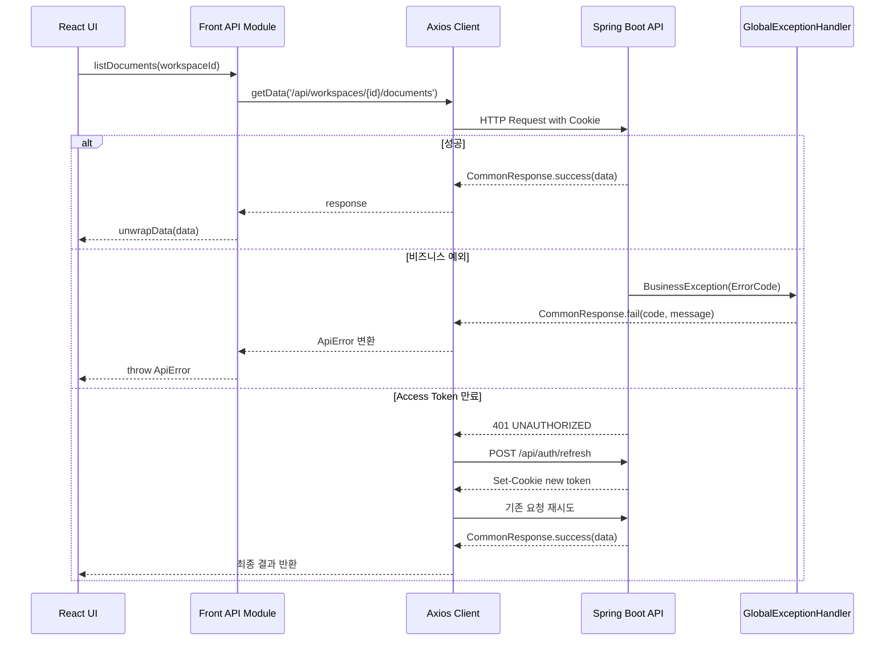

# 공통 API / 에러 처리

EVIDO AI는 Spring Boot API 서버와 React 프론트엔드 사이의 응답 형식을 통일하고, 인증 만료와 예외 상황을 한 곳에서 처리할 수 있도록 공통 API 구조를 분리했습니다.

이 문서는 다음 내용을 정리합니다.

- 백엔드 공통 응답 구조
- 백엔드 전역 예외 처리
- 프론트엔드 Axios API Client
- 401 발생 시 토큰 자동 재발급
- 공통 API 호출 함수
- 에러 메시지 변환 방식
- SSE 스트리밍 API의 별도 처리
- 개선 예정 사항

---

## 1. 기능 목적

초기에는 각 API에서 성공 응답과 실패 응답의 형태가 조금씩 달라질 수 있습니다.  
응답 구조가 달라지면 프론트엔드에서는 API마다 다른 방식으로 data, message, error를 처리해야 합니다.

이를 방지하기 위해 EVIDO AI는 대부분의 REST API 응답을 다음 형식으로 통일했습니다.

```json
{
  "success": true,
  "code": "SUCCESS",
  "message": "요청이 성공했습니다.",
  "data": {}
}
```

실패 응답도 동일한 구조를 사용합니다.

```json
{
  "success": false,
  "code": "DOCUMENT_NOT_FOUND",
  "message": "문서를 찾을 수 없습니다.",
  "data": null
}
```

이 구조를 통해 프론트엔드는 다음 기준으로 응답을 처리할 수 있습니다.

| 필드 | 설명 |
| --- | --- |
| success | 요청 성공 여부 |
| code | 성공 또는 실패 코드 |
| message | 사용자에게 보여줄 수 있는 메시지 |
| data | 실제 응답 데이터 |

---

## 2. 전체 처리 흐름

```text
React Page / Component
→ api 함수 호출
→ http helper 실행
→ Axios Client 요청
→ Spring Boot Controller
→ UseCase / Service 실행
→ 성공 시 CommonResponse.success 반환
→ 실패 시 BusinessException 또는 예외 발생
→ GlobalExceptionHandler에서 CommonResponse.fail 반환
→ Axios Interceptor에서 ApiError로 변환
→ 화면에서 getApiErrorMessage로 사용자 메시지 표시
```



---

## 3. 백엔드 공통 응답 구조

백엔드에서는 CommonResponse<T>를 사용해 성공과 실패 응답을 통일했습니다.

```java
public record CommonResponse<T>(
        boolean success,
        String code,
        String message,
        T data
) {
    public static <T> CommonResponse<T> success(T data) {
        return new CommonResponse<>(
                true,
                "SUCCESS",
                "요청이 성공했습니다.",
                data
        );
    }

    public static <T> CommonResponse<T> success(String message, T data) {
        return new CommonResponse<>(
                true,
                "SUCCESS",
                message,
                data
        );
    }

    public static CommonResponse<Void> fail(String code, String message) {
        return new CommonResponse<>(
                false,
                code,
                message,
                null
        );
    }
}
```

### 성공 응답 예시

```java
return CommonResponse.success(response);
```

```java
return CommonResponse.success("워크스페이스가 생성되었습니다.", response);
```

### 삭제 성공 응답 예시

```java
return CommonResponse.<Void>success("문서가 삭제되었습니다.", null);
```

삭제처럼 반환 데이터가 없는 API도 동일한 응답 구조를 유지합니다.  
프론트엔드에서는 이런 API를 unwrapVoid()로 처리합니다.

---

## 4. ErrorCode

서비스에서 사용하는 주요 에러는 ErrorCode enum으로 관리합니다.

```java
public enum ErrorCode {

    INVALID_INPUT_VALUE(HttpStatus.BAD_REQUEST, "INVALID_INPUT_VALUE", "잘못된 입력값입니다."),
    INTERNAL_SERVER_ERROR(HttpStatus.INTERNAL_SERVER_ERROR, "INTERNAL_SERVER_ERROR", "서버 오류가 발생했습니다."),
    UNAUTHORIZED(HttpStatus.UNAUTHORIZED, "UNAUTHORIZED", "인증이 필요합니다."),
    FORBIDDEN(HttpStatus.FORBIDDEN, "FORBIDDEN", "접근 권한이 없습니다."),
    USER_NOT_FOUND(HttpStatus.NOT_FOUND, "USER_NOT_FOUND", "사용자를 찾을 수 없습니다."),
    WORKSPACE_NOT_FOUND(HttpStatus.NOT_FOUND, "WORKSPACE_NOT_FOUND", "워크스페이스를 찾을 수 없습니다."),
    WORKSPACE_ACCESS_DENIED(HttpStatus.FORBIDDEN, "WORKSPACE_ACCESS_DENIED", "워크스페이스 접근 권한이 없습니다."),
    CONVERSATION_NOT_FOUND(HttpStatus.NOT_FOUND, "CONVERSATION_NOT_FOUND", "대화를 찾을 수 없습니다."),
    DOCUMENT_NOT_FOUND(HttpStatus.NOT_FOUND, "DOCUMENT_NOT_FOUND", "문서를 찾을 수 없습니다."),
    RAG_SERVER_ERROR(HttpStatus.BAD_GATEWAY, "RAG_SERVER_ERROR", "RAG 서버 호출 중 오류가 발생했습니다."),
    FILE_SIZE_EXCEEDED(HttpStatus.PAYLOAD_TOO_LARGE, "FILE_SIZE_EXCEEDED", "업로드 가능한 최대 용량을 초과했습니다.");
}
```

### ErrorCode를 분리한 이유

| 목적 | 설명 |
| --- | --- |
| HTTP 상태 코드 통일 | 같은 상황에서 항상 같은 status를 반환합니다. |
| 프론트 분기 처리 | DOCUMENT_NOT_FOUND, WORKSPACE_ACCESS_DENIED처럼 코드 기준으로 화면 처리가 가능합니다. |
| 메시지 관리 | 기본 메시지를 백엔드에서 일관되게 관리할 수 있습니다. |
| 예외 확장 | 새로운 도메인 예외가 생겼을 때 enum에 추가하면 됩니다. |

---

## 5. BusinessException

서비스 계층에서 예상 가능한 비즈니스 오류가 발생하면 BusinessException을 던집니다.

```java
public class BusinessException extends RuntimeException {

    private final ErrorCode errorCode;

    public BusinessException(ErrorCode errorCode) {
        super(errorCode.getMessage());
        this.errorCode = errorCode;
    }

    public BusinessException(ErrorCode errorCode, String message) {
        super(message);
        this.errorCode = errorCode;
    }
}
```

### 사용 예시

```java
throw new BusinessException(ErrorCode.WORKSPACE_ACCESS_DENIED);
```

```java
throw new BusinessException(
        ErrorCode.UNAUTHORIZED,
        "refresh token 재사용이 감지되었습니다."
);
```

BusinessException을 사용하면 Controller에서 직접 try-catch를 작성하지 않아도 됩니다.  
발생한 예외는 GlobalExceptionHandler가 잡아서 공통 실패 응답으로 변환합니다.

---

## 6. 전역 예외 처리

백엔드에서는 @RestControllerAdvice 기반의 GlobalExceptionHandler를 사용합니다.

처리 대상은 다음과 같습니다.

| 예외 | 응답 코드 | 설명 |
| --- | --- | --- |
| BusinessException | ErrorCode 기준 | 서비스에서 직접 정의한 비즈니스 예외 |
| MethodArgumentNotValidException | INVALID_INPUT_VALUE | @Valid 검증 실패 |
| MissingServletRequestParameterException | INVALID_INPUT_VALUE | 필수 파라미터 누락 |
| MethodArgumentTypeMismatchException | INVALID_INPUT_VALUE | PathVariable, RequestParam 타입 불일치 |
| HttpMessageNotReadableException | INVALID_INPUT_VALUE | JSON 요청 본문 파싱 실패 |
| HttpRequestMethodNotSupportedException | INVALID_INPUT_VALUE | 지원하지 않는 HTTP Method |
| MaxUploadSizeExceededException | FILE_SIZE_EXCEEDED | 파일 업로드 용량 초과 |
| AuthenticationException | UNAUTHORIZED | 인증 실패 |
| AccessDeniedException | FORBIDDEN | 인가 실패 |
| Exception | INTERNAL_SERVER_ERROR | 예상하지 못한 서버 오류 |

### 비즈니스 예외 처리 예시

```java
@ExceptionHandler(BusinessException.class)
public ResponseEntity<CommonResponse<Void>> handleBusinessException(
        BusinessException e,
        HttpServletRequest request
) {
    ErrorCode errorCode = e.getErrorCode();

    log.warn(
            "[비즈니스 예외] code={}, message={}, path={}",
            errorCode.getCode(),
            e.getMessage(),
            request.getRequestURI()
    );

    return ResponseEntity
            .status(errorCode.getStatus())
            .body(CommonResponse.fail(
                    errorCode.getCode(),
                    e.getMessage()
            ));
}
```

### 검증 실패 처리 예시

```java
@ExceptionHandler(MethodArgumentNotValidException.class)
public ResponseEntity<CommonResponse<Void>> handleValidationException(
        MethodArgumentNotValidException e,
        HttpServletRequest request
) {
    String message = e.getBindingResult()
            .getFieldErrors()
            .stream()
            .findFirst()
            .map(error -> error.getField() + ": " + error.getDefaultMessage())
            .orElse(ErrorCode.INVALID_INPUT_VALUE.getMessage());

    return ResponseEntity
            .status(ErrorCode.INVALID_INPUT_VALUE.getStatus())
            .body(CommonResponse.fail(
                    ErrorCode.INVALID_INPUT_VALUE.getCode(),
                    message
            ));
}
```

---

## 7. 프론트엔드 공통 응답 타입

프론트엔드에서도 백엔드 응답 구조에 맞춰 CommonResponse<T> 타입을 정의했습니다.

```ts
export type CommonResponse<T> = {
    success: boolean;
    code: string | null;
    message: string | null;
    data: T | null;
};
```

성공 응답은 unwrapData()로 실제 data만 꺼내서 페이지에 전달합니다.

```ts
export function unwrapData<T>(body: CommonResponse<T>): T {
    if (!body.success) {
        throw new ApiError(
            200,
            body.code ?? "UNKNOWN_ERROR",
            body.message ?? "요청 처리 중 오류가 발생했습니다."
        );
    }

    if (body.data === null) {
        throw new ApiError(
            200,
            "EMPTY_RESPONSE",
            "응답 데이터가 없습니다."
        );
    }

    return body.data;
}
```

반환 데이터가 없는 API는 unwrapVoid()를 사용합니다.

```ts
export function unwrapVoid(body: CommonResponse<unknown>): void {
    if (!body.success) {
        throw new ApiError(
            200,
            body.code ?? "UNKNOWN_ERROR",
            body.message ?? "요청 처리 중 오류가 발생했습니다."
        );
    }
}
```

### 구분 기준

| 상황 | 사용 함수 |
| --- | --- |
| 목록 조회, 상세 조회, 생성 응답처럼 data가 반드시 필요한 경우 | unwrapData() |
| 삭제, 로그아웃처럼 data가 없어도 되는 경우 | unwrapVoid() |
| 성공했지만 data가 null일 수 있는 경우 | unwrapNullableData() |

---

## 8. ApiError

프론트엔드에서는 HTTP 에러, 비즈니스 에러, 네트워크 에러를 ApiError로 변환합니다.

```ts
export class ApiError extends Error {
    status: number;
    code: string;

    constructor(status: number, code: string, message: string) {
        super(message);
        this.status = status;
        this.code = code;
        this.name = "ApiError";

        Object.setPrototypeOf(this, ApiError.prototype);
    }
}
```

ApiError를 사용하면 화면에서는 다음처럼 동일한 방식으로 에러를 처리할 수 있습니다.

```ts
try {
    await deleteDocument(workspaceId, documentId);
} catch (error) {
    alert(getApiErrorMessage(error));
}
```

---

## 9. Axios API Client

프론트엔드의 모든 일반 REST API 요청은 api/client.ts의 Axios 인스턴스를 사용합니다.

```ts
const API_BASE = (import.meta.env.VITE_API_BASE_URL ?? "").replace(/\/+$/, "");

const api = axios.create({
    baseURL: API_BASE || undefined,
    withCredentials: true,
    timeout: 15000,
});
```

### 설정 의미

| 설정 | 설명 |
| --- | --- |
| baseURL | 백엔드 API 서버 주소를 환경변수로 관리합니다. |
| withCredentials: true | HttpOnly Cookie 기반 인증 토큰을 요청에 포함합니다. |
| timeout: 15000 | 15초 이상 응답이 없으면 요청 시간 초과로 처리합니다. |

---

## 10. 401 자동 토큰 재발급

Access Token이 만료되면 백엔드는 401 UNAUTHORIZED를 반환합니다.  
프론트엔드는 Axios Interceptor에서 이 응답을 감지하고, /api/auth/refresh를 호출해 토큰을 재발급합니다.

```text
API 요청
→ 401 응답
→ /api/auth/refresh 호출
→ Refresh Token 검증
→ 새 Access Token / Refresh Token 발급
→ 실패했던 기존 요청 재시도
→ 최종 응답 반환
```

### Interceptor 처리 흐름

```ts
api.interceptors.response.use(
    (res) => res,
    async (err: AxiosError<CommonResponse<null>>) => {
        const originalRequest = err.config as RetryConfig | undefined;
        const status = err.response?.status;
        const requestUrl = originalRequest?.url ?? "";
        const isRefreshRequest = requestUrl.includes("/api/auth/refresh");

        if (
            status === 401 &&
            originalRequest &&
            !originalRequest._retry &&
            !isRefreshRequest
        ) {
            originalRequest._retry = true;

            try {
                await refreshAccessToken();
                return api(originalRequest);
            } catch {
                window.location.href = "/login";
                throw new ApiError(
                    401,
                    "UNAUTHORIZED",
                    "로그인이 만료되었습니다. 다시 로그인해주세요."
                );
            }
        }

        return Promise.reject(toApiError(err));
    }
);
```

### 중복 재발급 방지

여러 API가 동시에 401을 받을 수 있기 때문에 refreshPromise를 사용해 재발급 요청을 하나로 묶습니다.

```ts
let refreshPromise: Promise<void> | null = null;

const refreshAccessToken = async () => {
    if (!refreshPromise) {
        refreshPromise = axios
            .post("/api/auth/refresh", {}, { withCredentials: true })
            .then(() => undefined)
            .finally(() => {
                refreshPromise = null;
            });
    }

    return refreshPromise;
};
```

이렇게 하면 동시에 여러 요청이 실패해도 /api/auth/refresh가 과도하게 반복 호출되는 문제를 줄일 수 있습니다.

---

## 11. HTTP Helper 함수

반복되는 API 호출 코드를 줄이기 위해 http.ts에 공통 함수를 분리했습니다.

```ts
export async function getData<T>(
    url: string,
    config?: AxiosRequestConfig
): Promise<T> {
    const { data } = await api.get<CommonResponse<T>>(url, config);
    return unwrapData(data);
}

export async function postData<T, B = unknown>(
    url: string,
    body?: B,
    config?: AxiosRequestConfig
): Promise<T> {
    const { data } = await api.post<CommonResponse<T>>(url, body, config);
    return unwrapData(data);
}

export async function patchData<T, B = unknown>(
    url: string,
    body?: B,
    config?: AxiosRequestConfig
): Promise<T> {
    const { data } = await api.patch<CommonResponse<T>>(url, body, config);
    return unwrapData(data);
}

export async function deleteData(
    url: string,
    config?: AxiosRequestConfig
): Promise<void> {
    const { data } = await api.delete<CommonResponse<null>>(url, config);
    unwrapVoid(data);
}
```

### 적용 예시

워크스페이스 API는 다음처럼 간결하게 작성할 수 있습니다.

```ts
export function listWorkspaces(): Promise<Workspace[]> {
    return getData<Workspace[]>("/api/workspaces");
}

export function createWorkspace(name: string): Promise<Workspace> {
    return postData<Workspace, { name: string }>("/api/workspaces", { name });
}

export function renameWorkspace(
    workspaceId: number,
    name: string
): Promise<Workspace> {
    return patchData<Workspace, { name: string }>(
        /api/workspaces/${workspaceId},
        { name }
    );
}

export function removeWorkspace(workspaceId: number): Promise<void> {
    return deleteData(/api/workspaces/${workspaceId});
}
```

---

## 12. 에러 메시지 변환

화면에서는 ApiError.code를 기준으로 사용자에게 보여줄 메시지를 변환합니다.

```ts
export function getApiErrorMessage(error: unknown): string {
    if (error instanceof ApiError) {
        switch (error.code) {
            case "INVALID_INPUT_VALUE":
                return error.message;

            case "UNAUTHORIZED":
                return "로그인이 필요합니다.";

            case "FORBIDDEN":
                return "접근 권한이 없습니다.";

            case "WORKSPACE_NOT_FOUND":
                return "워크스페이스를 찾을 수 없습니다.";

            case "DOCUMENT_NOT_FOUND":
                return "문서를 찾을 수 없습니다.";

            case "RAG_SERVER_ERROR":
                return "답변 생성 서버에 문제가 발생했습니다. 잠시 후 다시 시도해주세요.";

            case "NETWORK_ERROR":
                return "서버에 연결할 수 없습니다. 네트워크 상태를 확인해주세요.";

            case "REQUEST_TIMEOUT":
                return "요청 시간이 초과되었습니다. 잠시 후 다시 시도해주세요.";

            default:
                return error.message || "오류가 발생했습니다.";
        }
    }

    return "알 수 없는 오류가 발생했습니다.";
}
```

### 메시지 변환을 분리한 이유

| 이유 | 설명 |
| --- | --- |
| 화면 코드 단순화 | 각 페이지에서 에러 코드별 switch문을 반복하지 않아도 됩니다. |
| 사용자 메시지 통일 | 같은 오류는 어디서 발생해도 같은 문구로 표시됩니다. |
| 백엔드 메시지 보호 | 내부 예외 메시지를 그대로 노출하지 않고 사용자 친화적인 메시지로 바꿀 수 있습니다. |

---

## 13. SSE 스트리밍 API 처리

일반 REST API는 Axios를 사용하지만, 채팅 스트리밍 API는 fetch를 사용합니다.

이유는 브라우저에서 POST 요청으로 SSE 스트림을 읽기 위해 ReadableStream을 직접 처리해야 하기 때문입니다.

```text
POST /api/conversations/{conversationId}/messages/stream
→ text/event-stream 응답 수신
→ ReadableStream 읽기
→ data: 라인 파싱
→ ChatStreamEvent로 변환
→ UI에 토큰 단위 반영
```

### 스트리밍 요청 예시

```ts
const response = await fetch(${API_BASE}${path}, {
    method: "POST",
    headers: {
        "Content-Type": "application/json",
        Accept: "text/event-stream",
    },
    credentials: "include",
    body: JSON.stringify(body),
    signal: options.signal,
});
```

### SSE 이벤트 파싱

```ts
function parseSseEvent(rawEvent: string): ChatStreamEvent | null {
    const dataLines = rawEvent
        .split("\n")
        .map((line) => line.trimEnd())
        .filter((line) => line.startsWith("data:"))
        .map((line) => line.slice("data:".length).trimStart());

    if (dataLines.length === 0) {
        return null;
    }

    const data = dataLines.join("\n");

    if (!data || data === "[DONE]") {
        return null;
    }

    try {
        return JSON.parse(data) as ChatStreamEvent;
    } catch {
        return {
            type: "error",
            code: "SSE_PARSE_ERROR",
            message: "스트리밍 응답을 해석하지 못했습니다.",
        };
    }
}
```

### SSE에서도 토큰 재발급 처리

fetch는 Axios Interceptor를 사용할 수 없기 때문에 SSE 요청 안에서 별도로 401을 처리합니다.

```ts
if (response.status === 401 && !retried) {
    try {
        await refreshAccessTokenForFetch();
        return postSseStream(path, body, options, true);
    } catch {
        window.location.href = "/login";
        throw new ApiError(
            401,
            "UNAUTHORIZED",
            "로그인이 만료되었습니다. 다시 로그인해주세요."
        );
    }
}
```

---

## 14. 파일 API의 예외적인 처리

문서 파일 조회 기능은 일반 JSON 응답이 아니라 파일 본문이나 텍스트를 직접 반환합니다.

### TXT / MD 내용 조회

```ts
export async function getDocumentTextContent(
    workspaceId: number,
    documentId: number,
    versionId?: number
): Promise<string> {
    const { data } = await api.get<string>(
        ${documentBasePath(workspaceId)}/${documentId}/content,
        {
            params: { versionId },
            responseType: "text",
        }
    );

    return data;
}
```

텍스트 뷰어에서는 원본 텍스트를 그대로 표시해야 하므로 CommonResponse가 아닌 text/plain 응답을 사용합니다.

### PDF 파일 열기

```ts
export function getDocumentFileUrl(
    workspaceId: number,
    documentId: number,
    versionId?: number
): string {
    const url = new URL(
        ${documentBasePath(workspaceId)}/${documentId}/file,
        window.location.origin
    );

    if (typeof versionId === "number") {
        url.searchParams.set("versionId", String(versionId));
    }

    return url.pathname + url.search;
}
```

브라우저의 PDF 뷰어가 파일 스트림을 직접 읽어야 하므로, JSON 응답 대신 파일 URL을 생성해 iframe 또는 새 탭에서 사용합니다.

---

## 15. 외부 서버 연동 공통 설정

Spring Boot API 서버는 FastAPI RAG 서버와 통신하기 위해 WebClient를 사용합니다.

```java
@Configuration
@EnableConfigurationProperties(RagProperties.class)
public class RagWebClientConfig {

    @Bean
    public WebClient ragWebClient(RagProperties props) {
        return WebClient.builder()
                .baseUrl(props.baseUrl())
                .build();
    }
}
```

RAG 서버 주소는 설정 파일에서 관리합니다.

```java
@ConfigurationProperties(prefix = "rag")
public record RagProperties(
        String baseUrl,
        int timeoutSeconds
) {}
```

이 구조를 사용하면 개발 환경과 운영 환경에서 RAG 서버 주소만 다르게 설정할 수 있습니다.

```properties
rag.base-url=http://localhost:8000
rag.timeout-seconds=60
```

### RAG 서버 호출 실패 처리

RAG 서버가 응답하지 않거나 오류를 반환하면 백엔드에서는 RAG_SERVER_ERROR로 변환해 프론트엔드에 전달합니다.

```json
{
  "success": false,
  "code": "RAG_SERVER_ERROR",
  "message": "RAG 서버 호출 중 오류가 발생했습니다.",
  "data": null
}
```

프론트엔드는 이 코드를 사용자 친화적인 메시지로 바꿔 표시합니다.

```text
답변 생성 서버에 문제가 발생했습니다. 잠시 후 다시 시도해주세요.
```

---

## 16. CORS 설정

프론트엔드와 백엔드가 서로 다른 도메인에서 동작하기 때문에 CORS 설정이 필요합니다.

```java
@Configuration
public class WebConfig {

    @Bean
    public CorsConfigurationSource corsConfigurationSource() {
        CorsConfiguration config = new CorsConfiguration();

        config.setAllowedOrigins(List.of(
                "http://localhost:5173",
                "http://localhost:3000",
                "https://evido-web.vercel.app",
                "https://evido-ai.vercel.app",
                "https://evido.site",
                "https://www.evido.site"
        ));
        config.setAllowedMethods(List.of("GET", "POST", "PUT", "PATCH", "DELETE", "OPTIONS"));
        config.setAllowedHeaders(List.of("*"));
        config.setAllowCredentials(true);
        config.setMaxAge(3600L);

        UrlBasedCorsConfigurationSource source = new UrlBasedCorsConfigurationSource();
        source.registerCorsConfiguration("/**", config);
        return source;
    }
}
```

### 설정 포인트

| 설정 | 이유 |
| --- | --- |
| setAllowedOrigins | 허용할 프론트엔드 도메인을 명시합니다. |
| setAllowCredentials(true) | Cookie 기반 인증을 사용하기 위해 필요합니다. |
| OPTIONS 허용 | 브라우저 Preflight 요청을 처리합니다. |
| setMaxAge(3600L) | Preflight 결과를 일정 시간 캐시합니다. |

---

## 17. Health Check

서버 상태 확인을 위해 /health 엔드포인트를 제공합니다.

```java
@Hidden
@RestController
public class HealthController {

    @GetMapping("/health")
    public String health() {
        return "ok";
    }
}
```

이 엔드포인트는 다음 용도로 사용할 수 있습니다.

- Nginx 또는 로드밸런서 헬스체크
- 배포 후 서버 정상 실행 여부 확인
- Blue-Green 배포 전환 전 신규 서버 상태 확인
- 장애 상황에서 API 서버 생존 여부 확인

---

## 18. UseCase 로그 처리

일부 서비스 메서드에는 @UseCaseLog를 적용해 주요 작업의 실행 시간과 결과 개수를 로그로 남깁니다.

```java
@UseCaseLog("conversation.create")
public Conversation create(CreateConversationCommand command) {
    // use case 실행
}
```

AOP를 통해 공통 로그를 처리합니다.

```java
@Around("@annotation(useCaseLog)")
public Object logUseCase(
        ProceedingJoinPoint joinPoint,
        UseCaseLog useCaseLog
) throws Throwable {
    long start = System.currentTimeMillis();

    try {
        Object result = joinPoint.proceed();
        long durationMs = System.currentTimeMillis() - start;
        Integer resultCount = getResultCount(result);

        log.info(
                "UseCase completed. action={}, method={}, durationMs={}, resultCount={}",
                useCaseLog.value(),
                joinPoint.getSignature().toShortString(),
                durationMs,
                resultCount
        );

        return result;
    } catch (Exception e) {
        long durationMs = System.currentTimeMillis() - start;

        log.warn(
                "UseCase failed. action={}, method={}, durationMs={}, exception={}",
                useCaseLog.value(),
                joinPoint.getSignature().toShortString(),
                durationMs,
                e.getClass().getSimpleName()
        );

        throw e;
    }
}
```

### 로그 예시

```text
UseCase completed. action=conversation.create, method=ConversationService.create(..), durationMs=35, resultCount=null
UseCase failed. action=workspace.init, method=WorkspaceInitService.init(..), durationMs=12, exception=BusinessException
```

---

## 19. 대표 API 모듈 구조

프론트엔드 API 모듈은 기능별로 분리되어 있습니다.

```text
src/api
├─ client.ts          # Axios 인스턴스, 토큰 재발급, 에러 변환
├─ http.ts            # getData, postData, patchData, deleteData
├─ response.ts        # CommonResponse unwrap 처리
├─ ApiError.ts        # 프론트 공통 에러 클래스
├─ workspaces.ts      # 워크스페이스 API
├─ documents.ts       # 문서 API
├─ conversations.ts   # 대화 / SSE 스트리밍 API
└─ userSettings.ts    # 사용자 설정 API
```

백엔드 공통 모듈은 다음과 같이 구성됩니다.

```text
com.evido.api.common
├─ config
│  ├─ WebConfig
│  ├─ RagProperties
│  ├─ RagWebClientConfig
│  ├─ OpenApiConfig
│  └─ MessageStreamExecutorConfig
├─ controller
│  └─ HealthController
├─ exception
│  ├─ BusinessException
│  ├─ ErrorCode
│  └─ GlobalExceptionHandler
├─ logging
│  ├─ UseCaseLog
│  ├─ UseCaseLogAspect
│  └─ LogLevel
└─ response
   └─ CommonResponse
```

---

## 20. 적용된 API 예시

### 문서 목록 조회

```ts
export function listDocuments(
    workspaceId: number,
    params: ListDocumentsParams = {}
): Promise<PageResponse<DocumentListItem>> {
    return getData<PageResponse<DocumentListItem>>(documentBasePath(workspaceId), {
        params: {
            q: params.query,
            page: params.page ?? 0,
            size: params.size ?? 10,
            sort: params.sort ?? "createdAt,desc",
        },
    });
}
```

처리 흐름은 다음과 같습니다.

```text
listDocuments 호출
→ getData 실행
→ api.get 요청
→ CommonResponse<PageResponse<DocumentListItem>> 수신
→ unwrapData로 data 추출
→ 화면에는 PageResponse만 전달
```

### 문서 삭제

```ts
export function deleteDocument(
    workspaceId: number,
    documentId: number
): Promise<void> {
    return deleteData(${documentBasePath(workspaceId)}/${documentId});
}
```

처리 흐름은 다음과 같습니다.

```text
deleteDocument 호출
→ deleteData 실행
→ api.delete 요청
→ CommonResponse<null> 수신
→ unwrapVoid로 성공 여부만 확인
→ 화면에서 목록 새로고침
```

---

## 21. 예외 처리 기준

EVIDO AI에서는 예외를 다음 기준으로 나누어 처리합니다.

| 구분 | 예시 | 처리 방식 |
| --- | --- | --- |
| 사용자 입력 오류 | 제목 누락, 잘못된 ID 타입 | INVALID_INPUT_VALUE |
| 인증 오류 | 토큰 없음, 토큰 만료 | UNAUTHORIZED |
| 권한 오류 | 다른 워크스페이스 접근 | WORKSPACE_ACCESS_DENIED, FORBIDDEN |
| 리소스 없음 | 문서, 대화, 사용자 없음 | DOCUMENT_NOT_FOUND, CONVERSATION_NOT_FOUND, USER_NOT_FOUND |
| 파일 업로드 오류 | 최대 용량 초과 | FILE_SIZE_EXCEEDED |
| 외부 서버 오류 | RAG 서버 호출 실패 | RAG_SERVER_ERROR |
| 예상하지 못한 오류 | NullPointerException 등 | INTERNAL_SERVER_ERROR |

---

## 22. 개선 예정

| 구분 | 개선 내용 |
| --- | --- |
| 에러 코드 확장 | 문서 처리 실패, 벡터 삭제 실패, 파일 저장 실패 등 세부 코드 추가 |
| 공통 응답 정리 | data가 null 가능한 API와 불가능한 API를 타입 수준에서 더 명확히 분리 |
| 사용자 설정 API 통일 | userSettings.ts도 getData, patchData 기반으로 정리 |
| RAG WebClient timeout 적용 | rag.timeoutSeconds 값을 실제 WebClient timeout 설정에 반영 |
| 요청 추적 ID | requestId를 응답과 로그에 포함하여 장애 추적성 강화 |
| 에러 상세 정보 | 개발 환경에서는 detail을 제공하고 운영 환경에서는 숨기는 구조 검토 |
| SSE 공통화 | 스트리밍 요청의 토큰 재발급, 에러 변환, 이벤트 파싱 로직을 별도 유틸로 분리 |
| 파일 API 보안 | PDF 직접 열기 URL 생성 시 API_BASE와 인증 정책을 더 명확히 분리 |
| 로깅 고도화 | 사용자 ID, workspaceId, conversationId를 MDC로 기록하는 구조 검토 |
| 테스트 추가 | GlobalExceptionHandler, unwrapData, Axios Interceptor에 대한 단위 테스트 추가 |
